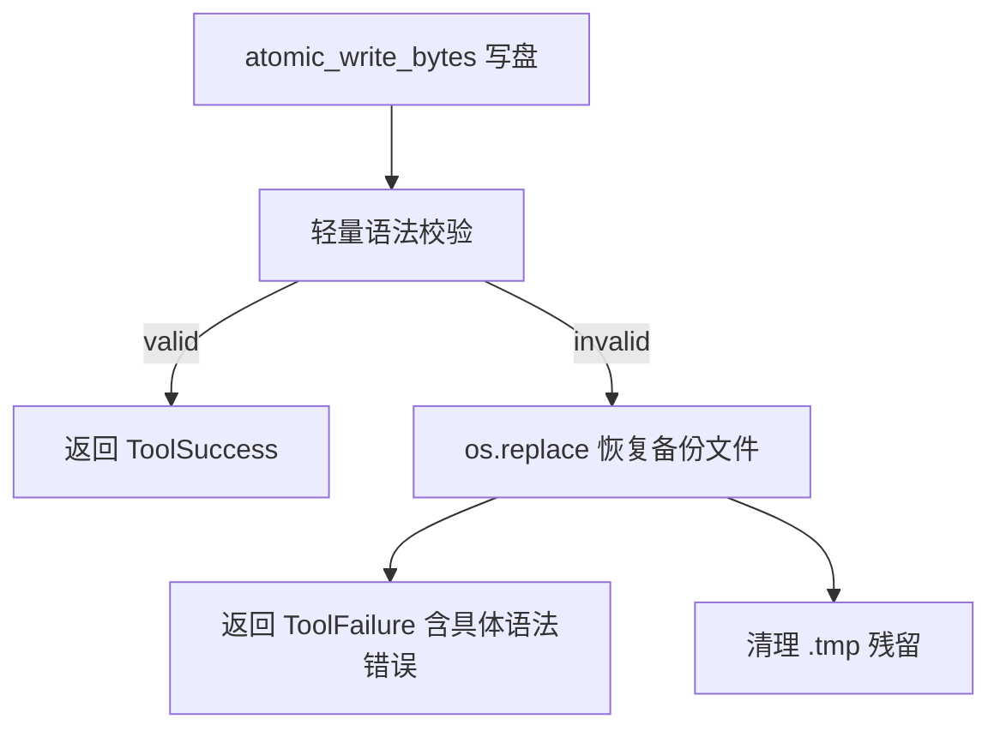

# LocalRuntime CC-Align 加固执行规划书

> 文档版本：1.0.0
> 创建日期：2026-08-03
> 当前基线：H0-H8 + Phase A-C + R1-R3 + Tool 系统细粒度重建完成
> 对标：Claude Code LocalRuntime（三层校验 + 原子化编辑 + 静态工具定义 + Git 状态源）
> 核心原则：**只做 LocalRuntime，不实现 Docker/MicroVM 沙箱**。每阶段 ≤5 文件。

---

# 0. 使用说明与不可违背的施工纪律（先读本节）

## 0.1 范围声明（硬约束）

**本项目不实现 DockerRuntime / Firecracker MicroVM / 任何容器化沙箱。** 所有执行都发生在宿主进程内，安全由以下三层 LocalRuntime 机制承载，而非物理隔离：

| 层级 | 机制 | 落地位置 |
|---|---|---|
| L1 | 权限白名单 `allowedTools / blockedTools` | `hitl/pipeline.py` PermissionPipeline + `agent/session/registry_builder.py` |
| L2 | 路径约束（Workspace Root 锚定 + symlink 二次校验） | `core/base.py` sanitize_path / is_path_safe / resolve_safe_parent |
| L3 | 交互式确认（Human-in-the-loop） | `hitl/pipeline.py` Layer 6 + `AgentConfig` 权限模式 |

**推论**：既然没有容器隔离兜底，L1-L3 必须成为**真正的控制边界**，不允许存在"仅提示"性质的绕过路径。这是本计划所有加固动作的总纲。

## 0.2 核心原则

- **不信任 LLM 输出的任何路径或命令**：所有输入必须经 L1→L2→L3 三层校验后才执行，与"LLM 生成 → 直接执行"的 naive 实现有本质区别。
- **先做新的，再兼容旧的，最后删旧的**：新函数/新配置独立创建，旧逻辑标记 DEPRECATED 后删除。
- **禁止 monkey-patch 旧对象实现新功能**。
- **每阶段 ≤5 文件**，禁止一次性大改。
- **验收以测试为准**：每阶段必须先写 Before Test（证明缺口存在），实现后再跑 Target Tests + Regression Slice。

## 0.3 与 Claude Code 的三处对齐边界

1. **无内置 Checkpoint 系统**：Claude Code 没有 SQLite 检查点、turn 级快照或自动回滚。**Git 是唯一状态源**，`session_checkpoints` 表仅用于调试长任务（默认关闭，见 Phase 3C）。任何人不得将 Checkpoint 宣传为生产恢复机制。
2. **工具静态定义 + 动态过滤**：工具 Schema 在代码中静态声明，不支持运行时动态注册自定义工具；MCP 工具同样受 L1-L3 约束且需显式启用。
3. **语法校验不做全量 AST**：避免语言依赖。用轻量级语法检查器（`py_compile` / `node --check` / tree-sitter），失败时即时回滚而非"写入后检查"。

## 0.4 固定执行循环

```text
完整读取本阶段 → 检查允许文件(≤5) → Before Test（须 FAIL） → 实现
→ Target Tests（须 PASS） → Static Gates → Regression Slice → git diff --check
→ 阶段报告 → 停止等待确认
```

## 0.5 风险登记（每条后续阶段必须回归验证）

- **R-A**：乐观写入 + 回滚若校验器自身抛错，必须仍能恢复原文件，不得留下 `.tmp` 残留。
- **R-B**：`readonly_paths` 的 glob 匹配不得影响已授权路径（如 `.git` 内的 `commit` 通过 git 工具而非 Write 工具写入）。
- **R-C**：TrustAccumulator 衰减必须防止单次长会话信任无限累积；HIGH 风险工具无论 trust 多高都强制 ASK。
- **R-D**：Evidence 断点续传的 workspace 比对必须容错（文件 hash 变化即视为 turn 未完成），宁可重跑也不可错误跳过。
- **R-E**：Artifact 版本化后，`reference_text()` 中引用必须指向最新版本，避免模型读到 superseded 内容。

---

# 1. 25 条 CC 事实基线（LocalRuntime 版）

## 1.1 执行模型

| # | CC 事实 | 本工程现状 | 缺口 |
|---|---|---|---|
| E1 | LLM 只生成 Action（tool_use），不直接执行 | ✅ `runtime_core/model_actions.py` + `agent/loop/turns.py` | 无 |
| E2 | 命令/路径全部经 L1-L3 校验 | ⚠️ 校验存在 | 见 Phase 1B（隐式路径黑名单缺失） |
| E3 | 无容器隔离，安全靠三层校验 | ✅ 已定位 LocalRuntime | 本计划总纲 |

## 1.2 文件代理

| # | CC 事实 | 本工程现状 | 缺口 |
|---|---|---|---|
| F1 | Edit = Search/Replace 块，非全量重写 | ✅ `tools/file_edit_tool.py:194-232` 唯一性检查 | 无 |
| F2 | Edit 单次一处替换，多处需多次调用 | ✅ `count>1` 报错 | 无 |
| F3 | Read 加行号 + 大文件截断 + 拒绝二进制 | ⚠️ 需确认 | 计划核对项 |
| F4 | Write 用临时文件 + rename 原子写 | ✅ `core/base.py:683` atomic_write_bytes | 无 |
| F5 | 写入后语法校验，失败不落盘 | ❌ 直接写盘 | **Phase 1A** |
| F6 | 隐式保护 `.git/ .env node_modules *.lock` | ❌ workspace 内任意路径可写 | **Phase 1B** |

## 1.3 工具路由

| # | CC 事实 | 本工程现状 | 缺口 |
|---|---|---|---|
| T1 | Schema 注入 System Prompt | ✅ `capabilities/render.py` | 无 |
| T2 | 参数校验在路由前拦截 | ✅ `llm/tool_call_validator.py` + `loop/turns.py:485` | 无 |
| T3 | MCP 工具同样受 L1-L3 约束 | ✅ `mcp_integration.py` | 无 |
| T4 | 权限分级 safe/confirm/forbidden + 信任升级 | ❌ RiskLevel/TrustAccumulator 未接入 | **Phase 2** |

## 1.4 状态持久化

| # | CC 事实 | 本工程现状 | 缺口 |
|---|---|---|---|
| S1 | 无内置 Checkpoint，Git 是状态源 | ✅ 默认关闭 `checkpoint_db_path=""` | 保持 |
| S2 | 会话历史持久化（不含文件快照） | ✅ SessionStore | 无 |
| S3 | 长任务断点续传 | ❌ 重启后从 step 0 重跑 | **Phase 3A** |
| S4 | Artifact 带版本 + 不可变 | ❌ 无 version 字段，覆盖丢历史 | **Phase 3B** |

---

# 2. Phase 1 — 文件系统代理加固

> 目标：对齐 CC 的"不污染工作区"原则。写入要么成功且语法有效，要么回滚且报错。

## Phase 1A — 乐观写入 + 即时回滚

**涉及文件（≤5）**：`core/base.py`、`tools/file_edit_tool.py`、`tools/file_tool.py`、`core/tool_plugin.py`（如需要）、`tests/test_write_rollback.py`

### 设计



- **备份策略**：`atomic_write_bytes` 写盘前先 `shutil.copy2(src, backup)` 到内存/临时备份；校验失败用 `os.replace(backup, src)` 原子恢复。
- **校验器路由**（按扩展名，注册表式，避免语言依赖）：
  - `.py` → `py_compile.compile(..., doraise=True)`
  - `.js/.mjs/.cjs` → `node --check <tmpfile>`（子进程，超时 5s）
  - `.json` → `json.loads`
  - 其他 → 跳过（不引入重量级 AST）
- **失败反馈**：ToolFailure 的 error 必须包含校验器原始输出（行号/消息），让 LLM 自我纠正。

### Before Test（须 FAIL）

`test_write_rollback.py::test_edit_invalid_syntax_rolls_back` — 向合法 `.py` 文件做破坏缩进的 Edit，断言当前行为是"文件被污染且返回成功"。

### Target Tests

- `test_edit_invalid_syntax_rolls_back`：Edit 破坏语法 → 文件内容恢复到 Edit 前、返回 ToolFailure、无 `.tmp` 残留。
- `test_write_valid_content_passes`：合法内容正常写入成功。
- `test_rollback_preserves_original_bytes`：恢复后字节级一致。
- `test_validator_error_is_safe`：校验器自身抛异常 → 仍恢复原文件（R-A）。

### 验收标准

- 所有文件工具写路径（Write + Edit）都经过校验 → 回滚闭环。
- 校验器按扩展名路由，无硬编码语言假设。
- Before Test 变绿，Target Tests 全绿，Regression Slice（`tests/test_tool_isreadonly.py`、`tests/test_read_before_edit_cache.py`、文件工具相关）全绿。

## Phase 1B — 隐式路径黑名单 + readonly_paths

**涉及文件（≤5）**：`core/base.py`、`agent/agent_config.py`、`tools/file_tool.py`、`tools/file_edit_tool.py`、`tests/test_readonly_paths.py`

### 设计

- **隐式黑名单（默认拒绝，除非显式 override）**：
  `DEFAULT_PROTECTED_PATHS = (".git/", ".env", "__pycache__/", "node_modules/", "*.lock")`
  在 `is_path_safe()` / 写路径入口判断：路径匹配任一保护条目 → 拒绝写入（Read 不受限）。
- **`AgentConfig.readonly_paths: list[str]`**（glob 模式），追加到保护列表，支持用户自定义。
- **`AgentConfig.allow_write_to_protected: list[str]`**（可选 override，显式逃生门，须记录日志）。
- 将"per-tool isReadOnly"升级为"per-path + per-tool"二维矩阵：写工具 + 受保护路径 → 拒绝；读工具不受限。

### Before Test（须 FAIL）

`test_readonly_paths.py::test_write_to_git_dir_is_blocked` — Write 到 `<repo>/.git/config`，断言当前"成功写入"。

### Target Tests

- 写 `.git/`、`.env`、`__pycache__/`、`node_modules/`、`*.lock` 均被拒。
- `readonly_paths=["secrets/*"]` 配置生效。
- Read 受保护路径仍允许。
- override 逃生门可写但记录日志。
- **Regression Slice 重点**：`tests/test_tool_e2e_matrix.py`、`tests/test_old_tool_deprecation.py`（确保没误伤正常文件编辑）。

## Phase 1C — 路径逃逸回归测试集

**涉及文件（≤2）**：`tests/test_path_escape_matrix.py`

### 测试矩阵（硬性验收，全部必须 PASS）

| # | 攻击向量 | 断言 |
|---|---|---|
| P1 | `../../etc/passwd` | 拒绝 |
| P2 | `symlink -> /etc` 的写入目标 | 拒绝（O_NOFOLLOW / is_symlink） |
| P3 | `symlink -> ../outside` | 拒绝（resolve 后 relative_to） |
| P4 | `hardlink` 指向 workspace 外 | 拒绝 |
| P5 | unicode normalization（`\u202e` RTL 覆盖 / NFC/NFD） | 拒绝或规范化后仍受锚定 |
| P6 | 绝对路径逃逸（`C:\Windows\...` / `/etc`） | 拒绝 |
| P7 | 嵌套 symlink（workspace 内 symlink → 再 symlink 出界） | 拒绝 |
| P8 | `.` / `..` 尾缀（`workspace/..`） | 拒绝 |
| P9 | 空字节 `\x00` 注入 | 拒绝或安全处理 |
| P10 | Windows `..\..\` 反斜杠 | 拒绝（normpath 统一） |

### 验收标准

- 三层防御（sanitize_path / is_path_safe / resolve_safe_parent）逐层被测，任一攻击向量在某一层被拦截即 PASS（记录拦截层）。
- 缺测试 = 三层防御等同虚设 —— **本阶段是硬性门槛，不跳过**。

---

# 3. Phase 2 — RiskLevel + TrustAccumulator 接入权限决策

> 目标：把"分级"从数据标签变成控制流。权限决策从二元（DENY/ALLOW）升级为三元组联合决策。

## Phase 2A — RiskLevel 接入决策管线

**涉及文件（≤5）**：`core/types.py`、`llm/tool_call_validator.py`、`agent/loop/turns.py`、`hitl/pipeline.py`、`tests/test_risk_decision_matrix.py`

### 设计

```text
decision = f(rule_result, risk_level, trust_score)
  rule_result == DENY          → DENY（无条件）
  rule_result == ALLOW         → ALLOW
  rule_result == ASK:
      risk_level == HIGH       → ASK（无论 trust 多高，R-C 硬规则）
      risk_level in {NONE,LOW} and trust_score >= threshold → ALLOW（自动降级，记日志）
      else                     → ASK
```

- `RiskLevel` 由 `BaseTool.classify_risk(params)` 计算（`core/base.py:383`），写入 ToolMetadata。
- `validate_action_contract()`（`loop/turns.py:485`）成为联合决策入口：读取 `rule_result`（来自 PermissionPipeline）+ `risk_level`（来自工具元数据）+ `trust_score`（来自 TrustAccumulator）。

### Before Test（须 FAIL）

`test_risk_decision_matrix.py::test_low_risk_ask_auto_allowed_when_trusted` — LOW 风险 + 高 trust 的 ASK 场景，断言当前仍弹确认。

## Phase 2B — 激活 SessionTrustAccumulator 反馈回路

**涉及文件（≤5）**：`hitl/trust_accumulator.py`、`hitl/pipeline.py`、`server/services/agent_service.py`、`tests/test_trust_accumulator_loop.py`

### 设计

- 扩展现有 API（`record_approval` / `is_trusted` → 增加）：
  - `record_confirmation(tool_name, risk_level, params)`：用户确认后调用。
  - `record_rejection(tool_name, params)`：用户拒绝 / 工具失败后调用（**降低**该 key 的信任）。
- **衰减因子**：每 10 分钟 trust_score 衰减 10%（时间戳驱动，防止单次长会话信任无限累积，R-C）。
- **接线点**：`hitl/pipeline.py` Layer 6 交互回调的 ALLOW/DENY 分支处。
- **会话作用域**：trust 状态随 session 生命周期，`clear()` 于 session 结束（现有 `SessionRuntime` 的 `_active_sessions` 清理处）。

### Before Test（须 FAIL）

`test_trust_accumulator_loop.py::test_rejection_decreases_trust` — 同 key 拒绝一次后再次判断，断言当前信任不降。

## Phase 2C — 信任状态可观测

**涉及文件（≤2）**：`hitl/pipeline.py`、`tests/test_trust_observability.py`

### 设计

- debug 日志完整输出信任演化链路：`key=... risk=... rule=... trust=... decision=...`（每次决策一行）。
- 可选高级特性（本计划标记为"可选，默认不做"）：system prompt 动态注入 `[Current Trust: ...]`。避免过度承诺。

### 验收标准

- 三元组联合决策通过 `test_risk_decision_matrix` 全矩阵。
- HIGH 风险在任意 trust 下强制 ASK（回归验证 R-C）。
- 反馈回路闭环：确认增信任、拒绝降信任、10 分钟衰减生效。
- Regression Slice：`tests/test_approval_*`、`tests/test_permission_*`、`tests/hitl/*` 全绿。

---

# 4. Phase 3 — Evidence 断点续传 + Artifact 版本化 + Checkpoint 定位

## Phase 3A — 基于 Evidence 的轻量级断点续传

**涉及文件（≤5）**：`agent/session/run_evidence.py`、`agent/session/runtime.py`、`agent/session/session_store.py`、`agent/session/checkpoint.py`、`tests/test_evidence_resume.py`

### 设计

- **不维护 step counter**（对齐 CC：不做 step 级续传）。利用已有 evidence 持久化：
  - 每 turn 结束时记录 `{turn_id, tool_calls_hash, output_artifact_ids, files_hash}` 到 run_evidence（`EvidenceKind.RESUME_MARKER`）。
  - 重启时加载最近一条 RESUME_MARKER，比对当前 workspace 状态（文件 hash / git status）：
    - 匹配 → 跳过该 turn 及之前所有 turns，从下一 turn 继续。
    - 不匹配 → 放弃恢复，从最新 turn 重跑（宁可重跑，不可错误跳过，R-D）。
- `tool_calls_hash`：对 turn 内 tool_call 的 (name, params) 序列做 sha256，用于幂等判定。

### Before Test（须 FAIL）

`test_evidence_resume.py::test_restart_resumes_from_last_marker` — 完成 turn 1-2 后模拟重启，断言当前从 step 0 重跑。

### 验收标准

- 匹配时跳过已完成 turns；不匹配时安全回退。
- 与现有 `IdempotentToolCache` 协同（turn 内去重 + turn 间跳过的双层）。

## Phase 3B — ArtifactStore 版本化 + 不可变语义

**涉及文件（≤3）**：`context/artifacts.py`、`agent/session/checkpoint.py`、`tests/test_artifact_versioning.py`

### 设计

- `Artifact` 增加 `version: int`；`artifact_id` 形如 `artifact_id:v1`、`artifact_id:v2`。
- 每次写入生成新版本，旧版本保留并标记 `superseded=True`。
- `reference_text()` 始终引用最新版本（R-E）。
- Checkpoint 恢复时按时间戳关联对应版本 Artifact，避免恢复到过期内容。

### Before Test（须 FAIL）

`test_artifact_versioning.py::test_overwrite_creates_new_version_preserving_old` — 同 tool 同 key 写两次，断言当前覆盖丢失旧内容。

## Phase 3C — Checkpoint 定位文档化 + debug flag

**涉及文件（≤3）**：`agent/agent_config.py`、`agent/session/runtime.py`、`server/main.py`（或 CLI）

### 设计

- **文档化定位**（写入 `docs/` 架构文档 + 代码 docstring）：Checkpoint 仅用于调试长任务 / 验证状态机行为；生产恢复依赖 Git + Evidence。防止后续误以为功能缺失反复启用。
- CLI flag：`--enable-checkpoint-debug` → 将 `checkpoint_db_path` 设为 `<repo>/.grace/checkpoints.db`，默认保持 `""`（关闭）。

### Before Test（须 FAIL）

`test_checkpoint_debug_flag.py::test_flag_enables_checkpoint` — 默认关闭，flag 开启。

### 验收标准

- 默认行为不变（`checkpoint_db_path=""` 零开销）。
- flag 开启后 `session_checkpoints` 表被写入。
- 架构文档明确"生产 = Git + Evidence，Checkpoint = 调试工具"。

---

# 5. 回归总闸门（每阶段完成后必须全绿）

```text
tests/test_path_escape_matrix.py        (Phase 1C 新增)
tests/test_readonly_paths.py            (Phase 1B 新增)
tests/test_write_rollback.py            (Phase 1A 新增)
tests/test_risk_decision_matrix.py      (Phase 2A 新增)
tests/test_trust_accumulator_loop.py    (Phase 2B 新增)
tests/test_evidence_resume.py           (Phase 3A 新增)
tests/test_artifact_versioning.py       (Phase 3B 新增)
tests/test_checkpoint_debug_flag.py     (Phase 3C 新增)
```

外加既有回归切片（每阶段在报告里列明本次运行的文件集合）。

---

# 6. 明确不做（No-Go）清单

- ❌ DockerRuntime / Firecracker / MicroVM / 任何容器化沙箱。
- ❌ 全量 AST 语法校验（`ast.parse` 硬编码语言假设）——用轻量级校验器。
- ❌ step 级断点续传（维护 step counter）——用 Evidence 哈希比对。
- ❌ Checkpoint 作为生产恢复机制——Git 是唯一状态源。
- ❌ 运行时动态注册自定义工具——工具静态定义 + 动态过滤。
- ❌ 网络白名单 / iptables / cgroup（这些是 Docker 形态的能力，LocalRuntime 不做，交给宿主环境）。
