# P0 #1: Context Window Manager — CC-Native 重构设计

> 设计版本: v1.0 | 日期: 2026-08-01
> 对标: Claude Code `autoCompact.ts` + `token-budget.ts` + `StreamingToolExecutor` context assembly
> 状态: 深度调研完成 → 设计规范

---

## 1. 调研与质询记录

### 1.1 搜索摘要

Claude Code 的上下文管理由三个核心子系统组成：

**A. Token 计量** — 精确优先于估算:
- Anthropic backend: 调用 `anthropic.beta.messages.countTokens()` API 获取精确值
- AWS Bedrock: 使用 `CountTokensCommand`
- OpenAI/Gemini: 近似估算 (4 chars/token)
- 存在 Haiku 保底方案: 发送 `max_tokens=1` 请求读取 `usage.input_tokens`

**B. 三层渐进式压缩** (永远不直接截断):
1. MicroCompact (无 API 调用) — 按时间衰减清除旧 tool output 内容，替换为 `[Old tool result content cleared]`
2. Session Memory Compact (无 API 调用, feature-flagged) — 复用已提取的 Session Memory 作为摘要
3. Traditional API Summary — Fork Agent 复用主线程 prompt cache，请求模型生成摘要

**C. 自触发阈值**:
- `AUTOCOMPACT_BUFFER_TOKENS = 13,000` → 窗口 - 13K = 自动压缩触发点
- `WARNING_THRESHOLD = 20,000` 高于触发点
- `MANUAL_COMPACT_BUFFER = 3,000` → 窗口 - 3K = 阻塞阈值
- `MAX_CONSECUTIVE_FAILURES = 3` → 熔断

**D. Pair-Aware 保留** (关键不变量):
- `adjustIndexToPreserveAPIInvariants()` 确保 `tool_result` 永远与 `tool_use` 配对
- `preservedSegment` 标记记录哪些消息被保留 vs 压缩
- 压缩边界 marker: `SystemCompactBoundaryMessage` 类型 + metadata

**E. 子 Agent 上下文**:
- 上下文窗口隔离: 子 Agent 看不到父会话历史，仅接收 task description
- Token 预算非独立: 共享父会话的 200K/8192 限制 (CC 同样未解决此问题)
- 但我们的实现不应该走"继承历史"的歪路

### 1.2 质询应答

**Q1: CC 在该模块的核心设计哲学是什么？**

CC 的设计哲学是 **"渐进降级，永不静默截断"**。三层压缩从低代价到高代价渐进；截断是最后一招且要有明确的 circuit breaker。不是"窗口管理"，而是"上下文质量保障"——每次压缩都应该是信息密度提升，而非信息丢失。

**Q2: 当前实现与 CC 的根本差异是"实现细节"还是"架构范式"？**

架构范式差异。三个关键点:
1. CC 是 **单一装配入口** + 内部渐进降级，我们是 **三路分流** + 主路有预算、旁路绕过
2. CC 的子 Agent 是 **干净上下文** (仅 task description)，我们是 **复制全量历史** — 这不是预算 bug，这是设计错误
3. CC 是 **精确 API 计量优先**，我们靠字符串估算 — 导致多模态和结构化内容严重低估

**Q3: 如果完全照搬 CC 的设计，我们的技术栈/运行环境是否存在硬性阻碍？**

- `countTokens()` API 对 DeepSeek backend 不可用 → 需要 provider-specific estimator 接口
- Python 没有 `AbortController` 原生概念 → 使用 `asyncio.Event` + `CancellationToken` 等价替代
- CC 的 Fork Agent 复用 prompt cache 依赖 Anthropic API 特定行为 → DeepSeek 不需要此优化，标记为 Anthropic-only 特性
- 其余设计均可直接移植

**Q4: 这个设计是否引入了隐式依赖？是否能在不修改其他模块的情况下独立替换/升级？**

`ContextWindowManager` (新设计) 的依赖方向:
- 依赖: `TokenCounter` (接口)、`CompactionStrategy` (接口)、`ConversationHistory` (数据对象)
- 不感知: Session 存储格式、Tool 注册表、MCP 传输层、LLM Backend 具体实现
- 可以独立替换: 只要 `TokenCounter` 和 `CompactionStrategy` 接口不变，Manager 内部可以完全重写

**Q5: 业界是否有过该设计的失败案例或已知陷阱？CC 是如何规避的？**

- **陷阱**: Prompt Caching 的 breakpoint 位置影响命中率 → CC 用 Fork Agent (复用主线程的 cache prefix) 来解决
- **陷阱**: 压缩后丢失 tool_use/tool_result 配对导致 API 400 错误 → CC 的 `adjustIndexToPreserveAPIInvariants` 是硬性不变量
- **陷阱**: 连续压缩失败形成死亡循环 → CC 的 3 次失败熔断
- **陷阱**: 子 Agent 共享预算但独立上下文导致隐性超支 → CC 通过干净启动 (不继承历史) 和显式上下文窗口来让超支变得可见和可预测

### 1.3 决策依据

**选择全量重构而非修补**的理由:
1. `build_sub_agent_messages()` 和 `build_inherited_messages()` 不仅是绕过预算——它们是架构错误。"子 Agent 继承父历史"在 CC 范式中根本不应该存在
2. `estimate_tokens(str)` 的接口签名本身就是错误的——token 计量的单位是 `Message | ContentBlock`，不是 `str`
3. `ContextLayer.max_tokens` 有字段无执行——说明分层模型从未被正确集成

---

## 2. CC-Native 设计规范

### 2.1 架构图

```mermaid
flowchart TD
    subgraph "ContextWindowManager (单一入口)"
        CM[build_context]
    end

    subgraph "Meter 层 (精确计量)"
        TC[TokenCounter &#123;interface&#125;]
        TCA[AnthropicCounter<br/>countTokens API]
        TCD[DeepSeekCounter<br/>char/4 + image estimator]
        TCO[OpenAICounter<br/>tiktoken]
    end

    subgraph "Budget 层 (预算分配)"
        TP[TokenPlanner]
        TA[allocate: system / history / repo / output_room]
    end

    subgraph "Compact 层 (渐进降级)"
        CS[CompactionStrategy &#123;interface&#125;]
        MC[MicroCompactor<br/>no API - clear old tool outputs]
        SC[SessionMemoryCompactor<br/>no API - reuse extracted memory]
        AC[APICompactor<br/>Fork Agent summary]
    end

    subgraph "Trim 层 (最后防线)"
        TR[TokenTrimmer]
        PA[pair-aware 4-level trim]
    end

    subgraph "Assembly 层"
        SA[SystemAssembler]
        LA[LayerRenderer<br/>enforces max_tokens per layer]
    end

    CM --> TC --> TP
    TP -->|over budget?| CS
    CS -->|still over?| TR
    TR --> SA --> LA
    SA -->|final check| TC

    style CM fill:#4a90d9,color:#fff
    style TC fill:#2d7a3a,color:#fff
    style CS fill:#c9881e,color:#fff
```



### 2.2 核心接口

```python
# === Meter 层: 二层计量契约 ===

from abc import ABC, abstractmethod
from dataclasses import dataclass
from typing import Protocol, Union

class ContentBlock(Protocol):
    """单个内容块 — text/image/tool_use/tool_result/document."""
    type: str
    # ... provider-specific fields

@dataclass
class TokenCount:
    """精确 token 计数 — 区分计费维度和上下文占用维度。

    context_tokens: 实际占用的上下文窗口 token 数
    input_tokens:   计费用 input token (不含 cache_read 部分)
    cache_creation_tokens: 计费用 cache write token
    cache_read_tokens:     计费用 cache read token

    context_tokens 用于窗口守卫 (硬性不变量):
        context_tokens + output_room <= provider_context_limit
    input_tokens + cache_* 用于成本核算 (不应被相加到上下文占用中)。
    """
    context_tokens: int
    input_tokens: int = 0
    cache_creation_tokens: int = 0
    cache_read_tokens: int = 0

# === 二层契约: Local (同步) vs Provider (异步) ===

class LocalTokenEstimator(ABC):
    """快速、同步、保守的本地 token 估算。

    用于同步上下文装配路径中的即时决策 (trim、compact 触发)。
    默认 4 chars/token 保守估算，可被 provider-specific 覆盖。
    所有方法均为同步 — 不访问网络。
    """

    @abstractmethod
    def estimate(self, content: Union[str, ContentBlock, list[ContentBlock]]) -> int:
        """快速估算 token 数。始终 >= 精确值 (保守上界)。"""
        ...

    @abstractmethod
    def estimate_messages(self, messages: list[dict]) -> int:
        """快速估算消息列表 token 数。"""
        ...

    @property
    @abstractmethod
    def model_context_window(self) -> int:
        """模型最大上下文窗口。"""
        ...


class ProviderTokenCounter(ABC):
    """异步、权威的 provider API token 计数。

    对标 CC 的 countTokens() API 调用。
    所有方法均为 async — 可能发起网络请求。
    """

    @abstractmethod
    async def count_messages(self, messages: list[dict]) -> TokenCount:
        """精确 token 计数 — context_tokens + 计费维度拆解。"""
        ...

    @abstractmethod
    async def count_content(self, content: Union[str, ContentBlock, list[ContentBlock]]) -> int:
        """精确 token 计数 for 单个内容。"""
        ...
```

**调用约定**:
- `ContextWindowManager.build_context()` 是**同步**方法 — 内部使用 `LocalTokenEstimator` 进行触发决策和裁剪
- `ProviderTokenCounter.count_messages()` 在**发送前验证**时调用 (异步) — 作为最终守卫
- `TokenPlanner` 只接收 `model_context_window` 整数 — 不依赖任何 Counter 实现


# === Budget 层: TokenPlanner ===

@dataclass
class BudgetPlan:
    """单次请求的预算分配方案。"""
    total: int                     # 模型窗口 - 输出预留
    system: int                    # 系统提示预算
    history: int                   # 对话历史预算
    repo_map: int                  # 仓库地图预算
    observation: int               # 工具结果预算
    output_room: int               # 输出预留
    consumed_so_far: int           # 已消耗 (含 prompt cache)

class TokenPlanner:
    """预算分配策略。

    完全无状态 — 每次 build_context 创建新实例。
    不感知: LLM Backend、Compaction、Session 存储。
    """

    OUTPUT_ROOM_DEFAULT: int = 4096
    SYSTEM_FRACTION: float = 0.12
    REPO_MAP_MAX: int = 12000

    def plan(
        self,
        model_window: int,
        consumed_tokens: int = 0,
        output_room: int | None = None,
        *,
        system_fraction: float | None = None,
    ) -> BudgetPlan: ...


# === Compact 层: CompactionStrategy (接口) ===

@dataclass
class CompactResult:
    compacted_messages: list[dict]
    summary: str | None
    tokens_saved: int
    strategy: str               # "micro" | "session_memory" | "api"
    preserved_segment: range    # 保留的消息索引范围

class CompactionStrategy(ABC):
    """一条压缩策略。

    每条策略独立实现，按优先级串联。
    策略内部可以无状态或持有轻量配置。
    """

    @property
    @abstractmethod
    def name(self) -> str: ...

    @abstractmethod
    def compact(
        self,
        messages: list[dict],
        budget: BudgetPlan,
        *,
        task_context: str = "",
    ) -> CompactResult: ...


# === 最终防线: DeterministicTrimmer ===

class DeterministicTrimmer:
    """Pair-aware 确定性裁剪 — APICompactor 熔断后的降级目标。

    APICompactor 失败/熔断时，不抛出异常，降级到 pair-aware trim。
    这是上下文装配的**最终不变量**：
        exact_context_tokens + output_room <= provider_context_limit
    裁剪永远是确定性的 (不依赖 LLM)，保证请求不会因超窗而失败。
    """

    def trim(
        self,
        messages: list[dict],
        max_tokens: int,
        *,
        preserve_system: bool = True,
        preserve_last_n_pairs: int = 3,
    ) -> list[dict]:
        """确定性裁剪到 max_tokens 以下。

        优先级: system > 最近 N 对 tool_use/tool_result > 其余
        """
        ...


# === 主入口: ContextWindowManager ===

@dataclass
class ContextAssembly:
    messages: list[dict]
    stats: ContextStats
    compaction_applied: list[str]   # 实际执行的策略名列表
    fallback_trim_applied: bool     # 是否降级到确定性裁剪

class ContextWindowManager:
    """CC-Native 上下文窗口管理器。

    单一入口: build_context()。
    所有路径 (主会话、子 Agent、Fork) 走同一管线。

    渐进降级链:
    Micro → SessionMemory → API
              API 失败/熔断
                   ↓
         DeterministicTrimmer (pair-aware, 不抛异常)
                   ↓
         context_tokens + output_room <= provider_context_limit ✅

    不感知:
    - Session 数据库格式
    - MCP 传输层
    - Tool 注册表
    - 权限/HITL 管线
    - 具体 LLM Backend 实现 (仅通过 LocalTokenEstimator 接口)
    """

    def __init__(
        self,
        estimator: LocalTokenEstimator,
        budget_planner: TokenPlanner,
        compaction_chain: list[CompactionStrategy],  # 优先级从高到低
        trimmer: DeterministicTrimmer,
        auto_compact_threshold: float = 0.80,
        max_consecutive_api_failures: int = 3,
    ): ...

    def build_context(
        self,
        *,
        system_content: str | list[ContentBlock],
        history: list[dict],
        memory_context: str = "",
        task_anchor: str = "",
        repo_map: str = "",
        consumed_tokens: int = 0,
        enable_prompt_cache: bool = False,
        task_context: TaskContext | None = None,
    ) -> ContextAssembly:
        """单一上下文装配入口。

        内部流程:
        1. TokenPlanner.plan() → BudgetPlan
        2. LocalTokenEstimator.estimate_messages() → 快速估算
        3. if over threshold → CompactionStrategy.compact() (渐进: Micro→SM→API)
        4. if API compact fails or circuit breaker open → DeterministicTrimmer.trim()
        5. SystemAssembler.assemble() → 结构化系统提示
        6. LayerRenderer.render(budget) → 裁剪到 max_tokens
        7. LocalTokenEstimator.estimate_messages() → 验证 < model_window

        不变量: 步骤 7 的 context_tokens + output_room <= provider_context_limit
        如果步骤 7 仍超限 → 硬截断 (保留 system + 最近配对)
        """
        ...
        1. TokenPlanner.plan() → BudgetPlan
        2. LocalTokenEstimator.estimate_messages() → 快速估算
        3. if over threshold → CompactionStrategy.compact() (渐进: Micro→SM→API)
        4. if API compact fails or circuit breaker open → DeterministicTrimmer.trim()
        5. SystemAssembler.assemble() → 结构化系统提示
        6. LayerRenderer.render(budget) → 裁剪到 max_tokens
        7. LocalTokenEstimator.estimate_messages() → 验证 < model_window

        不变量: 步骤 7 的 context_tokens + output_room <= provider_context_limit
        如果步骤 7 仍超限 → 硬截断 (保留 system + 最近配对)
        """
        ...


# === 子 Agent 专用: TaskContext (显式任务契约) ===

@dataclass
class TaskContext:
    """子 Agent 的干净、显式任务描述。

    CC 范式: 子 Agent 从干净上下文开始。
    不继承父历史，但接收显式的任务契约。

    task + agent_type: 必填 — 定义任务内容和角色
    workspace_scope:    文件系统范围 (避免跨 worktree 泄漏)
    constraints:        显式约束 (如 "只读"、"不允许修改 .py 文件")
    artifact_refs:      父 Agent 产出的大文件引用 (如 "读取 artifact://abc123 的结果")
    expected_output:    交付物定义 (如 "3 个 bug findings"、"修改后的 plan.md")
    parent_run_id:      仅用于追踪和日志 — 不属于历史上下文
    context_provenance: 上下文来源标记 ("primary" | "fork" | "worktree")
    """

    task: str
    agent_type: str                         # "explore" | "general" | "plan" | "code-reviewer"
    workspace_scope: str | None = None      # worktree root path
    constraints: list[str] = field(default_factory=list)
    artifact_refs: list[str] = field(default_factory=list)
    expected_output: str | None = None
    parent_run_id: str | None = None        # 仅追踪，非上下文
    context_provenance: str = "fork"
    tool_allowlist: list[str] | None = None
    max_turns: int = 25

    def to_system_content(self) -> list[ContentBlock]:
        """生成子 Agent 专用的系统提示内容。

        包含: 任务描述 + workspace_scope + constraints + expected_output + 工具列表
        不包含: 父会话历史 (与 CC 对齐)。
        artifact_refs 作为可读取的引用 (非内联内容) 传递给子 Agent。
        parent_run_id 和 context_provenance 仅用于 Session 追踪，不进入 system prompt。
        """
        ...
```

### 2.3 解耦矩阵

| 本模块 | LLM Backend | Session Store | Tool Registry | MCP Transport | HITL Pipeline | Skills Registry |
|--------|-------------|---------------|---------------|---------------|---------------|-----------------|
| `TokenCounter` | 通过接口 (实现由 Backend 提供) | 不感知 | 不感知 | 不感知 | 不感知 | 不感知 |
| `TokenPlanner` | 仅用 `model_context_window` | 不感知 | 不感知 | 不感知 | 不感知 | 不感知 |
| `CompactionStrategy` | API 策略需要 LLM 调用 (通过接口) | 不感知 | 不感知 | 不感知 | 不感知 | 不感知 |
| `ContextWindowManager` | 仅通过 `TokenCounter` | 不感知 | 不感知 | 不感知 | 不感知 | 不感知 |
| `TaskContext` | 不感知 | 不感知 | 不感知 | 不感知 | 不感知 | 不感知 |

**关键设计原则**: Context 层不感知存储格式。`history: list[dict]` 总是由调用方 (Agent 核心) 从 Session Store 中读取并转换为 dict 后传入。

### 2.4 废弃清单

以下旧代码/接口将被**直接删除**，不保留兼容层：

| 文件 | 废弃项 | 原因 |
|------|--------|------|
| `context/manager.py` | `build_sub_agent_messages()` | 架构错误 — 子 Agent 不应继承父历史 |
| `context/manager.py` | `build_inherited_messages()` | 架构错误 — 不存在"继承上下文"概念 |
| `context/manager.py` | `ContextPlanner` 类 | 替换为 `TokenPlanner` + `CompactionStrategy` 链 |
| `context/manager.py` | `build_request_messages()` 16 参数签名 | 替换为 `ContextWindowManager.build_context()` |
| `context/token_budget.py` | `estimate_tokens(text: str)` | 替换为 `TokenCounter.count_tokens(ContentBlock)` |
| `context/token_budget.py` | `compute_plan()` 多次调用模式 | 替换为单次 `TokenPlanner.plan()` |
| `context/structured.py` | `ContextLayer.max_tokens` (死代码状态) | 重新实现为 `LayerRenderer.render(budget)` 强制约束 |
| `context/artifacts.py` | 前 1000 字符哈希 | 替换为全内容 SHA-256 |
| `agent/core.py` | `_build_messages()` 三路分流 | 替换为单路径 `ContextWindowManager.build_context()` |
| `agent/core.py` | `_inherited_context` 字段 | 删除 — 用 `TaskContext` 代替 |
| `agent/context_trimming.py` | `prepare_history_for_turn()` | 逻辑并入 `CompactionStrategy` 链 |

---

## 3. 分阶段开发路线图

| 阶段 | 目标 | 交付物 | 前置依赖 | 预估工时 | 回滚方案 |
|------|------|--------|---------|---------|---------|
| **P1** | TokenCounter 接口 + 3 个实现 | `context/counters.py`: `TokenCounter(ABC)`, `AnthropicCounter`, `DeepSeekCounter`, `OpenAICounter` | None | 2 人日 | 新旧计量并存，feature flag `USE_PRECISE_TOKEN_COUNTER` |
| **P2** | TokenPlanner 单一预算分配 | `context/planner.py`: `TokenPlanner`, `BudgetPlan` | P1 | 1 人日 | 保留旧 `compute_plan()` 为内部实现，外部切换到 Planner |
| **P3** | CompactionStrategy 链 (Micro → SM → API) | `context/compaction/`: `MicroCompactor`, `SessionMemoryCompactor`, `APICompactor` | P2 | 3 人日 | 每条策略独立 feature flag；默认仅启用 Micro |
| **P4** | ContextWindowManager 单一入口 | `context/manager_v2.py`: `ContextWindowManager.build_context()` | P2, P3 | 2 人日 | 与旧 `ContextManager` 并行运行 1 个 release，通过 `USE_V2_CONTEXT_MANAGER` 切换 |
| **P5** | 子 Agent 干净上下文 (TaskContext) | `context/task_context.py`: `TaskContext`；`agent/core.py` 删除 `_inherited_context`；`agent/session/subagent.py` 适配 | P4 | 1.5 人日 | 旧子 Agent 路径保留但标记 deprecated |
| **P6** | Agent 核心切换 + 旧代码删除 | 删除 `agent/core.py` 三路分流；删除 `build_sub_agent_messages`、`build_inherited_messages`、`_inherited_context` | P4, P5 | 1 人日 | Git revert (无运行时 flag，一步到位) |
| **P7** | Artifact 全内容哈希 + LayerRenderer | 修复 `context/artifacts.py` 哈希；`context/structured.py` → `LayerRenderer.render(budget)` 强制约束 | P4 | 1 人日 | Artifact 哈希向后兼容 (新 hash 与旧 hash 并存) |
| **P8** | 端到端测试 + Provider 边界测试 | 8 个新测试 (子 Agent 裁剪、多层压缩、多模态计量、pair 保留、压缩熔断等) | P6, P7 | 2 人日 | 无回滚 — 测试只有 merge 或 skip |

**总工时**: 13.5 人日

---

## 4. 验收标准清单

### P1: TokenCounter

- [ ] **AC-1.1**: `AnthropicCounter.count_messages()` 与 `anthropic.beta.messages.count_tokens()` 返回值误差 < 1%
- [ ] **AC-1.2**: `DeepSeekCounter.count_tokens([image_block, text_block])` 返回值 > `len(text)//4` (即不再低估多模态)
- [ ] **AC-1.3**: `TokenCounter` 接口实例化时不依赖任何全局状态、环境变量或文件系统
- [ ] **AC-1.4**: 单元测试覆盖 3 种 Counter + 至少 5 种 block 类型 (text/image/tool_use/tool_result/document)

### P2: TokenPlanner

- [ ] **AC-2.1**: `plan(model_window=200_000, consumed_tokens=150_000)` 返回的 `history` 预算 > 0 且 < 200_000 - output_room
- [ ] **AC-2.2**: `plan()` 的 system + history + repo_map + observation + output_room == total (无“泄漏”)
- [ ] **AC-2.3**: `plan(model_window=128_000)` 对 DeepSeek 的 repo_map 不超过 REPO_MAP_MAX

### P3: CompactionStrategy 链

- [ ] **AC-3.1**: `MicroCompactor.compact()` 不清除当前 turn 的 tool 输出 (只清除旧 turn)
- [ ] **AC-3.2**: 任意策略 compact 后，所有 `tool_use` 与 `tool_result` 保持配对 (API invariant)
- [ ] **AC-3.3**: `MAX_CONSECUTIVE_FAILURES = 3` — 第 4 次 `APICompactor` 失败时抛出 `CompactionCircuitBreakerOpen` 而非重试
- [ ] **AC-3.4**: 链式执行: Micro 优先 → 如果 `tokens_saved` 不足 → 尝试 SessionMemory → 仍然不足 → API

### P4: ContextWindowManager

- [ ] **AC-4.1**: `build_context()` 对主会话、子 Agent (task_context 非 None) 均走同一代码路径
- [ ] **AC-4.2**: 输出消息列表的 `TokenCounter.count_messages()` 结果 ≤ `model_context_window` (硬性不变量)
- [ ] **AC-4.3**: `ContextWindowManager` 初始化参数仅通过构造函数传入，不从环境变量或全局配置读取
- [ ] **AC-4.4**: 可 mock `TokenCounter` 和 `CompactionStrategy` 进行隔离单元测试

### P5: 子 Agent 干净上下文

- [ ] **AC-5.1**: 子 Agent 的系统提示**不包含**父会话的任何历史消息
- [ ] **AC-5.2**: 子 Agent 的系统提示**包含** `TaskContext.to_system_content()` 的完整输出
- [ ] **AC-5.3**: 构造父会话 200K token 历史 + 子 Agent 启动 → 子 Agent 上下文 < 10K token (仅 system + task)

### P6: Agent 核心切换

- [ ] **AC-6.1**: `agent/core.py` 中不存在 `build_sub_agent_messages`、`build_inherited_messages`、`_inherited_context` 字符串
- [ ] **AC-6.2**: 68 项现有测试保持通过
- [ ] **AC-6.3**: 子 Agent 执行一个简单任务 (如 `grep "foo"`) 不触发 provider 400 错误

### P7: Artifact + LayerRenderer

- [ ] **AC-7.1**: 两个前 1000 字符相同、后续不同的 10 KB 输出 → 不同的 Artifact ID
- [ ] **AC-7.2**: `LayerRenderer.render({"repo_map": 500, "system_core": 2000})` → repo_map 层 ≤ 500 tokens, system_core 层 ≤ 2000 tokens
- [ ] **AC-7.3**: `ArtifactEntry` 包含 `original_length` 字段，与 `content_length` 可能不同

### P8: 端到端测试

- [ ] **AC-8.1**: `test_sub_agent_clean_context_no_parent_history()` — 验证子 Agent 不继承父历史
- [ ] **AC-8.2**: `test_200k_history_fits_in_200k_window_after_compaction()` — 200K token 历史 → 压缩后 ≤ 200K
- [ ] **AC-8.3**: `test_tool_pair_preserved_after_any_compaction()` — 所有压缩策略后配对完整
- [ ] **AC-8.4**: `test_circuit_breaker_stops_after_3_consecutive_failures()` — 3 次失败后熔断
- [ ] **AC-8.5**: `test_multimodal_token_count_not_underestimated()` — image block 估算值不被 `len(list)` 低估
- [ ] **AC-8.6**: `test_artifact_no_collision_on_prefix_match()` — 前缀相同但内容不同的 Artifact 不碰撞
- [ ] **AC-8.7**: `test_layer_max_tokens_enforced()` — max_tokens 正数时实际生效
- [ ] **AC-8.8**: `test_real_anthropic_endpoint_does_not_return_400()` — 真实 endpoint 集成测试
