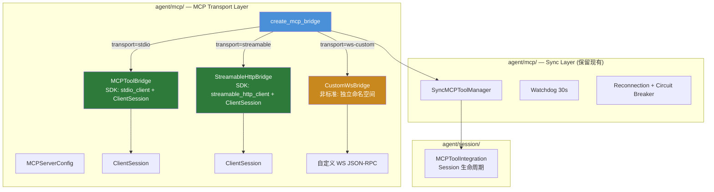

# P0 #2: MCP Transport Layer — CC-Native 重构设计

> 设计版本: v1.0 | 日期: 2026-08-01
> 对标: Claude Code MCP client (使用官方 SDK Streamable HTTP) + MCP 2025-06-18 Spec
> 状态: 深度调研完成 → 设计规范

---

## 1. 调研与质询记录

### 1.1 搜索摘要

**MCP Python SDK v1.x 已全面支持 Streamable HTTP**:
- 客户端: `from mcp.client.streamable_http import streamable_http_client` (稳定 API)
- 版本约束: `mcp>=1.27,<2` (含 CVE 修复 1.27.2/1.28.1)
- SDK 自动处理: `Mcp-Session-Id` header、`MCP-Protocol-Version` header、`notifications/initialized`、SSE stream 读取、JSON-RPC id 匹配
- 废弃: `streamablehttp_client` (无下划线拼写) 在 v2.0 中已移除
- HTTP+SSE (2024-11-05): 已在 2025-03 废弃

**Claude Code 的行为**:
- CC 使用协议版本 `2025-06-18`
- 直接 POST 到 `/mcp` (单一 endpoint)
- 不再使用旧的 GET `/sse` + POST `/mcp/message` 模式

**协议关键要求 (2025-06-18 Spec)**:
- Session ID: `Mcp-Session-Id` **响应头** (非 JSON body) → 客户端必须在所有后续请求的 **请求头** 中回传
- 协议版本: `MCP-Protocol-Version` 头在所有后续请求中携带，使用协商版本 (非硬编码)
- 初始化: `initialize` → 服务端响应 → 客户端 `notifications/initialized` → 后续操作
- 响应类型: POST 返回 JSON、SSE (`text/event-stream`)、或 `202 Accepted`
- Session 终止: `DELETE` 请求到 endpoint
- Session 恢复: `404` 错误 → 重新初始化
- SSE 可恢复性: `Last-Event-ID` header (可选)

**当前实现的核心问题** (均与协议规范相悖):
1. 自研 JSON-RPC — 未使用 SDK
2. Session ID 从 JSON body 提取，不从响应头提取
3. Session ID 提取后从不回传到后续请求
4. `notifications/initialized` 从未发送
5. 协议版本硬编码 `2024-11-05`，不协商
6. URL 路径强制拼接 `/mcp`、`/sse`，不遵从单一 endpoint
7. WS bridge 不安全: 无单 reader，并发冲突

### 1.2 质询应答

**Q1: CC 在该模块的核心设计哲学是什么？**

CC 对 MCP 传输层是 **"零自研，纯 SDK"**。Claude Code 使用官方 MCP SDK 进行协议握手、版本协商、session 管理和消息路由。它的职责是"用 SDK 连接，暴露工具给 Agent"，而不是"实现 MCP 协议"。我们的自研 HTTP/SSE/WS bridge 违反了这一哲学——自己维护 JSON-RPC、session header、协议版本处理，永远落后于协议演进。

**Q2: 当前实现与 CC 的根本差异是"实现细节"还是"架构范式"？**

架构范式差异:
1. CC 是 **"SDK 作为传输的唯一实现"**，我们是 **"SDK 仅用于 stdio，HTTP/SSE/WS 全自研"**
2. CC 的传输层是 **"薄封装"** (围绕 SDK 的 context manager + session)，我们是 **"重实现"** (~700 行自研 JSON-RPC + HTTP + SSE + WS)
3. CC 随 SDK 版本自动获得协议合规性，我们的自研实现需要手动追踪协议变更

**Q3: 如果完全照搬 CC 的设计，我们的技术栈/运行环境是否存在硬性阻碍？**

无硬性阻碍。MCP Python SDK v1.x 的 `streamable_http_client` 在 Python 3.10+ 上完全可用，且正是本项目已有依赖 (`mcp>=1.0.0,<2.0.0`)。

唯一考量: WebSocket bridge 不在 MCP 官方规范中。如果需要保留，它应该是独立于 MCP transport 的自定义通道，不使用 MCP 命名空间。

**Q4: 这个设计是否引入了隐式依赖？**

`MCPTransportLayer` (新设计) 的依赖方向:
- 依赖: MCP Python SDK (`mcp.client.streamable_http`、`mcp.client.stdio`、`mcp.ClientSession`)
- 不感知: Tool 执行管线、Context 预算、Session 数据库、HITL、Skills
- 可独立替换: 整个 `agent/mcp/` 可以通过 mock SDK 进行完整测试

**Q5: 已知陷阱？**

- **CVE-2025-66416**: DNS rebinding 防护未默认启用 → 修复: 始终在 localhost 部署时验证 Origin header
- **CVE-2026-52869**: Session ID 缺少 principal 验证 → 修复: SDK v1.27.2+ 已修复
- **Session ID 明文日志**: Session ID 作为 bearer credential，不应出现在日志中 → 实现 session ID masking
- **SSE 断线静默**: 需要主动检测并重连，而非静默丢失通知能力

### 1.3 决策依据

**选择 SDK 替换而非修复自研**的理由:
1. 自研 HTTP/SSE bridge 的每一个关键行为都与协议规范相悖 (session header、initialized 通知、版本协商)
2. 修复所有这些行为等同于重写 — 而 SDK 已经提供了正确实现
3. SDK 随协议演进而自动更新 (v2.0 目标 2026-07-27) — 自研实现需要手动追踪
4. WebSocket 不是 MCP 标准传输 — 应移出 MCP 命名空间

---

## 2. CC-Native 设计规范

### 2.1 架构图



**关键变化**: 两种标准传输 (stdio, streamable) 都通过 `ClientSession` 统一管理 — 这消除了 HTTP bridge 的"自研 JSON-RPC"问题。`SyncMCPToolManager` 和 `MCPToolIntegration` 保持不变 (它们调用的是 `bridge.call_tool()`，不关心底层 transport 细节)。

### 2.2 核心接口

```python
# === 传输工厂 (简化) ===

from mcp import ClientSession
from mcp.client.stdio import stdio_client, StdioServerParameters
from mcp.client.streamable_http import streamable_http_client

def create_mcp_bridge(config: MCPServerConfig) -> MCPToolBridge:
    """创建 MCP bridge — 仅两种标准传输。

    废弃: "http"、"sse" → 映射到 "streamable"
    非标准: "ws" → 仅用于自定义后端，使用独立类
    """
    transport = _normalize_transport(config)
    if transport == "stdio":
        return MCPToolBridge(config)   # 现有，无需修改
    elif transport == "streamable":
        return StreamableHttpBridge(config)  # NEW — 使用 SDK
    elif transport == "ws-custom":
        return CustomWsBridge(config)  # 重命名 + 文档标注非标准
    elif transport == "sse-legacy":
        return LegacySseBridge(config)  # 短期兼容 — 明确标为不受支持
    else:
        raise ValueError(f"Unknown transport: {transport}")

def _normalize_transport(t: str) -> str:
    """将旧 transport 名称映射到新名称。

    规则: 不静默映射 — 协议不同不可兼容。
    """
    if t == "http":
        # "http" 配置尝试 Streamable HTTP。
        # 服务端不支持会直接失败 (SDK initialize 抛异常) — 这是可诊断的。
        logger.info(
            "Transport 'http' mapped to 'streamable'. "
            "If the server only supports legacy HTTP+SSE (2024-11-05), "
            "use 'sse-legacy' explicitly."
        )
        return "streamable"
    if t == "sse":
        # 旧 "sse" 配置不会静默变成 Streamable HTTP。
        # 提示用户显式选择: streamable (新) 或 sse-legacy (旧)
        raise ValueError(
            "Transport 'sse' is ambiguous. "
            "Use 'streamable' for MCP 2025-06-18 Streamable HTTP, "
            "or 'sse-legacy' for deprecated HTTP+SSE (2024-11-05)."
        )
    if t == "ws":
        logger.warning("WebSocket transport is non-standard. Renamed to 'ws-custom'.")
        return "ws-custom"
    return t


# === StreamableHttpBridge — SDK 驱动 (新实现) ===

class StreamableHttpBridge(MCPToolBridge):
    """MCP Streamable HTTP 传输 — 使用官方 SDK。

    对标 CC: 单一 endpoint、会话 header、版本协商。
    SDK 自动处理:
    - Mcp-Session-Id header (响应头提取 + 请求头回传)
    - MCP-Protocol-Version header (协商版本)
    - notifications/initialized 发送
    - SSE stream 读取 + JSON-RPC id 匹配
    - 202 Accepted 处理

    本类只负责:
    - Transport 类型返回 "streamable"
    - SDK context manager 的生命周期 (owner task)
    - Fingerprint 计算
    - 连接状态管理 (_connected)
    """

    # 不覆写以下行为 — 全部委托给 SDK:
    # - _rpc_call()        → ClientSession.call_tool() / send_request()
    # - discover_tools()    → ClientSession.list_tools()
    # - call_tool()         → ClientSession.call_tool()
    # - list_resources()    → ClientSession.list_resources()
    # - read_resource()     → ClientSession.read_resource()
    # - close()             → ClientSession.__aexit__ → transport.__aexit__

    transport_type: str = "streamable"

    async def _create_session(self) -> tuple[ClientSession, Callable]:
        """创建 streamable HTTP session。

        对标 stdio bridge 的 _run_owned_session():
        1. 进入 streamable_http_client(url, headers, timeout, sse_read_timeout)
        2. 进入 ClientSession(read_stream, write_stream)
        3. 调用 session.initialize()  (SDK 内部处理 initialized 通知)
        4. 返回 (session, close_callback)
        """
        url = self._config.url  # 原值 — 不拼接 /mcp
        headers = dict(self._config.headers or {})

        # SDK v1.x: streamable_http_client 返回 (read, write, get_session_id)
        transport_cm = streamable_http_client(
            url=url,
            headers=headers,
            timeout=self._config.timeout_seconds or 30,
            sse_read_timeout=self._config.sse_read_timeout or 300,
        )

        read_stream, write_stream, get_session_id = await transport_cm.__aenter__()
        self._transport_cm = transport_cm
        self._get_session_id = get_session_id

        session_cm = ClientSession(read_stream, write_stream)
        session = await session_cm.__aenter__()
        self._session_cm = session_cm

        await session.initialize()  # SDK handles: initialize → initialized → version negotiation

        return session

    async def close(self) -> None:
        """关闭传输 — 包括 session DELETE。

        SDK 的 transport.__aexit__ 自动发送 DELETE (如果服务器支持)。
        """
        ...

    # fingerprint 计算与 stdio bridge 一致 — 使用 initialize result + config


# === 资源/Prompt 增强 ===

@dataclass
class MCPResourceContent:
    """CC-Native resource 内容 — 保留完整元数据。

    对标 MCP Resource 模型 (2025-06-18):
    - text / blob 双内容
    - mimeType 保留
    - annotations (audience, priority, lastModified)
    """
    uri: str
    mime_type: str | None
    text: str | None
    blob: bytes | None
    annotations: dict | None

# SyncMCPToolManager 新增方法:
#   def list_prompts(self) -> list[MCPPromptInfo]: ...
#   def get_prompt(self, name: str, arguments: dict) -> MCPPromptResult: ...


# === 配置扩展 ===

@dataclass
class MCPServerConfig:
    """MCP Server 配置 — 简化 transport 字段。"""
    name: str
    command: str | None = None     # stdio only
    args: list[str] | None = None
    url: str | None = None         # streamable only
    transport: str = "stdio"       # "stdio" | "streamable" | "ws-custom"
    headers: dict | None = None
    timeout_seconds: float = 30
    sse_read_timeout: float = 300  # streamable: GET SSE 超时
    env: dict | None = None
    # ... 其余字段保持
```

### 2.3 解耦矩阵

| 本模块 | Tool 执行 | Context 预算 | Session 存储 | HITL | LLM Backend | Skills |
|--------|----------|-------------|-------------|------|-------------|--------|
| `create_mcp_bridge()` | 不感知 | 不感知 | 不感知 | 不感知 | 不感知 | 不感知 |
| `StreamableHttpBridge` | 不感知 | 不感知 | 不感知 | 不感知 | 不感知 | 不感知 |
| `MCPToolBridge` (stdio) | 不感知 | 不感知 | 不感知 | 不感知 | 不感知 | 不感知 |
| `SyncMCPToolManager` | 仅提供 Tool 注册 | 不感知 | 不感知 | 不感知 | 不感知 | 不感知 |
| `MCPToolIntegration` | 仅 Tool 池组装 | 不感知 | 仅用 session_id | 不感知 | 不感知 | 不感知 |

### 2.4 废弃清单

| 文件 | 废弃项 | 原因 |
|------|--------|------|
| `agent/mcp/client.py` | `HttpMCPBridge` 类 (556-711 行) | 自研 JSON-RPC — 替换为 SDK `streamable_http_client` |
| `agent/mcp/client.py` | `SseMCPBridge` 类 (718-821 行) | 旧 SSE 协议 (2024-11-05) — SDK 处理 |
| `agent/mcp/client.py` | `WsMCPBridge._rpc_call()` 并发不安全 | 重命名类为 `CustomWsBridge`，加单 reader + id 分发 |
| `agent/mcp/client.py` | `HttpMCPBridge._initialize()` hardcoded `"2024-11-05"` | SDK 内部协商 |
| `agent/mcp/client.py` | `HttpMCPBridge._session_id` 从 JSON body 提取 | SDK 从响应头提取 |
| `agent/mcp/client.py` | `create_mcp_bridge()` 中的 `"sse"` transport (静默映射) | `"sse"` → 显式报错，要求用户选择 `"streamable"` 或 `"sse-legacy"` |
| `agent/mcp/client.py` | `create_mcp_bridge()` 中的 `"http"` transport | `"http"` → 尝试 `"streamable"` (有诊断日志)；失败时抛明确错误 |
| `agent/mcp/sync_bridge.py` | Prompt API 有实现但未暴露 | 新增 `list_prompts()` / `get_prompt()` 同步方法 |
| `agent/mcp/types.py` | Transport 字面量 `Literal["stdio","http","sse","ws"]` | 改为 `Literal["stdio","streamable","ws-custom"]` |

---

## 3. 分阶段开发路线图

| 阶段 | 目标 | 交付物 | 前置依赖 | 预估工时 | 回滚方案 |
|------|------|--------|---------|---------|---------|
| **P1** | SDK 升级 + Conformance 测试服务器 | `pyproject.toml`: `mcp>=1.27,<2`；`tests/mcp_conformance/server.py` | None | 2 人日 | SDK 版本可回退；conformance 服务器仅用于测试 |
| **P2** | StreamableHttpBridge (SDK 驱动) | `agent/mcp/streamable_bridge.py`: SDK-based bridge | P1 | 1.5 人日 | 与旧 `HttpMCPBridge` 并行，按 transport 选择 |
| **P3** | Transport 映射 (工厂更新) | `create_mcp_bridge()` 更新；旧 transport → streamable 映射 | P2 | 0.5 人日 | 旧映射保留为 deprecated path |
| **P4** | Resource/Prompt 能力完善 | `MCPResourceContent`；`SyncMCPToolManager.list_prompts/get_prompt`；Resource blob/annotations 保留 | None | 2 人日 | 新字段默认 None (向后兼容) |
| **P5** | WebSocket bridge 隔离 | `CustomWsBridge` 重命名；单 reader task；文档标注非标准 | None | 1.5 人日 | WS 行为不变，仅命名隔离 |
| **P6** | 旧代码删除 | 删除 `HttpMCPBridge`、`SseMCPBridge`、硬编码版本、JSON body session ID | P2, P3 | 1 人日 | Git revert |
| **P7** | 集成 + 回归测试 | Conformance 测试套件 (9 场景)；真实 MCP server 互操作测试 | P3, P6 | 2 人日 | 无回滚 |

**总工时**: 10.5 人日

---

## 4. 验收标准清单

### P1: SDK 升级 + Conformance 服务器

- [ ] **AC-1.1**: `mcp>=1.27,<2` 安装成功，`streamable_http_client` 导入可用
- [ ] **AC-1.2**: Conformance 服务器覆盖 9 个场景 (initialize、session header、version header、JSON/SSE/202 响应、notifications、DELETE、404 recovery、concurrent requests、notifications dispatch)

### P2: StreamableHttpBridge

- [ ] **AC-2.1**: `StreamableHttpBridge.connect()` → SDK 完成 initialize → initialized 握手
- [ ] **AC-2.2**: `Mcp-Session-Id` 在所有后续请求的 header 中出现 (由 SDK 自动添加)
- [ ] **AC-2.3**: `MCP-Protocol-Version` 使用服务端协商的版本 (非硬编码)
- [ ] **AC-2.4**: `discover_tools()` → `ClientSession.list_tools()` → 返回 `MCPToolInfo` 列表
- [ ] **AC-2.5**: `call_tool()` → `ClientSession.call_tool()` → 返回 `MCPCallResult`
- [ ] **AC-2.6**: Conformance 服务器全部 9 个测试通过

### P3: Transport 映射

- [ ] **AC-3.1**: `transport="http"` 或 `"sse"` → 自动映射到 `StreamableHttpBridge` + WARNING 日志
- [ ] **AC-3.2**: `transport="ws"` → 自动映射到 `"ws-custom"` + WARNING 日志
- [ ] **AC-3.3**: `transport="stdio"` → 行为不变 (零退化)

### P4: Resource/Prompt

- [ ] **AC-4.1**: `read_resource(uri)` → 返回 `MCPResourceContent` (含 text/blob/mimeType/annotations)
- [ ] **AC-4.2**: `SyncMCPToolManager.list_prompts()` 返回 `MCPPromptInfo` 列表
- [ ] **AC-4.3**: `SyncMCPToolManager.get_prompt(name, args)` 返回 `MCPPromptResult`
- [ ] **AC-4.4**: Resource 的 blob 内容不在日志中完整输出 (隐私保护)

### P5: WebSocket 隔离

- [ ] **AC-5.1**: `CustomWsBridge` 使用单 reader task + `dict[id, Future]` 并发分发
- [ ] **AC-5.2**: 类名和 transport key 明确标注"非标准" (`ws-custom`)
- [ ] **AC-5.3**: 两个并发请求 + 一个服务端通知 → 响应按 id 正确关联，通知正确 dispatch

### P6: 旧代码删除

- [ ] **AC-6.1**: `agent/mcp/client.py` 不存在 `class HttpMCPBridge`
- [ ] **AC-6.2**: `agent/mcp/client.py` 不存在 `class SseMCPBridge`
- [ ] **AC-6.3**: `agent/mcp/client.py` 不存在 `"2024-11-05"` 硬编码
- [ ] **AC-6.4**: Session ID 从 `InitializeResult` JSON body 提取的代码被删除

### P7: 集成/回归测试

- [ ] **AC-7.1**: Conformance 服务器 9/9 通过 (与新 bridge)
- [ ] **AC-7.2**: stdio bridge 19 项现有测试保持通过
- [ ] **AC-7.3**: 68 项基础测试保持通过
- [ ] **AC-7.4**: 连接真实第三方 MCP server (如 GitHub MCP) → 工具列表正常、工具调用成功
