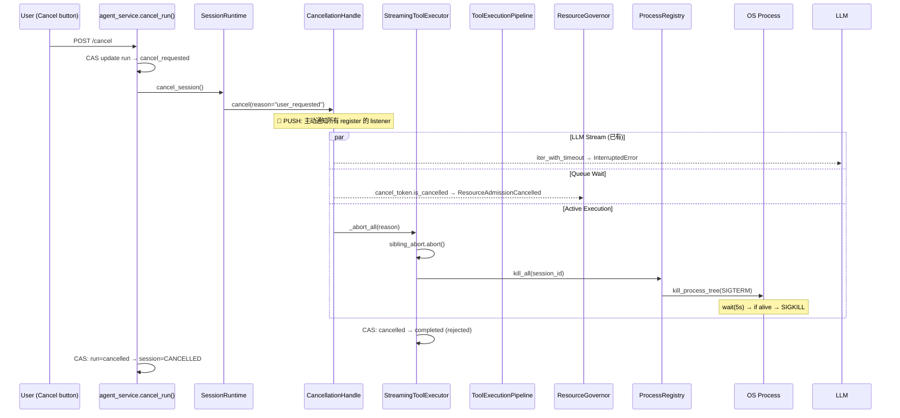

# P0 #3: Cancellation & Abort Pipeline — CC-Native 重构设计

> 设计版本: v1.0 | 日期: 2026-08-01
> 对标: Claude Code `StreamingToolExecutor.ts` + `AbortController` pattern + sibling abort
> 状态: 深度调研完成 → 设计规范

---

## 1. 调研与质询记录

### 1.1 搜索摘要

Claude Code 的取消管线由五个协同机制组成：

**A. Generator-Based 级联传播** (CC 的核心创新):
- 整个流式管线 (API SSE → `callModel()` → `query()` → `QueryEngine` → REPL → Ink renderer) 由嵌套的 `async function*` generator 构成
- 调用 `.return()` 在顶层 generator → **自动级联关闭所有嵌套 generator**
- 取消传播是架构的一等公民，不是后加的"检查点"

**B. AbortController 多层部署**:
- 每个 `ToolUseContext` 暴露 `abortController` → 工具内部可检查 `signal.aborted`
- `StreamingToolExecutor` 持有全局 `AbortController` → 用户取消时触发
- `abortChildProcess()` (Node.js `child_process` 内部) → 将 AbortSignal 映射为 SIGINT/SIGTERM
- 堆栈确认: `AbortController.abort()` → `abortSignal` → `EventTarget.dispatch` → `abortChildProcess` → `AbortError`

**C. Sibling Abort (Fail-Fast)**:
- 如果同一 batch 中任一 tool 严重失败 (如 Bash error)，`siblingAbortController.abort()` → 终止所有 in-flight 并行 tool
- 不再调度队列中的 tool
- 设计理由: 后续 tool 可能依赖失败 tool 的输出

**D. 模型回退时的 Fresh Executor**:
- 如果 mid-stream 发生模型回退，`discard()` 机制丢弃所有 pending/in-progress tool call
- **全新 `StreamingToolExecutor` 实例** — 旧的 `tool_use_id` 被 scope 到原模型会话
- 防止: 旧 tool_use_id 污染新模型上下文

**E. 子 Agent/Teammate 联动取消**:
- 子 Agent: 父取消级联到子 (深度最大 3)
- Teammate: 双级 `AbortController` — `abortController` 杀整个 teammate，`currentWorkAbortController` 仅取消当前 turn

### 1.2 质询应答

**Q1: CC 在该模块的核心设计哲学是什么？**

CC 的取消哲学是 **"信号即行为"**，不把取消当成"可以稍后检查的状态标记"。`AbortController.abort()` 不是设置一个 boolean——它**主动执行**清理: `abortChildProcess()` 立即发 SIGINT，generator `.return()` 立即级联关闭整个流式管线。我们的问题恰恰是把取消实现为"检查 threading.Event 然后 return"——把信号降级成了状态。

**Q2: 当前实现与 CC 的根本差异是"实现细节"还是"架构范式"？**

架构范式差异:
1. CC 的取消是 **push-based** (AbortController 主动中断执行)，我们是 **poll-based** (每 0.1s 检查 `threading.Event`)
2. CC 的取消有 **级联语义** (generator `.return()` 穿透嵌套)，我们是 **单点检查** (仅在 batch 边界)
3. CC 有 **故障隔离** (sibling abort, fresh executor)，我们没有——一个 tool 失败继续跑 batch 中其他 tool
4. CC 的 `abortChildProcess` 直接对接 OS 进程信号，我们仅更新 Python 枚举值

**Q3: 如果完全照搬 CC 的设计，我们的技术栈/运行环境是否存在硬性阻碍？**

- Python 无 `async function*` generator 的 `.return()` 级联 → 使用 `asyncio.Task.cancel()` 等价替代 (Python 的 TaskGroup 和 cancel propagation 是标准化的)
- Python 无 `AbortController`/`AbortSignal` 浏览器 API → 设计等价的 `CancellationHandle` 类，包装 `threading.Event` + `kill_process()` 回调
- `subprocess.Popen` 的跨平台 kill → 已有 `kill_process_tree()` 实现，直接复用
- 其余设计可直接移植

**Q4: 这个设计是否引入了隐式依赖？**

`CancellationPipeline` (新设计) 的依赖方向:
- 依赖: `CancellationHandle` (接口)、`ProcessRegistry` (进程注册表)
- 不感知: Tool 具体实现、MCP 传输协议、LLM Backend、Session 数据库
- 可独立测试: mock `ProcessRegistry` → 验证 cancel 调用 `process.kill()`

**Q5: 已知陷阱？**

- SDK Bug (#2970): `query({ abortController })` 不生效但 `query({ options: { abortController } })` 生效 → 教训: 取消信号的传递路径必须是类型约束的，不能靠 convention
- 子 Agent AbortError 导致缺失 `tool_result` block (#5470) → 教训: 取消后的清理必须保证 API message format invariants
- 进程 shim 吞 SIGINT → 教训: 不能假设子进程正确处理信号，时序到了直接 kill (SIGKILL)

### 1.3 决策依据

**选择全量重构而非修补**的理由:
1. `_cancel_executing()` 改为 "更新 status + kill process + cancel future" 是不够的——它仍然把取消视为 StreamingExecutor 的内部职责，而非穿透全栈的第一等信号
2. 当前 poll-based 模式 (每 0.1s 检查) 永远无法解决"tool 内部阻塞在 communicate()"的问题——只有 push-based 模式 (后台监视线程 + 主动 kill) 能解决
3. sibling abort 和 fresh executor 是缺失的一等概念——需要新建而非修补

---

## 2. CC-Native 设计规范

### 2.1 架构图



### 2.2 核心接口

```python
# === 取消信号: CancellationHandle ===

from __future__ import annotations
from dataclasses import dataclass, field
from typing import Callable
import threading

@dataclass
class CancellationHandle:
    """CC-Native 取消信号 — push-based，非 poll-based。

    对标 CC 的 AbortController + AbortSignal。
    关键差异 vs 当前 CancellationToken:
    1. cancel() 主动调用所有 register 的回调 (push)
    2. 回调包括: kill_process, cancel_future, abort_siblings
    3. 不可逆 — 一旦 cancel，永远 cancelled
    """

    _reason: str = ""
    _detail: str = ""
    _event: threading.Event = field(default_factory=threading.Event)
    _on_cancel_callbacks: list[Callable[[str], None]] = field(default_factory=list)
    _parent: CancellationHandle | None = None
    _children: list[CancellationHandle] = field(default_factory=list)
    _lock: threading.Lock = field(default_factory=threading.Lock)

    @property
    def is_cancelled(self) -> bool:
        """检查父链上是否有任何 handle 已取消。"""
        return self._event.is_set() or (self._parent is not None and self._parent.is_cancelled)

    @property
    def reason(self) -> str:
        return self._reason or (self._parent.reason if self._parent else "")

    def cancel(self, reason: str = "", detail: str = "") -> None:
        """PUSH — 不可逆取消。

        1. 锁内: 设置 Event + 快照 callbacks + 快照 children (O(1) 状态交换)
        2. 锁外: 执行所有 callbacks + 级联到 children
        规则: 回调在锁外执行，防止回调中 unregister/register/child() 死锁。
        """
        callbacks_snapshot: list[Callable[[str], None]]
        children_snapshot: list[CancellationHandle]

        with self._lock:
            if self._event.is_set():
                return
            self._reason = reason
            self._detail = detail
            self._event.set()
            callbacks_snapshot = list(self._on_cancel_callbacks)
            children_snapshot = list(self._children)

        # 锁外执行 — 回调安全
        for cb in callbacks_snapshot:
            try:
                cb(reason)
            except Exception:
                pass

        for child in children_snapshot:
            child.cancel(reason=reason, detail=detail)

    def on_cancel(self, callback: Callable[[str], None]) -> Callable[[], None]:
        """注册取消回调。返回 unregister 函数。

        对标 CC: AbortSignal.addEventListener('abort', callback)
        规则: 如果已取消，在锁外调用 callback (不在锁内)。
        """
        already_cancelled = False
        cached_reason = ""

        with self._lock:
            already_cancelled = self._event.is_set()
            cached_reason = self._reason
            if not already_cancelled:
                self._on_cancel_callbacks.append(callback)

        if already_cancelled:
            # 锁外调用 — 防止死锁
            callback(cached_reason)

        def unregister():
            with self._lock:
                try:
                    self._on_cancel_callbacks.remove(callback)
                except ValueError:
                    pass
        return unregister

    def child(self) -> CancellationHandle:
        """创建子 Handle — 父取消级联到子。

        对标 CC: linked AbortController for sub-agents
        """
        child = CancellationHandle(_parent=self)
        with self._lock:
            if self._event.is_set():
                # 父已取消 → 子立即取消
                child._reason = self._reason
                child._detail = self._detail
                child._event.set()
            else:
                self._children.append(child)
        return child


# === 进程注册表: ProcessRegistry ===

@dataclass
class ProcessHandle:
    """运行中进程的句柄 — 允许外部 kill。

    键空间: session_id + generation + run_id + invocation_id
    最低隔离单位为 run — 旧 run 的延迟取消不能误杀新 generation 的进程。
    """
    pid: int
    session_id: str
    generation: int
    run_id: str
    invocation_id: str
    process: subprocess.Popen
    created_at: float

class ProcessRegistry:
    """活跃进程注册表 — 取消时提供 kill 能力。

    隔离规则:
    - kill_run():  终止特定 run 的所有进程 (工具取消的默认范围)
    - kill_one():  终止单个 invocation (精确取消)
    - kill_session(): 终止整个 session (session 级 abort, 仅用于极端场景)

    不感知:
    - 工具类型 (shell/MCP/custom)
    - 执行策略 (parallel/serial)
    - 权限/HITL
    """

    def __init__(self): ...

    def register(self, handle: ProcessHandle) -> None: ...
    def unregister(self, invocation_id: str) -> None: ...

    def kill_run(
        self,
        session_id: str,
        generation: int,
        run_id: str,
        *,
        escalate: bool = True,
    ) -> int:
        """终止指定 run 的所有进程。返回终止数量。

        工具取消的默认范围 — 不跨 run 扩散。
        escalate=True: SIGTERM → wait(5s) → SIGKILL
        """
        ...

    def kill_one(self, invocation_id: str) -> bool: ...

    def kill_session(
        self,
        session_id: str,
        *,
        generation: int | None = None,
        escalate: bool = True,
    ) -> int:
        """终止指定 session 的所有进程。返回终止数量。

        仅用于 session 级 abort (用户主动关闭会话)。
        generation 可选 — 不传则终止所有 generation。
        """
        ...


# === 执行管线: CancellableToolPipeline ===

@dataclass
class ToolExecutionContext:
    """单次工具执行的上下文 — 携带取消信号。

    对标 CC: ToolUseContext.abortController
    """
    invocation_id: str
    session_id: str
    cancellation: CancellationHandle
    process_registry: ProcessRegistry
    timeout_s: float | None = None

class CancellableToolPipeline:
    """CC-Native 工具执行管线 — 取消信号端到端传播。

    对标 CC: checkPermissionsAndCallTool() 8-stage pipeline
    关键增强:
    1. 每个阶段可被取消中断
    2. ResourceGovernor 取消后立即释放 admission
    3. 进程通过 ProcessRegistry 注册 → 取消时 kill
    4. Side-effect 标记: UNKNOWN (非 FAILED) 超时/取消
    """

    async def execute(
        self,
        tool: BaseTool,
        params: dict,
        context: ToolExecutionContext,
    ) -> ToolResult:
        """执行工具，全程响应取消信号。

        阶段:
        1. cancellation check → AbortError?
        2. ResourceGovernor.admit_wait(cancel_token=cancellation)
        3. cancellation check → AbortError?
        4. tool.execute(params)
        5. result processing
        6. post-hooks
        """
        ...


# === 失败策略: FailurePolicy ===

from enum import Enum, auto

class FailurePolicy(Enum):
    """同批 tool 失败时的处理策略。

    对标 CC: sibling abort (FAIL_FAST) vs independent read-only tools (CONTINUE_INDEPENDENT)
    CC 的 isConcurrencySafe 模式: 只读 tool 之间不需要 abort。
    """
    FAIL_FAST = auto()              # 一个失败 → 全部取消 (事务型批次)
    CONTINUE_INDEPENDENT = auto()   # 独立 tool 各自完成 (并行只读)
    ABORT_DEPENDENTS = auto()       # 仅取消依赖失败 tool 的其他 tool (默认)

# === 执行器: CancellableStreamingExecutor ===

class CancellableStreamingExecutor:
    """CC-Native 流式工具执行器 — 对标 StreamingToolExecutor.ts。

    关键增强:
    1. 接收 CancellationHandle → 部署到所有 worker
    2. Sibling Abort as Policy: 默认 ABORT_DEPENDENTS; 用户取消时无条件 abort all
    3. Fresh Executor on Model Fallback: 旧 tool_use_id 不泄漏
    4. Ordered Result Output: 结果按请求顺序发出
    5. CAS 终态: cancelled → completed 被拒绝
    """

    def __init__(
        self,
        registry: ToolRegistry,
        cancellation: CancellationHandle,
        process_registry: ProcessRegistry,
        *,
        max_workers: int = 8,
        failure_policy: FailurePolicy = FailurePolicy.ABORT_DEPENDENTS,
    ): ...

    def dispatch(self, tool_calls: list[ToolCall]) -> DispatchResult: ...
    async def collect(self) -> list[ToolResult]: ...
    def abort_all(self, reason: str) -> None:
        """无条件终止所有 in-flight 执行。

        仅用于:
        - 用户主动取消 (CancellationHandle.cancel)
        - Session 级 abort
        不用于工具级别的 sibling abort (由 FailurePolicy 控制)。
        """
        ...


# === Agent 核心集成 ===

class CancellationOrchestrator:
    """取消编排器 — Agent 主循环与 Session 运行时的桥梁。

    对标 CC: QueryEngine 中的 abort 集成
    """

    @staticmethod
    def create_for_session(session_id: str, generation: int) -> CancellationHandle: ...

    @staticmethod
    def wire_to_agent_loop(
        agent: ReActAgent,
        handle: CancellationHandle,
        process_registry: ProcessRegistry,
    ) -> None:
        """将取消信号接入 Agent 主循环。

        部署点:
        1. LLM streaming: iter_with_timeout
        2. Between tool batches (已有)
        3. StreamingExecutor: CancellableStreamingExecutor
        4. Sub-agent spawn: handle.child()
        """
        ...
```

### 2.3 解耦矩阵

| 本模块 | Tool 实现 | Session Store | LLM Backend | MCP Transport | HITL Pipeline |
|--------|----------|---------------|-------------|---------------|---------------|
| `CancellationHandle` | 不感知 | 不感知 | 不感知 | 不感知 | 不感知 |
| `ProcessRegistry` | 不感知 | 不感知 | 不感知 | 不感知 | 不感知 |
| `CancellableToolPipeline` | 仅通过 `BaseTool` 接口 | 不感知 | 不感知 | 不感知 | 通过 permission check (已有) |
| `CancellableStreamingExecutor` | 仅通过 `ToolRegistry` | 不感知 | 不感知 | 不感知 | 不感知 |
| `CancellationOrchestrator` | 不感知 | 仅用 `session_id` | 不感知 | 不感知 | 不感知 |

**关键设计原则**: 取消信号是**控制面基础设施**，不是业务逻辑。任何模块都可以创建 `CancellationHandle`、register 进程到 `ProcessRegistry`、或在 `on_cancel` 中注册清理回调。不依赖特定的 executor 或 pipeline 实现。

### 2.4 废弃清单

| 文件 | 废弃项 | 原因 |
|------|--------|------|
| `core/streaming_executor.py` | `_cancel_executing()` 仅改状态 | 替换为 `abort_all()` — 主动 kill process + cancel future |
| `core/streaming_executor.py` | `_execute_one()` 无取消检查 | 替换为 `CancellableStreamingExecutor` |
| `core/tool_execution.py` | `_execute_once()` `cancel_token` 永远 None | 替换为 `CancellableToolPipeline` — cancel_token 强制传入 |
| `core/resource_governor.py` | `ResourceRequest.cancel_token` 字段存在但无填充 | 管线现在强制填充 |
| `agent/session/run_context.py` | `CancellationToken` poll-based 类 | 替换为 `CancellationHandle` push-based 类 |
| `agent/loop/turns.py` | `execute_action()` 不传 cancel token | 替换为传入 `ToolExecutionContext` |
| `server/services/agent_service.py` | `cancel_run()` CAS 结果忽略 | 替换为 CAS 检查 + 事务性 run+session 更新 |
| `tools/shell_tool.py` | shell 字符串拼接 | 替换为原生 argv 模式 (shell mode 显式 opt-in) |

---

## 3. 分阶段开发路线图

### Batch 1: First Implementation (严格范围 — 5.5 人日)

第一批**只交付**取消基础设施的核心组件。不做 Shell argv 重构、不做通用超时、不做旧代码删除。

| 阶段 | 目标 | 交付物 | 前置依赖 | 预估工时 | 回滚方案 |
|------|------|--------|---------|---------|---------|
| **B1-P1** | CancellationHandle + ProcessRegistry | `core/cancellation.py`: `CancellationHandle` (锁安全), `ProcessHandle` (4 字段键), `ProcessRegistry` (kill_run + kill_one + kill_session) | None | 2 人日 | 新旧 Handle 并排；Agent 通过 `USE_CANCELLATION_HANDLE` flag 选择 |
| **B1-P2** | 旧新 token 适配器 | `core/cancellation_adapter.py`: 将旧 `CancellationToken` 转换为 `CancellationHandle` (旧代码不改动，适配器桥接) | B1-P1 | 0.5 人日 | 适配器本身作为回滚点 — 不传适配器则走旧路径 |
| **B1-P3** | 终态 CAS | `core/streaming_executor.py`: `_execute_one()` 中 CAS 保护 cancelled → completed 拒绝；`agent_service.py`: `cancel_run()` CAS 检查 | B1-P1 | 1.5 人日 | CAS 逻辑新增独立函数，旧路径在 flag 关闭时不变 |
| **B1-P4** | 三个关键测试 | `test_cancel_kills_active_process`; `test_cancelled_not_overwritten_by_completed`; `test_old_run_does_not_kill_new_run` | B1-P3 | 1.5 人日 | 无回滚 — 测试独立 |

**Batch 1 交付物验证**:
- [ ] 用户取消 Shell 进程 → 进程在 5s 内终止 (`kill_run` 精确范围)
- [ ] 取消后的 completed 更新被 CAS 拒绝 (状态不分裂)
- [ ] 旧 run 的延迟取消不误杀同 session 新 run (generation + run_id 隔离)

### Batch 2+: 剩余阶段 (按需排期)

| 阶段 | 目标 | 交付物 | 前置依赖 | 预估工时 | 回滚方案 |
|------|------|--------|---------|---------|---------|
| **P2** | CancellableToolPipeline | `core/cancellable_pipeline.py` | B1-P1 | 1.5 人日 | 旧 pipeline 保留 |
| **P3** | CancellableStreamingExecutor | `core/cancellable_executor.py` + `FailurePolicy` | P2 | 2 人日 | 旧 executor 保留 |
| **P4** | Shell argv + workspace fail-closed | `tools/shell_tool.py` | None | 1 人日 | 旧 shell 保留 |
| **P5** | Agent 集成 + CAS | `CancellationOrchestrator`；`agent_service.py` | P1, P3 | 2 人日 | flag 控制 |
| **P6** | 通用超时 | `BaseTool.execution_timeout` | P2 | 1 人日 | 默认无超时 |
| **P7** | 旧代码删除 | 删除 `CancellationToken` 等 | P5, P6 | 0.5 人日 | Git revert |
| **P8** | 完整测试套件 | 10 个测试 | P5, P7 | 2 人日 | 无回滚 |

**总工时**: Batch 1: 5.5 人日 | 全量: 11.5 人日

---

## 4. 验收标准清单

### B1-P1: CancellationHandle + ProcessRegistry

- [ ] **AC-1.1**: `handle.cancel("test")` → callbacks 在锁外执行 (验证: callback 内部可调用 `handle.on_cancel()` 不产生死锁)
- [ ] **AC-1.2**: 已取消后注册的 callback 立即在锁外触发 (不在 `on_cancel()` 内部持锁调用)
- [ ] **AC-1.3**: `parent.cancel()` → `child.is_cancelled` 为 True；深度 > 3 的孙子不被级联
- [ ] **AC-1.4**: `parent.cancel()` 时父已取消 → `child()` 返回已取消的 child (不挂到父 children)
- [ ] **AC-1.5**: callback 抛异常不影响其他 callback 和 cancel 传播
- [ ] **AC-1.6**: `ProcessRegistry.kill_run(session_id, generation, run_id)` 仅终止该 run 的进程；不同 run 不受影响；不同 generation 不受影响
- [ ] **AC-1.7**: SIGTERM → wait(5s) → 进程仍存活 → SIGKILL (escalate 验证)

### B1-P2: 旧新 token 适配器

- [ ] **AC-2.1**: 旧 `CancellationToken` 通过适配器 → `CancellationHandle` 可以传播 cancel 信号 (旧代码零改动)
- [ ] **AC-2.2**: 未传适配器 → 所有行为与旧代码完全一致 (向后兼容)

### B1-P3: 终态 CAS

- [ ] **AC-3.1**: `_execute_one()`: tool completed 后检查 status ≠ CANCELLED → 才写 COMPLETED (CAS)
- [ ] **AC-3.2**: `cancel_run()`: CAS `expect_status="running"` 失败 → 不更新 session 状态，返回 False
- [ ] **AC-3.3**: run=CANCELLED 且 session=CANCELLED 在同一事务/原子操作链内完成

### P4: Shell argv 模式

- [ ] **AC-4.1**: `command="echo", args=["; rm -rf /"]` → 参数 `; rm -rf /` 作为 argv[1] 字面传递，不被 shell 解释
- [ ] **AC-4.2**: `use_shell=True` + HITL 高风险审批 (显式 opt-in)
- [ ] **AC-4.3**: workspace root 缺失 → 拒绝执行并报 `WorkspaceRootRequired` 错误

### P5: Agent 核心 + Session Runtime

- [ ] **AC-5.1**: 用户取消 → `CancellationHandle.cancel()` → `iter_with_timeout` 抛 `InterruptedError` (已有)
- [ ] **AC-5.2**: 用户取消 → tool 正在执行 → 子进程被 kill (新增)
- [ ] **AC-5.3**: `cancel_run()` CAS 失败 (run 已完成) → session 状态不变；返回 False
- [ ] **AC-5.4**: run=CANCELLED 且 session=CANCELLED 在同一事务内更新 (或明确关联的 CAS 链)

### P6: 通用超时

- [ ] **AC-6.1**: `BaseTool.execution_timeout = 30` → 30s 后 `CancellableToolPipeline` 触发 `handle.cancel("timeout")`
- [ ] **AC-6.2**: 超时 → `ToolResult.side_effect = SideEffect.UNKNOWN` (非 FAILED — 因为不知是否已成功)
- [ ] **AC-6.3**: 未设置 `execution_timeout` → 行为不变 (默认无超时)

### P7: 旧代码删除

- [ ] **AC-7.1**: `agent/session/run_context.py` 不存在 `class CancellationToken`
- [ ] **AC-7.2**: `core/streaming_executor.py` 中 `_cancel_executing` 被删除
- [ ] **AC-7.3**: `tools/shell_tool.py` 中不存在字符串拼接 command+args

### P8: 端到端测试

- [ ] **AC-8.1**: `test_cancel_kills_active_shell_process()` — sleep 60 → cancel → 进程在 5s 内不存在
- [ ] **AC-8.2**: `test_cancel_before_execution_skips_tool()` — 取消信号已 set → tool 不执行
- [ ] **AC-8.3**: `test_cancel_during_queue_wait_releases_slot()` — admit_wait 排队被取消后释放 slot
- [ ] **AC-8.4**: `test_sibling_abort_on_tool_failure()` — batch 中 1 个失败 → 其余被取消
- [ ] **AC-8.5**: `test_cas_prevents_cancelled_to_completed()` — 取消后完成更新被拒绝
- [ ] **AC-8.6**: `test_cancel_cas_failure_preserves_session()` — 已完成的 run 取消失败
- [ ] **AC-8.7**: `test_shell_argv_no_command_injection()` — 含特殊字符的参数不被解释
- [ ] **AC-8.8**: `test_toohttps://platform.openai.com/docs/guides/structured-outputs` — 超时 → 副作用 UNKNOWN
- [ ] **AC-8.9**: `test_sub_agent_cancel_cascades_from_parent()` — 父取消 → 子 Agent 也取消
- [ ] **AC-8.10**: `test_fresh_executor_on_model_fallback()` — 模型回退 → tool_use_id 不跨 executor 泄漏
