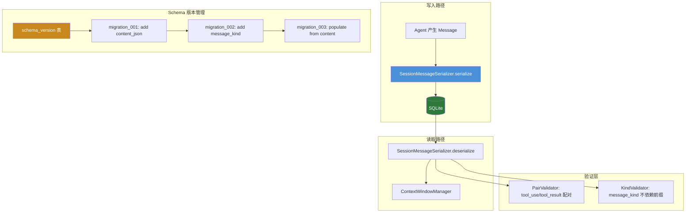

# P0 #4: Session 结构化消息序列化 — CC-Native 重构设计

> 设计版本: v1.0 | 日期: 2026-08-01
> 对标: Claude Code JSONL transcript + content block array + schema versioning
> 状态: Step 1 深度调研完成 → Step 2 设计规范

---

## 1. 调研与质询记录

### 1.1 搜索摘要

**A. CC 的消息持久化格式**

Claude Code 使用 **JSONL append-only 文件** 存储会话转录 (transcript)，NOT SQLite：
- `~/.claude/projects/{encoded-path}/{sessionId}.jsonl` — 主会话
- `~/.claude/projects/{encoded-path}/agent-{agentId}.jsonl` — 子 Agent
- 每行一个 JSON 对象 (typed entry)，通过 `parentUuid` 链接成因果链

每个 entry 包含结构化 `message.content` **数组**，而非字符串：
```json
{
  "type": "assistant",
  "uuid": "...",
  "parentUuid": "...",
  "message": {
    "model": "claude-sonnet-4-5-20250929",
    "content": [
      {"type": "text", "text": "I'll search for that."},
      {"type": "tool_use", "id": "toolu_xxx", "name": "Grep", "input": {...}}
    ],
    "stop_reason": "tool_use",
    "usage": {"input_tokens": 500, "output_tokens": 50}
  }
}
```

关键消息类型区分：
| 类型 | 持久化 | 说明 |
|------|--------|------|
| UserMessage | ✅ | 用户输入 + tool result |
| AssistantMessage | ✅ | 模型响应 + tool call |
| AttachmentMessage | ✅ | Memory/Skill 上下文 |
| SystemMessage | ✅ | 压缩边界、错误 |
| ProgressMessage | ❌ | 瞬态进度 UI |
| TombstoneMessage | ❌ | 已处理的撤回 |

**B. SQLite 生态实践**

虽然 CC 本身不用 SQLite 存转录，但生态中有成熟的 SQLite 实现：
- **HumanLayer Daemon**: `conversation_events` 表，22 个增量 migration，`schema_version` 表
- **claude-code-analytics**: 从 JSONL 导入 SQLite，含 FTS5 全文索引
- **fable**: 混合方案 — JSONL 作 raw truth + SQLite Map 作索引

共同原则：
- **Schema versioning**: `schema_version` 表 + 增量 migration + 幂等
- **Message kind 列**: 类型枚举，不依赖内容前缀判断
- **content_json**: 结构化 JSON，不依赖 `str()` 转换

**C. 崩溃恢复机制**

CC 的 resume 流程：
1. 读取 JSONL transcript → 重构 parentUuid 因果链
2. 恢复 file history (checkpoint 快照)
3. 恢复 attribution state (谁修改了什么)
4. 恢复 TodoWrite state
5. 恢复 agent settings + worktree state
6. 切换 session ID → 继续执行

`--continue`: 上一个会话
`--resume <id>`: 指定会话
`--resume <id> --fork-session`: fork 新会话

**D. 已知陷阱**

1. **`/clear` 破坏会话连续性** (Issue #9352): `/clear` 后 session 被永久孤立
2. **Checkpoint restore 失败** (Issue #15403): 外部备份文件引用格式变更后 `/rewind` 不工作
3. **tool_use/tool_result 配对破坏** (zeph #1360): 恢复时配对错误 → API 400
4. **schema migration 不可逆**: 必须幂等 + `IF NOT EXISTS` + 验证步骤

### 1.2 质询应答

**Q1: CC 在该模块的核心设计哲学是什么？**

CC 的设计哲学是 **"转录即事实源"** (Transcript as Source of Truth)。JSONL 是 append-only、WAL-style 的持久化格式 — 简单、可重放、跨版本兼容。SQLite 是**可选的加速层** (用于查询/分析)，不是事实源本身。核心原则：**消息内容必须是结构化数组**，永远不降级为字符串。

**Q2: 当前实现与 CC 的根本差异是"实现细节"还是"架构范式"？**

架构范式差异：
1. CC: 消息内容 = `list[ContentBlock]` 结构化数组 → 我们: `str(message.content)` 字符串化
2. CC: 消息类型 = 枚举 (user/assistant/system/attachment) → 我们: 按 `role` 字符串推断, 且非 user 角色被统一恢复为 assistant
3. CC: schema versioning = `schema_version` 表 + 22 次增量 migration → 我们: 无版本管理
4. CC: 崩溃恢复 = JSONL 重放 + 状态重构 → 我们: orphan run 直接标记失败

**Q3: 如果完全照搬 CC 的设计，我们的技术栈是否存在硬性阻碍？**

- SQLite 替代 JSONL: 非硬性阻碍 — CC 生态已有成熟 SQLite 实现 (HumanLayer 22 migrations)
- 结构化内容: `content_json TEXT` 列存 JSON，读写时序列化/反序列化 — 标准做法
- Schema versioning: `schema_version` 表 + 增量 SQL 文件 — 可工程化
- 崩溃恢复: 需要 checkpoint 机制 (见 P0_3 的 step checkpoint)，不能仅靠消息格式修复

**Q4: 这个设计是否引入了隐式依赖？**

`SessionMessageSerializer` (新设计) 的依赖方向：
- 依赖: `ContentBlock` 类型定义 (已在 context 层)
- 不感知: LLM Backend、MCP Transport、Tool Registry、HITL Pipeline
- 可独立测试: 序列化/反序列化 → 验证 content block 类型不丢失

**Q5: 已知陷阱？**

1. **tool_use/tool_result 配对破坏**: 恢复时必须保证每个 `tool_use` 紧邻 `tool_result` → 反序列化时做 pairing validation
2. **不可逆迁移**: 旧 `content TEXT` → 新 `content_json TEXT` → 迁移必须幂等 + 可回退
3. **cache_control block**: Anthropic prompt cache marker — 恢复后应保留或安全丢弃 (不影响语义)
4. **并发写入**: SQLite WAL mode 已缓解，但 JSONL append-only 更简单

### 1.3 决策依据

**选择增量迁移而非推倒重来**的理由：
1. SQLite 已经是项目的基础设施 (session, message, archive, compaction, notification, trace 表)
2. 生态中 HumanLayer 的 22-migration SQLite 方案证明了 SQLite 持久化结构化消息的可行性
3. 核心问题是 `str(message.content)` 丢失了类型信息 — 修复只需要: 加 `content_json` 列 + `message_kind` 列 + schema_version
4. JSONL 是更好的长期方案，但切换成本 (全部读写路径 + 工具链) 超出本轮 P0 范围

---

## 2. CC-Native 设计规范

### 2.1 架构图



### 2.2 核心接口

```python
# === MessageKind 枚举 (替代字符串 role 推断) ===

from enum import StrEnum

class MessageKind(StrEnum):
    USER = "user"
    ASSISTANT = "assistant"
    TOOL_RESULT = "tool_result"
    SYSTEM = "system"
    ATTACHMENT = "attachment"


# === 序列化器 ===

@dataclass
class SerializedMessage:
    """一条消息的持久化表示。"""
    id: str
    session_id: str
    role: str                          # 保留兼容
    kind: MessageKind                  # 精确类型
    content_json: str                  # JSON 序列化的 ContentBlock[]
    content_text: str                  # 纯文本摘要 (向后兼容 + 搜索)
    tool_call_id: str | None = None    # 关联 tool_use
    metadata_json: str = "{}"          # 扩展元数据
    created_at: str = ""               # ISO 8601


class SessionMessageSerializer:
    """CC-Native 消息序列化器。

    不感知: LLM Backend, MCP Transport, Tool Registry, HITL
    """

    @staticmethod
    def serialize(message: LLMMessage, *, kind: MessageKind | None = None) -> SerializedMessage:
        """LLMMessage → SerializedMessage (结构化 JSON)。

        content 序列化为 JSON 数组:
        [
          {"type": "text", "text": "..."},
          {"type": "tool_use", "id": "...", "name": "...", "input": {...}},
          {"type": "image", "source": {...}}
        ]
        """
        ...

    @staticmethod
    def deserialize(entry: dict) -> LLMMessage:
        """数据库行 → LLMMessage (完整 ContentBlock 数组)。

        优先读取 content_json；旧数据回退到 content_text (纯文本)。
        """
        ...

    @staticmethod
    def validate_pairs(messages: list[LLMMessage]) -> list[str]:
        """验证 tool_use/tool_result 配对完整性。
        返回错误列表 (空 = 通过)。
        """
        ...


# === Schema Versioning ===

@dataclass
class SchemaMigration:
    version: int
    name: str
    sql: str                          # 幂等 SQL (含 IF NOT EXISTS)

SCHEMA_MIGRATIONS: list[SchemaMigration] = [
    SchemaMigration(1, "add_content_json", """
        ALTER TABLE messages ADD COLUMN content_json TEXT DEFAULT NULL;
    """),
    SchemaMigration(2, "add_message_kind", """
        ALTER TABLE messages ADD COLUMN message_kind TEXT DEFAULT NULL;
    """),
    SchemaMigration(3, "populate_message_kind", """
        UPDATE messages SET message_kind =
            CASE
                WHEN role = 'user' AND tool_call_id IS NOT NULL THEN 'tool_result'
                WHEN role = 'user' THEN 'user'
                WHEN role = 'assistant' THEN 'assistant'
                WHEN role = 'system' THEN 'system'
                ELSE 'user'
            END
        WHERE message_kind IS NULL;
    """),
]


class SchemaMigrator:
    """幂等 schema 迁移器。"""

    def __init__(self, db_path: str): ...

    def ensure_latest(self) -> int:
        """应用所有未应用的迁移。返回当前版本。"""
        ...

    def current_version(self) -> int: ...
```

### 2.3 解耦矩阵

| 本模块 | LLM Backend | Context | Tools | MCP | HITL |
|--------|-------------|---------|-------|-----|------|
| `SessionMessageSerializer` | 不感知 | 不感知 | 不感知 | 不感知 | 不感知 |
| `SchemaMigrator` | 不感知 | 不感知 | 不感知 | 不感知 | 不感知 |
| `MessageKind` | 不感知 | 不感知 | 不感知 | 不感知 | 不感知 |

### 2.4 废弃清单

| 文件 | 废弃项 | 原因 |
|------|--------|------|
| `agent/session/session_store.py:638` | `str(message.content)` | 替换为 `MessageSerializer.serialize()` → `content_json` |
| `agent/session/session_store.py:780` | `[SYSTEM]`, `[Conversation compacted` 前缀过滤 | 替换为 `message_kind` 列查询 |
| `agent/session/session_store.py:817` | 非 user 角色统一恢复为 assistant | 替换为 `message_kind` 精确恢复 |

---

## 3. 分阶段开发路线图

| 阶段 | 目标 | 交付物 | 前置依赖 | 工时 | 回滚 |
|------|------|--------|---------|------|------|
| P1 | Schema migration 基础设施 | `SchemaMigrator` + `schema_version` 表 + 3 个 migration | None | 1 人日 | Migration 幂等; 旧列保留 |
| P2 | MessageSerializer | `SessionMessageSerializer` + `MessageKind` 枚举 | P1 | 1.5 人日 | 新旧序列化并行 1 release |
| P3 | SessionStore 适配 | `append_message()` 使用 Serializer; `list_messages()` 优先 content_json | P2 | 1 人日 | `content_text` 始终保留为 fallback |
| P4 | 前缀过滤替换 | 消息过滤基于 `message_kind` 列, 不再依赖内容前缀 | P2 | 0.5 人日 | 旧前缀逻辑保留但跳过 (kind 存在时) |
| P5 | 测试 | 序列化往返、pair validation、schema 迁移幂等性、旧数据兼容 | P3, P4 | 2 人日 | 无回滚 |

**总工时**: 6 人日

---

## 4. 验收标准清单

### P1: Schema Migration

- [ ] **AC-1.1**: `SchemaMigrator.ensure_latest()` 在空 DB 上创建 `schema_version` 表且 version=3
- [ ] **AC-1.2**: 重复调用 `ensure_latest()` 不重复执行已应用的 migration
- [ ] **AC-1.3**: 旧 DB (无 `content_json`, `message_kind` 列) 经过 migration 后可正常读写新列

### P2: MessageSerializer

- [ ] **AC-2.1**: `serialize(assistant_msg_with_tool_use)` → `content_json` 包含 `[{"type":"text","text":"..."},{"type":"tool_use",...}]`
- [ ] **AC-2.2**: `deserialize(content_json=上述JSON)` → `LLMMessage.content` 是 `list[ContentBlock]` (非字符串)
- [ ] **AC-2.3**: 旧数据 (仅 `content_text`, 无 `content_json`) → `deserialize` 回退为纯文本 LLMMessage
- [ ] **AC-2.4**: `validate_pairs()`: 缺少 tool_result 的 tool_use → 返回错误; 完整配对 → 返回空列表

### P3: SessionStore 适配

- [ ] **AC-3.1**: `append_message()` 持久化 `content_json` (JSON 数组) + `content_text` (摘要) + `message_kind` (枚举)
- [ ] **AC-3.2**: `list_messages()` 恢复时 content 为结构化数组 (非 `str()` 表示)
- [ ] **AC-3.3**: 包含 image block 的消息 → 恢复后 image block 保留 (不丢失)

### P4: 前缀过滤替换

- [ ] **AC-4.1**: 用户输入以 `[SYSTEM]` 开头 → 不被错误过滤 (基于 `message_kind='user'` 判断)
- [ ] **AC-4.2**: `message_kind='system'` → 被过滤 (无论内容前缀)

### P5: 测试

- [ ] **AC-5.1**: `test_roundtrip_text_message` — 纯文本消息序列化往返完整
- [ ] **AC-5.2**: `test_roundtrip_tool_use_message` — tool_use 消息往返, tool_use block 保留
- [ ] **AC-5.3**: `test_roundtrip_image_message` — image block 往返不丢失
- [ ] **AC-5.4**: `test_old_data_fallback` — 仅 content_text 的旧数据 → deserialize 为纯文本
- [ ] **AC-5.5**: `test_pair_validation_catches_missing_tool_result` — 配对验证检测到缺失
- [ ] **AC-5.6**: `test_migration_idempotent` — 重复 migration 不报错
- [ ] **AC-5.7**: `test_message_kind_filter_excludes_system` — system 消息被正确过滤
- [ ] **AC-5.8**: `test_user_message_starting_with_system_prefix_not_filtered` — `[SYSTEM]` 开头的用户消息不被过滤
