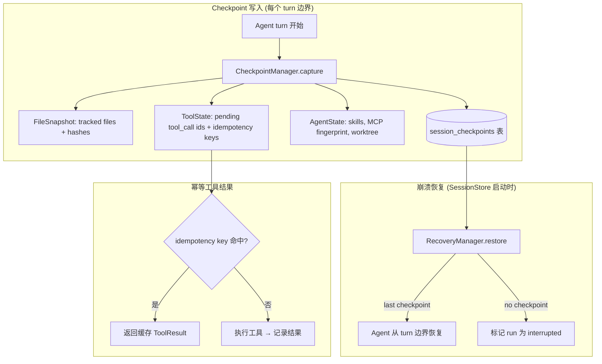
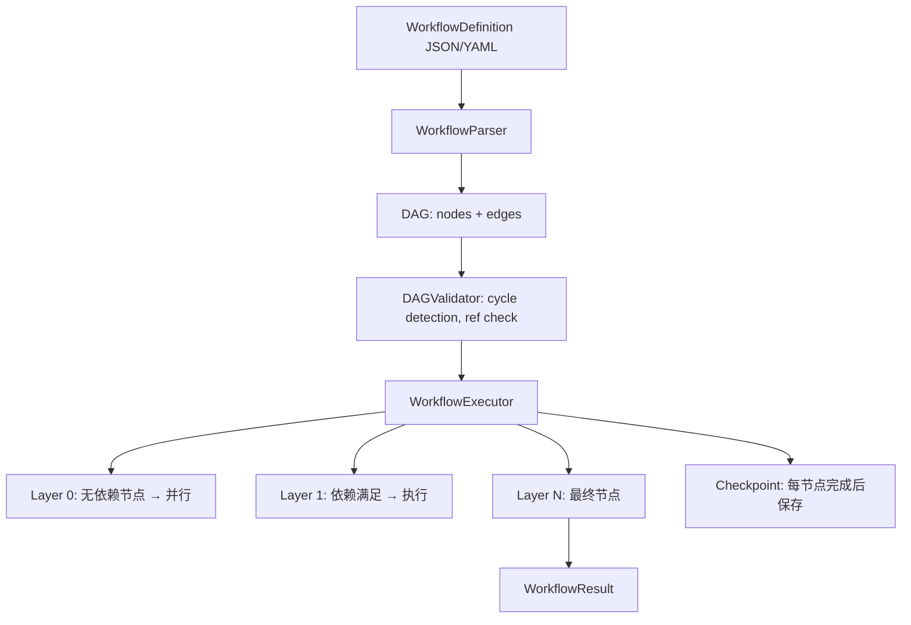

# Grace-Code P1 增强路线图

> 设计版本: v1.0 | 日期: 2026-08-01
> 对标: Claude Code 2025 checkpoint + JSON Schema validation + Workflow DAG
> 范围: 3 个 P1 项 — Step Checkpoint, Schema Validator, Workflow DAG

---

## P1-1: Step Checkpoint + Idempotent Tool Recovery

### 1. 调研与质询

**搜索摘要**:

CC 的 checkpoint 机制是 **prompt 级别自动触发** (每个 user prompt 前创建快照)，通过 `/rewind` 恢复。底层持久化用 WAL-style JSONL transcript + `parentUuid` 因果链。崩溃恢复流程：恢复 file history → TodoWrite state → agent settings → worktree → cost tracking。

**质询应答**:

1. **CC 的设计哲学**: "转录即事实源" + "快照即回滚点"。不追求完美覆盖 (bash 副作用不回滚)，追求足够好 + 简单可靠。
2. **差异级别**: 架构范式 — 我们的 `recover_orphaned_runs()` 只是标记失败，CC 是完整状态重构。
3. **技术栈阻碍**: 无。我们的 P0_4 已完成结构化消息持久化，checkpoint 可以在此基础上构件。
4. **隐式依赖**: Checkpoint 需要 P0_3 的 `CancellationHandle` (中断时保存快照) 和 P0_4 的 `SessionMessageSerializer` (恢复时重建状态)。这些已完成。
5. **已知陷阱**: CC 的 `/clear` 破坏连续性的 bug (#9352)；Bash 副作用不回滚；subagent 无状态是 CC 自身也存在的限制。

### 2. 设计规范



**核心接口**:

```python
@dataclass
class StepCheckpoint:
    session_id: str
    generation: int
    turn_number: int
    file_snapshot_json: str     # {path: hash}
    pending_tool_ids: list[str]
    tool_idempotency_keys: dict[str, str]  # invocation_id → key
    active_skills_json: str     # [{name, version, source}]
    mcp_fingerprints_json: str  # {server_name: fingerprint}
    created_at: str

class CheckpointManager:
    def capture(self, session_id: str, generation: int, turn: int) -> StepCheckpoint: ...
    def restore(self, session_id: str) -> StepCheckpoint | None: ...
    def prune(self, session_id: str, keep_last_n: int = 5) -> int: ...

class IdempotentToolCache:
    def get(self, key: str) -> ToolResult | None: ...
    def put(self, key: str, result: ToolResult) -> None: ...
```

**分阶段计划**:

| 阶段 | 目标 | 工时 |
|------|------|------|
| P1 | `CheckpointManager` + `session_checkpoints` 表 | 1.5 人日 |
| P2 | `IdempotentToolCache` + turn 边界集成 | 1 人日 |
| P3 | `RecoveryManager.restore()` 从最后一个 checkpoint 恢复 | 1.5 人日 |
| P4 | 测试 (捕获/恢复/幂等/跨 turn 隔离) | 1.5 人日 |

**验收**:
- [ ] AC-1: crash 后 `restore()` 返回最后 turn 的 checkpoint (文件快照 + 工具状态)
- [ ] AC-2: 同一 invocation_id + 同一 idempotency key → 返回缓存结果 (不重复执行)
- [ ] AC-3: `prune(keep_last_n=5)` → 仅保留最近 5 个 checkpoint

---

## P1-2: Standard JSON Schema Validator

### 1. 调研与质询

**搜索摘要**:

CC 的 Zod `safeParse` 模式是核心：
- `safeParse()` 从不抛异常，返回 `{success, data?, error?}`
- Schema = Single Source of Truth，类型从 schema 推导
- 生产级封装: `SafeJsonParser` 工具类 + `tryJsonParse`/`safeJsonParseFile`
- Agent SDK: `z.toJSONSchema(schema, {target: "draft-7"})` 进行 LLM 输出验证

我们的当前实现 (`llm/tool_call_validator.py`) 是自研的子集 validator，不支持 `oneOf`/`anyOf`、`pattern`、`$ref`、范围约束。

**质询应答**:

1. **CC 的设计哲学**: "永远不静默接受非法输入" — `safeParse` 返回结构化错误给模型，让模型自我修正。
2. **差异级别**: 架构范式 — 手工子集实现无法跟上 JSON Schema 规范演进。
3. **技术栈阻碍**: 无 — Python `jsonschema` 库是标准方案，支持 draft-07/2019-09/2020-12。
4. **隐式依赖**: 仅依赖 `jsonschema` 库 + Tool schema 定义。
5. **已知陷阱**: Zod 4 破坏性变更 (`z.record()` 需 2 参数, `.loose()` 替换 `.passthrough()`) — 说明 schema 库需要版本锁定。

### 2. 设计规范

**核心接口**:

```python
@dataclass
class ValidationResult:
    valid: bool
    errors: list[ValidationError]   # 结构化错误 (路径 + 消息 + schema 引用)
    coerced_params: dict | None     # 类型强制转换后的参数 (仅当 valid=True)

class SchemaValidator:
    """CC-aligned JSON Schema validator — safeParse pattern.

    Uses jsonschema library (draft-07 as baseline).  Never throws.
    Returns structured errors that can be formatted for the LLM.
    """

    def __init__(self, schema: dict): ...

    def safe_parse(self, params: dict) -> ValidationResult:
        """Validate + coerce.  Never throws."""
        ...

    def format_errors_for_llm(self, errors: list[ValidationError]) -> str:
        """Format validation errors as LLM-readable feedback."""
        ...
```

**分阶段计划**:

| 阶段 | 目标 | 工时 |
|------|------|------|
| P1 | `SchemaValidator` + `jsonschema` 依赖 | 1 人日 |
| P2 | 替换 `tool_call_validator.py` 中的子集实现 | 1 人日 |
| P3 | 类型强制转换 (string→int, string→bool, string→null) | 0.5 人日 |
| P4 | 测试 (oneOf, pattern, nested, enum, 边界) | 1.5 人日 |

**验收**:
- [ ] AC-1: `{"type":"object","properties":{"x":{"type":"integer"}}}` + `{"x":"123"}` → `valid=True, coerced_params={"x":123}`
- [ ] AC-2: `oneOf` schema + 非法值 → `valid=False` + 结构化 errors (含 `path`, `message`, `schema_path`)
- [ ] AC-3: `pattern` 约束 + 不匹配字符串 → `valid=False`
- [ ] AC-4: 所有 68 项现有测试保持通过 (validator 替换对调用方透明)

---

## P1-3: Workflow DAG Engine

### 1. 调研与质询

**搜索摘要**:

CC 生态的 Workflow DAG 模式：
- **wf-composer**: 自然语言 → DAG 节点图 (Parse→Resolve→Enrich→Confirm→Persist)
- **DAG 执行**: 按层并行 (layer 0 无依赖 → layer 1 依赖 layer 0 → ...)
- **节点类型**: AI sub-agents, conditional branching, user interaction, MCP tools
- **Quality gates**: 85% 质量阈值, plan checker 必须在执行前 PASS
- **状态管理**: STATE.md + DAG JSON + research findings 持久化用于崩溃恢复

**质询应答**:

1. **CC 的设计哲学**: "描述工作流，而非硬编码" — 工作流是声明式的，执行是 Runtime 的职责。
2. **差异级别**: 架构范式 — 我们的 `workflow_tool.py` 只支持平铺并行步骤，没有 DAG。
3. **技术栈阻碍**: 无 — DAG 环检测、拓扑排序是经典算法，`StreamingExecutor` 已支持并行调度。
4. **隐式依赖**: 依赖 P0_3 的 `CancellationHandle` (节点取消), P0_4 的 checkpoint (节点状态持久化)。
5. **已知陷阱**: 循环依赖 → 环检测拒绝；节点超时 → cancellation 传播；子 Agent 无状态 → 需要 explicit output contract。

### 2. 设计规范



**核心接口**:

```python
@dataclass
class WorkflowNode:
    id: str
    type: str                      # "skill" | "tool" | "agent" | "condition" | "user_input"
    config: dict                   # type-specific config
    depends_on: list[str] = []     # node ids
    on_error: str = "fail"         # "fail" | "skip" | "retry" | "compensate"
    max_retries: int = 1
    timeout_s: float | None = None

@dataclass
class WorkflowDefinition:
    name: str
    version: str
    nodes: list[WorkflowNode]
    outputs: dict[str, str]        # output_name → node_id.variable

class WorkflowExecutor:
    """CC-aligned DAG executor — layer-by-layer, parallel within layer."""

    def __init__(self, executor: StreamingToolExecutor, checkpoint: CheckpointManager): ...

    def execute(self, workflow: WorkflowDefinition, inputs: dict) -> WorkflowResult:
        """Execute DAG layer by layer.

        1. Topological sort → layers
        2. For each layer: parallel execution of ready nodes
        3. On node completion: checkpoint state, feed outputs to dependents
        4. On error: follow on_error policy (fail/skip/retry/compensate)
        """
        ...

class WorkflowValidator:
    """Static validation — cycle detection, reference check, schema validation."""

    def validate(self, workflow: WorkflowDefinition) -> list[str]:
        """Returns list of errors (empty = valid)."""
        ...
```

**分阶段计划**:

| 阶段 | 目标 | 工时 |
|------|------|------|
| P1 | `WorkflowDefinition` schema + `WorkflowValidator` (环检测 + ref check) | 1 人日 |
| P2 | `WorkflowExecutor` (拓扑排序 + 按层并行 + 变量绑定) | 2 人日 |
| P3 | 错误处理 (on_error: fail/skip/retry) + checkpoint 集成 | 1 人日 |
| P4 | SkillRegistry 集成 (path→workflow 自动发现) | 1 人日 |
| P5 | 测试 (DAG 执行, 环检测, 变量绑定, 错误恢复) | 2 人日 |

**验收**:
- [ ] AC-1: `validate()`: 含循环依赖的 DAG → 返回错误列表 (非空)
- [ ] AC-2: 3 节点 A→B, A→C (B,C 无依赖) → B 和 C 在同一层并行执行
- [ ] AC-3: 节点失败 + `on_error="skip"` → 跳过该节点，依赖节点收到默认值
- [ ] AC-4: 节点失败 + `on_error="retry"` + `max_retries=2` → 重试最多 2 次
- [ ] AC-5: 每节点完成后 checkpoint 可恢复 (进程重启后从最后完成节点继续)

---

## 实施优先级

```
Phase A (Week 1-2):  P1-2 Schema Validator   (4 人日) — 独立, 影响面小, 收益直接
Phase B (Week 2-3):  P1-1 Step Checkpoint     (5.5 人日) — 依赖 P0_4, 基础能力
Phase C (Week 3-5):  P1-3 Workflow DAG        (7 人日) — 依赖 P1-1 checkpoint
```

**总工时**: 16.5 人日
