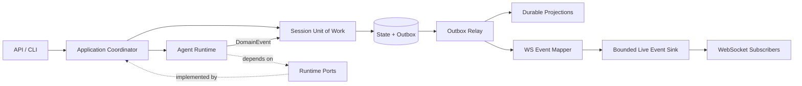
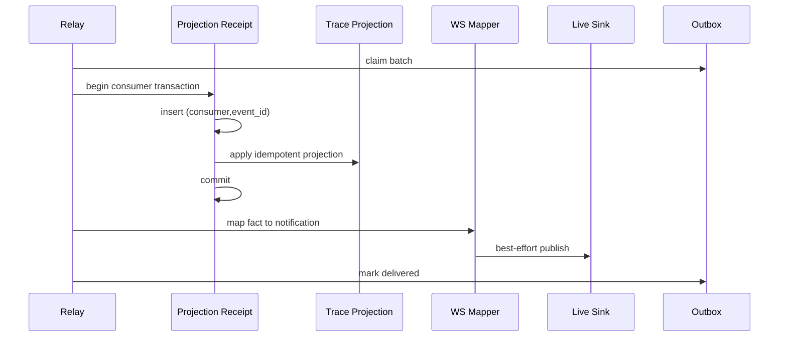

# R3-R4 Runtime / EventBus CC-Native 执行方案

> 日期：2026-08-02  
> 前置状态：R0-R2 已完成；Agent Team 已移除；Build、Plan、Multi-Agent 保留。  
> 本方案目标：先解决事件可靠性，再解决 Runtime 依赖反转。两个阶段禁止混做。

## 1. 最终目标

本轮重构完成后，系统应满足以下结构：



核心约束：

1. 业务状态与领域事实必须在同一个 SQLite transaction 中提交。
2. Runtime 只能发布事实，不能直接写 WebSocket DTO、Trace 或 Projection。
3. WebSocket 断线不得影响事实事件提交；实时通知是派生能力，不是权威状态。
4. Outbox 只承载可恢复的领域事实，不承载 token delta、思考片段和临时进度。
5. `server/services` 不得访问 `runtime._*` 私有字段。

## 2. 当前代码锚点

| 问题 | 当前位置 | 当前行为 | 目标 |
|---|---|---|---|
| EventBus 职责过宽 | `server/services/event_bus.py:272` `EventBus` | 同时持久化 Trace、缓存、排队和 WS 广播 | 拆成 Domain Publisher、Relay、Projection、Live Sink |
| Raw 事件入口 | `event_bus.py:417` `publish_raw()` | 接收 ad-hoc dict，并可选择跳过持久化 | 删除生产入口 |
| Typed 语义混杂 | `event_bus.py:444` `publish_typed()` | DomainEvent 与 Ws DTO 走同一入口 | 分离 durable fact 与 ephemeral notification |
| 终态特殊双写 | `session_store.py:2130` `transactional_finalize_run()` | 状态与 Trace 同事务，之后特殊广播 | 状态与 Outbox 同事务；Trace 由 Projection 生成 |
| Run 创建事务 | `run_submission.py:21` `submit_run_turn()` | Run、turn、message 同事务，但无事实事件 | 同事务写入 `RunSubmitted` Outbox |
| Raw terminal | `chat_pipeline.py:626` | 直接发布 terminal dict | 发布强类型领域事实或使用已入 Outbox 的事实 |
| Raw replay | `replay_service.py:273` `_publish_execution()` | 直接发布 replay dict | 强类型 `ReplayExecutionChanged` |
| Runtime 私有注入 | `agent_service.py:500-556` | Service 修改 5 类 Runtime 私有依赖 | 构造期 `RuntimeDependencies` |
| Runtime 私有 Store | `chat_pipeline.py:631` | Pipeline 直接访问 `_runtime._store` | `RunStorePort` / Coordinator command |

## 3. 不可混淆的事件分类

### 3.1 Durable Domain Events

必须进入事务性 Outbox：

- SessionStarted / SessionCompleted / SessionCancelled / SessionFailed
- RunSubmitted / RunStarted / RunCompleted / RunCancelled / RunFailed
- ToolExecuted（仅完成事实，不包含无限大原始输出）
- WorktreeResolved
- EvidenceRecorded
- MemoryWritten
- ReplayExecutionChanged

这些事件要求：可重放、可去重、有稳定 `event_id`、有 `aggregate_version` 或等价顺序字段。

### 3.2 Ephemeral Live Events

不得进入 Outbox：

- AssistantTextStart / Delta / End
- Thought delta
- Compact progress
- Queue position 的瞬时刷新
- Approval UI 倒计时
- Heartbeat / typing / connection status

这些事件只走有界 `LiveEventSink`。断线后，客户端通过 Snapshot/Trace 恢复，而不是重放所有 token delta。

### 3.3 Durable Projection Events

DomainEvent 经 Mapper 产生的持久投影：

- `session_trace_events`
- Stats / audit records
- 可查询的运行状态快照

投影必须幂等；不能反向驱动 Runtime 状态机。

## 4. R3：Transactional Outbox 实施

### Phase R3.0 — 锁定事件契约

预估：0.5 人日。

修改：

- `server/events.py`
- 新增 `server/domain_events.py`，或将 DomainEvent 从 WS DTO 文件中拆出
- 新增 `tests/test_domain_event_contract.py`

接口：

```python
@dataclass(frozen=True, kw_only=True)
class DomainEvent:
    event_id: str
    event_type: str
    session_id: str
    aggregate_id: str
    aggregate_version: int
    occurred_at: str
    correlation_id: str = ""
    causation_id: str = ""

    def payload(self) -> dict[str, object]: ...
```

规则：

- `event_type` 是稳定协议名，禁止依赖 Python class name 自动推导。
- Payload 必须 JSON-safe，禁止 `Any`、异常对象、连接对象、callback。
- `event_id` 在事实产生时生成；重试不得生成新 ID。
- `session_id` 是唯一作用域来源，Mapper 不得二次猜测。

验收：

- 所有 DomainEvent 为 frozen dataclass。
- 序列化 round-trip 后内容相等。
- 未知版本事件进入 dead-letter，而不是悄悄丢弃。

回滚点：仅新增类型，不接生产调用。

### Phase R3.1 — Outbox Schema 与 Repository

预估：1.5 人日。

修改：

- `agent/session/session_store.py`
- 新增 `server/services/outbox_repository.py`
- 新增 `tests/test_outbox_repository.py`

建议表结构：

```sql
CREATE TABLE event_outbox (
    event_id TEXT PRIMARY KEY,
    event_type TEXT NOT NULL,
    event_version INTEGER NOT NULL,
    session_id TEXT NOT NULL,
    aggregate_id TEXT NOT NULL,
    aggregate_version INTEGER NOT NULL,
    payload_json TEXT NOT NULL,
    occurred_at TEXT NOT NULL,
    available_at TEXT NOT NULL,
    status TEXT NOT NULL DEFAULT 'pending',
    attempts INTEGER NOT NULL DEFAULT 0,
    claimed_by TEXT,
    claimed_at TEXT,
    delivered_at TEXT,
    last_error TEXT
);

CREATE INDEX idx_event_outbox_delivery
ON event_outbox(status, available_at, occurred_at);

CREATE TABLE event_projection_receipts (
    consumer_name TEXT NOT NULL,
    event_id TEXT NOT NULL,
    processed_at TEXT NOT NULL,
    PRIMARY KEY (consumer_name, event_id)
);
```

Repository API：

```python
class OutboxWriter(Protocol):
    def append(self, conn: sqlite3.Connection, event: DomainEvent) -> None: ...

class OutboxRepository(Protocol):
    def claim_batch(self, worker_id: str, limit: int, lease_s: float) -> list[OutboxRecord]: ...
    def mark_delivered(self, event_id: str, worker_id: str) -> bool: ...
    def reschedule(self, event_id: str, worker_id: str, error: str, available_at: str) -> bool: ...
    def dead_letter(self, event_id: str, worker_id: str, error: str) -> bool: ...
    def release_expired_claims(self, now: str) -> int: ...
```

实现要求：

- Claim 使用短事务和 lease，不在网络/WS 投递期间持有 SQLite 写锁。
- `append()` 必须接收已有 connection，禁止自己再开 transaction。
- `event_id` 冲突视为幂等成功，但 payload 不同必须报错。
- 重试采用指数退避并设置上限；超过阈值进入 dead-letter。

验收：

- 两个 relay 并发 claim 时，同一事件只被一个 worker 获得。
- 进程崩溃后 lease 到期可以重新 claim。
- 相同 event_id + 相同 payload 幂等；不同 payload 拒绝。

回滚点：Schema 和 Repository 尚未接入主流程。

### Phase R3.2 — 公共 Unit of Work

预估：1.5 人日。

修改：

- `agent/session/session_store.py`
- `server/services/run_submission.py`
- 新增 `server/services/session_uow.py`
- 新增 `tests/test_session_uow.py`

目标接口：

```python
class SessionUnitOfWork(Protocol):
    def execute(self, command: Callable[[SessionTransaction], T]) -> T: ...

class SessionTransaction(Protocol):
    runs: RunWriter
    sessions: SessionWriter
    messages: MessageWriter
    outbox: OutboxWriter
```

迁移规则：

- `run_submission.py` 不再访问 `storage._store._connect()`。
- Command 在一个 transaction 内完成状态写入和 `tx.outbox.append(event)`。
- Repository 不得隐式 commit；只有 Unit of Work 可以 commit/rollback。
- transaction 中禁止发布 WebSocket、启动线程、调用 LLM 或执行 Hook。

首个迁移用例：`submit_run_turn()` 同事务提交 Run、Message、`RunSubmitted`。

失败注入点：

1. 状态写入后、Outbox 前抛错：全部 rollback。
2. Outbox 写入后、commit 前抛错：全部 rollback。
3. commit 后、Relay 前崩溃：状态与事件都存在，重启后补投。

回滚点：保留旧 `submit_run_turn()` 入口，内部通过 Feature Flag 选择新 UoW。

### Phase R3.3 — Terminal Run 迁移

预估：1.5 人日。

修改：

- `agent/session/session_store.py:2130`
- `agent/session/runtime.py` 的 `_finalize_run()` 调用链
- `server/services/chat_pipeline.py:626`
- 新增 `tests/test_terminal_outbox_atomicity.py`

目标：

- 将 `transactional_finalize_run()` 改为状态 CAS + `RunCompleted/Cancelled/Failed` Outbox。
- 删除 transaction 内直接插入 `session_trace_events` 的特殊逻辑。
- 删除 `_persisted_event`、`skip_persist=True` 等旁路协议。
- Runtime 只得到 CAS 结果，不得到供 WebSocket 使用的预格式化 dict。

终态保护：

- CAS 失败不得产生 Outbox 事件。
- CAS 成功只能产生一个 terminal event。
- 相同 run 的 completed/cancelled/failed 互斥。

回滚点：Feature Flag `GRACE_OUTBOX_TERMINAL_EVENTS`，旧路径只保留一个版本周期。

### Phase R3.4 — Relay、Projection 与 WS Mapper

预估：2 人日。

新增：

- `server/services/outbox_relay.py`
- `server/services/domain_event_publisher.py`
- `server/projections/trace_projection.py`
- `server/projections/projection_runner.py`
- `server/ws/event_mapper.py`
- `server/services/live_event_sink.py`

投递顺序：



关键语义：

- Durable Projection 是 at-least-once + receipt 去重。
- WebSocket 是 best-effort；无订阅者不算失败。
- Outbox ACK 依赖 Durable Projection 成功，不依赖 WS 客户端收到。
- 单一 aggregate 内按 `aggregate_version` 有序；不同 aggregate 可并行。
- Live queue 必须有容量上限和显式 overflow 策略。

Shutdown 顺序：

1. 停止接受新 command。
2. 等待活动 UoW commit/rollback。
3. Relay 停止 claim 新 batch。
4. 在 deadline 内完成已 claim batch。
5. 释放未完成 lease。
6. Drain Live queue。
7. 关闭数据库和 Runtime。

回滚点：Relay 可单独关闭；Outbox 中 pending 事件不会丢失。

### Phase R3.5 — 清除 Raw 与双语义 EventBus

预估：1 人日。

迁移调用点：

- `server/services/agent_service.py:527`
- `server/services/chat_pipeline.py:626`
- `server/services/replay_service.py:279`

处理方式：

- 领域事实改为 `DomainEventPublisher`。
- 纯 UI 事件改为 `LiveEventSink.publish(WsEvent)`。
- `EventBus.publish()`、`publish_raw()`、`publish_typed()` 删除或降级为内部兼容层后立即废弃。
- `_translate_event()` fallback 不得再发送未知 raw payload。

CI 门禁：

```powershell
rg -n "publish_raw|_persisted_event|skip_persist" agent server
rg -n "EventBus\.publish_typed" agent server
```

期望均为零；测试文件可以使用专用 Fake，但不得依赖已删除生产 API。

### Phase R3.6 — 崩溃恢复与压力验收

预估：1.5 人日。

必须新增的测试：

- commit 后、Relay 前进程崩溃，重启后补投。
- Projection commit 后、Outbox ACK 前崩溃，重投时不重复 Projection。
- Relay 执行中崩溃，lease 超时后可恢复。
- Poison event 达到最大次数进入 dead-letter，不阻塞后续事件。
- 慢 WebSocket 消费者不阻塞 Outbox ACK。
- 10k pending event 内存占用有界。
- Shutdown deadline 到达后未完成事件仍保持 pending/claimed-expired，可在下次启动恢复。

R3 完成定义：所有事实事件不再依赖进程内 callback 才能被观察到。

## 5. R4：Runtime Ports 与 Coordinator 实施

R4 必须在 R3 全绿后开始。预估 4 人日。

### Phase R4.0 — 定义依赖方向

新增 `agent/runtime_ports.py`：

```python
class RunEventPort(Protocol):
    def record(self, event: DomainEvent) -> None: ...

class StatsPort(Protocol): ...
class EvidencePort(Protocol): ...
class MemoryEventPort(Protocol): ...
class RunStorePort(Protocol): ...

@dataclass(frozen=True)
class RuntimeDependencies:
    run_events: RunEventPort
    stats: StatsPort
    evidence: EvidencePort
    memory_events: MemoryEventPort
    run_store: RunStorePort
    web_mode: bool = False
```

依赖规则：

- `agent/` 不得 import `server/services/*`。
- Port 使用领域对象，不使用 Ws DTO。
- Dependencies 在 Runtime 构造时一次性注入，之后不可替换。

### Phase R4.1 — 映射 6 处私有访问

| 当前访问 | 修改方向 |
|---|---|
| `runtime._is_web_mode` | 构造参数 `RuntimeDependencies.web_mode` |
| `runtime._stats_recorder` | `StatsPort` |
| `runtime._publish_run_terminal` | `RunEventPort`，发布 terminal DomainEvent |
| `runtime._evidence_stores.set_event_callback` | 构造期 `EvidencePort` |
| `runtime._memory_event_callback` | 构造期 `MemoryEventPort` |
| `runtime._store.update_run` | Application Coordinator 调用 `RunStorePort` |

不得简单增加六个 public setter。Setter 只是把私有字段污染变成公开的可变 Service Locator，不算完成依赖反转。

### Phase R4.2 — Application Coordinator

新增 `server/application/agent_coordinator.py`，职责限定为：

- 构造 RuntimeDependencies。
- 执行 submit/cancel/finalize command。
- 管理事务边界。
- 将 Runtime 产生的事实写入当前 UoW。
- 控制启动和关闭顺序。

禁止职责：

- 不包含 LLM loop。
- 不修改 Runtime 私有字段。
- 不作为 Event Projection consumer。
- 不持有 Team、Mailbox、TaskBoard 等已删除概念。

### Phase R4.3 — 删除旧装配路径

删除：

- AgentService 中 Runtime 私有字段赋值。
- Runtime callback setter/兼容字段。
- ChatPipeline 对 Runtime Store 的访问。
- 重复的 CLI/Web Runtime 装配代码。

验收门禁：

```powershell
rg -n "runtime\._|_runtime\._" server/services server/application
rg -n "from server" agent
```

两项均必须为零。

## 6. 提交与回滚策略

建议每个 Phase 一个独立 commit：

1. `R3.0 domain event contract`
2. `R3.1 outbox schema and repository`
3. `R3.2 session unit of work`
4. `R3.3 terminal event migration`
5. `R3.4 relay projections and live sink`
6. `R3.5 remove raw event paths`
7. `R3.6 crash recovery acceptance`
8. `R4.0 runtime port contracts`
9. `R4.1 migrate runtime dependencies`
10. `R4.2 application coordinator`
11. `R4.3 delete compatibility paths`

每个 commit 必须满足：

- 数据库 migration 向前兼容。
- 旧版本进程可以忽略新增表。
- 新版本可以处理旧数据库无 pending event 的情况。
- Feature Flag 只能切换完整路径，禁止同一事件双写旧 Trace 与 Outbox。
- 回滚应用版本时，Outbox 数据必须保留，不执行 destructive downgrade。

## 7. 总体验收矩阵

| 编号 | 验收项 | 机器判定 |
|---|---|---|
| AC-R3-01 | 状态与事实原子提交 | 三类 transaction failure injection 全通过 |
| AC-R3-02 | 崩溃后补投 | commit 后 kill，重启后 Projection 出现 |
| AC-R3-03 | Projection 幂等 | 同 event_id 投递两次，仅一条 Projection |
| AC-R3-04 | 终态互斥 | 同 run 仅一个 terminal event |
| AC-R3-05 | Raw API 清零 | 生产目录 grep 为零 |
| AC-R3-06 | 有界背压 | 慢消费者下 queue 不超过配置容量 |
| AC-R3-07 | Poison 隔离 | dead-letter 后后续事件继续投递 |
| AC-R3-08 | 可恢复 Shutdown | deadline 后事件不丢失，可重启恢复 |
| AC-R4-01 | Runtime 私有访问清零 | `runtime._*` grep 为零 |
| AC-R4-02 | 依赖方向正确 | `agent` 不 import `server` |
| AC-R4-03 | 构造后依赖不可变 | RuntimeDependencies frozen + 无 setter |
| AC-R4-04 | Build/Plan/Multi-Agent 不回归 | 三模式专项测试通过 |
| AC-ALL-01 | Python 基线 | `python -m compileall` + 全量 pytest |
| AC-ALL-02 | Web 基线 | `npm run build` + Web tests |
| AC-ALL-03 | Agent Team 不复活 | Team 生产符号扫描为零 |

## 8. 工期与执行顺序

| 批次 | 内容 | 预估 |
|---|---|---:|
| R3.0-R3.2 | 契约、Schema、UoW | 3.5 人日 |
| R3.3-R3.4 | Terminal 迁移、Relay、Projection | 3.5 人日 |
| R3.5-R3.6 | Raw 删除、故障与压力测试 | 2.5 人日 |
| R4.0-R4.3 | Ports、Coordinator、旧路径删除 | 4 人日 |
| 总计 | 含测试，不含评审等待 | 13.5 人日 |

推荐执行顺序：先完整交付 R3.0-R3.6 并稳定一个版本，再开始 R4。第一轮实现应从 R3.0-R3.2 开始，不提前建立 Relay 线程，也不修改 Runtime 私有依赖。

## 9. 第一轮可直接执行的任务单

### Task A — DomainEvent v2

- 修改 `server/events.py` 或拆出 `server/domain_events.py`。
- 新增稳定 envelope、event version 和 JSON round-trip。
- 不接生产路径。

### Task B — Outbox Repository

- 在 SessionStore migration 中新增两张表和索引。
- 实现 append/claim/ack/reschedule/dead-letter/release-expired。
- 完成双 worker 并发测试。

### Task C — Session UoW

- 提供公共 transaction boundary。
- 迁移 `submit_run_turn()`。
- 加入三个 failure injection 测试。
- 使用 Feature Flag 保留单阶段回滚能力。

第一轮 Definition of Done：Task A-C 全部通过，全量测试保持绿色，但尚不启动 Relay、不删除 EventBus 旧路径、不改变 Runtime 行为。
