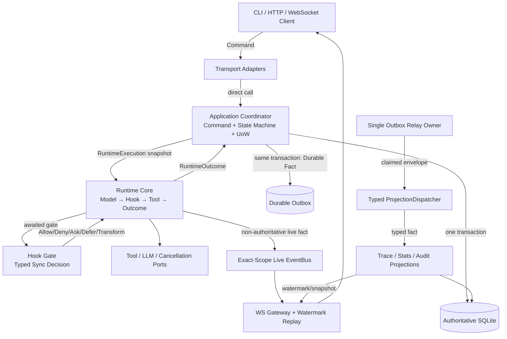
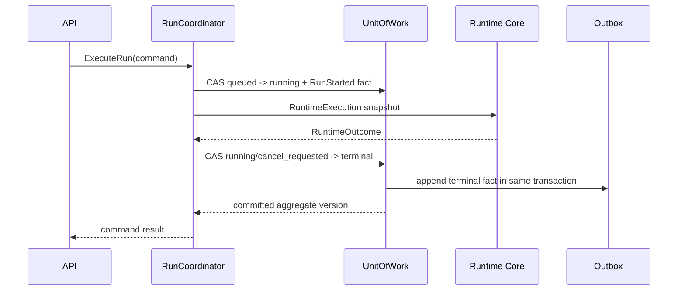

# Runtime / Hooks / EventBus 从 38 分到 90+ 分 CC-Native 重构执行规划书

> 文档版本：1.0.0  
> 创建日期：2026-08-02  
> 当前基线评分：38 / 100  
> 目标评分：至少 92 / 100  
> 适用代码库：`grace-code`  
> 前置审计：`RUNTIME_HOOKS_EVENTBUS_REASSESSMENT_2026-08-02.md`  
> 状态：**APPROVED FOR IMPLEMENTATION — 尚未执行本文阶段**  
> 核心原则：From Scratch、无兼容层、单一权威路径、机器证据优先

---

# 0. 使用说明与不可违背的施工纪律

## 0.1 本文解决什么问题

本文不是继续给当前 38 分实现追加补丁。它定义一条完整、可停、可验收、可删除旧代码的施工路线，把当前状态从：

```text
旧 Runtime / Hook / EventBus 仍权威
  + 新目录存在但契约不完整
  + Native 可选路径存在 false ACK / 双 Relay / Scope 语义错误
```

重建为：

```text
Application Coordinator 持有状态机权威
  + Runtime Core 只执行模型/工具循环
  + Hook Gate 只做同步生命周期决策
  + Durable Outbox/Projection 只广播已提交事实
  + Live ScopedEventBus 只做 exact-scope 非权威通知
  + 单一 Composition Root 创建唯一对象图
```

目标不是“文件齐全”，而是满足以下完成定义：

- 生产入口只有 Native 对象图；
- Runtime 不写数据库，不 import Server/Listener/Repository；
- Hook 不通过 `HookContext`、Bridge 或 dict 兼容旧系统；
- EventBus 不做持久化、不接 WebSocket、不消费 Command、不隐式冒泡；
- state + durable fact 在同一事务提交；
- Relay 只有一个 owner，至少一次投递，失败绝不 false ACK；
- Projection 幂等，可恢复，可检测 version gap；
- Session/Task/Global exact-scope 无泄漏；
- 所有旧 Runtime/Hook/EventBus/迁移 flag 已删除；
- strict typing、import contract、fault、leak、benchmark、全量回归和 Web build 全部通过。

## 0.2 规范性关键词

- **MUST / 必须**：不满足即阶段失败。
- **MUST NOT / 禁止**：出现即停止本阶段。
- **SHOULD / 应当**：只能通过新 ADR 和重新执行 Step 1 偏离。
- **Fact**：已经发生、不可撤销的事实，名称使用过去时。
- **Command**：要求系统做某事的意图，只能 direct-call Application Coordinator。
- **Hook**：发生在已知生命周期点、可能阻断当前动作的同步 gate。
- **Live Event**：非权威、可丢失、exact-scope 的运行时通知。
- **Durable Fact**：与权威状态同事务写入 Outbox、至少一次投影的事实。
- **Projection**：从 Durable Fact 构建可查询视图，不驱动业务状态机。
- **Authority**：对某项状态做最终决策和提交的唯一组件。

## 0.3 绝对禁止

1. 禁止继续扩展 `hook_core/bridge.py`。
2. 禁止保留 `HookContext -> typed input` 的永久转换层。
3. 禁止让旧、新 Relay 同时连接同一权威 Outbox。
4. 禁止 catch delivery/projection exception 后正常返回。
5. 禁止 `scope=None` 或 Global subscriber 接收 Session/Task event。
6. 禁止 EventBus import `application.events.*` 业务 schema。
7. 禁止 EventBus 用作 CommandBus。
8. 禁止 Runtime import SQLite、SessionStore、Trace、WebSocket、Listener、AgentService。
9. 禁止 Runtime 直接写 Run/Session/Message/Outbox。
10. 禁止 Listener/Projection 发布业务 Command 或修改 Run 状态。
11. 禁止使用 `Any`、裸 `dict`、裸 `list` 穿过核心边界。
12. 禁止 Hook command 使用 `shell=True` 或字符串拼接命令。
13. 禁止通过 sleep、随机 retry、放宽断言或提高性能阈值让测试变绿。
14. 禁止以提交名、marker、deprecation list 或注释证明阶段完成。
15. 禁止恢复 Team topology；只支持 build、plan、primary-mediated multi-agent。
16. 禁止一个阶段修改超过 3 个文件；需要第 4 个文件时拆阶段。
17. 禁止未完成本阶段全部 AC 就进入下一阶段。
18. 禁止在删除阶段使用兼容 re-export 保持旧 import 可用。

## 0.4 开工前工作区处理

当前工作区存在未提交实现。开始 G0 前必须：

1. 保存当前 diff 和测试输出；
2. 建立人工可识别的 baseline commit 或不可变归档；
3. 记录数据库 schema 版本和一份脱敏测试数据库快照；
4. 确认没有进程以 `GRACE_RUNTIME_MODE=NATIVE` 运行；
5. 停止所有本地 Relay/Server 进程；
6. 清理 `.coverage` 等生成物，但不得删除用户源码修改；
7. 输出 baseline SHA、pytest 数量、mypy 错误数量和 Web build 结果。

本文不规定必须如何保存未提交改动，但禁止使用 `git reset --hard` 或覆盖用户工作。

## 0.5 低能力模型固定执行循环

每个阶段严格执行：

```text
完整读取本阶段
  -> 检查只涉及允许文件
  -> 运行 Before Test，确认测试能暴露旧缺陷
  -> 实现本阶段完整契约
  -> 运行 Target Tests
  -> 运行 Static Gates
  -> 运行 Regression Slice
  -> git diff --check
  -> 输出阶段报告
  -> 停止，等待确认
```

遇到以下任一情况立即停止：

- 需要第 4 个文件；
- 需要兼容旧 API；
- 需要 Any/裸 dict 才能通过；
- 需要吞掉异常才能保持主流程；
- 需要同时启动两套权威实现；
- 无法说明谁拥有权威状态；
- 删除旧文件后只能通过重新添加旧 import 修复测试；
- 测试无法在固定时限内稳定复现。

## 0.6 版本治理

- 改变 Authority、Scope、Delivery、Hook decision precedence、Runtime loop、阶段顺序或性能阈值属于 MAJOR 变更。
- MAJOR 变更必须重新执行完整 Step 1，并升级本文主版本号。
- schema 字段或语义变化必须增加 schema version；禁止静默改变同一 `(event_type, version)`。
- 阶段报告必须写明本文版本；版本不一致时停止。

---

# 1. Step 1 — 深度调研与严肃质询

## 1.1 调研来源与证据等级

### 本轮实际检索词

- `Claude Code hooks lifecycle decision control official`
- `Claude Code runtime hooks event bus architecture separation`
- `Cline hooks task lifecycle official`
- `Cline hub spoke architecture session persistence`
- `Cline task resume checkpoint architecture`
- `CloudEvents required id source type specification`
- `Python asyncio TaskGroup cancellation Queue shutdown`
- `transactional outbox idempotent consumer official`
- `Python subprocess timeout kill child process`

检索日期为 2026-08-02。若开始实施时主要官方文档已有新 stable contract，必须先更新本节和设计差异，不得直接按旧资料施工。

### A 级：官方产品文档/官方源码

1. [Claude Code Hooks Reference](https://code.claude.com/docs/en/hooks)
2. [Claude Code Hooks Guide](https://code.claude.com/docs/en/hooks-guide)
3. [Claude Agent SDK Hooks](https://code.claude.com/docs/en/agent-sdk/hooks)
4. [Cline Hooks](https://docs.cline.bot/customization/hooks)
5. [Cline Hub-Spoke Architecture](https://docs.cline.bot/sdk/architecture/hub-spoke)
6. [Cline Tasks](https://docs.cline.bot/core-workflows/task-management)
7. [Cline Checkpoints](https://docs.cline.bot/core-workflows/checkpoints)
8. [Cline Public Repository](https://github.com/cline/cline)
9. [CloudEvents Specification](https://github.com/cloudevents/spec/blob/main/cloudevents/spec.md)
10. [Python asyncio Task/TaskGroup](https://docs.python.org/3/library/asyncio-task.html)
11. [Python asyncio Queue](https://docs.python.org/3/library/asyncio-queue.html)
12. [Python subprocess](https://docs.python.org/3/library/subprocess.html)
13. [Microsoft Transactional Outbox](https://learn.microsoft.com/en-us/azure/architecture/databases/guide/transactional-out-box-cosmos)

### B 级：成熟架构模式

1. [Transactional Outbox Pattern](https://microservices.io/patterns/data/transactional-outbox.html)
2. [Idempotent Consumer Pattern](https://microservices.io/patterns/communication-style/idempotent-consumer.html)

### 真实性声明

Claude Code 官方公开了 Hook 生命周期、输入输出、阻断决策和错误语义，但没有公开其内部 Runtime/EventBus 全部实现。本文不得把自行设计的 ScopedEventBus 说成“Claude Code 内部源码”。

本文采用以下证据组合：

- Hook 行为和 decision precedence：Claude Code 官方文档；
- Task/Session/执行角色分离：Cline 官方架构与任务文档；
- Event envelope/identity：CloudEvents；
- Structured cancellation/backpressure：Python 官方文档；
- state + event 原子提交和至少一次消费：Transactional Outbox；
- Grace Code 的具体边界：基于上述事实作出的工程设计。

## 1.2 搜索摘要

### Claude Code 的明确事实

- Hook 在确定的 lifecycle point 触发，而不是由模型随意决定。
- `PreToolUse` 能 allow/deny/ask/defer，并允许替换完整 tool input。
- 多个 PreToolUse 决策存在明确优先级：deny > defer > ask > allow。
- 不同 Hook event 使用不同输出 schema，不能用一个通用 dict 决策覆盖全部事件。
- command Hook 超时和错误具有明确处理方式；输出大小有上限。
- 同一 lifecycle point 的匹配 Hook 可以并行执行，但决策合并必须确定。

对本项目的要求：

- Hook 必须是 event-specific input + event-specific decision；
- HookDispatcher 必须固定 decision precedence；
- 可阻断 Hook 必须 awaited；
- 观测/统计不得伪装成阻断 Hook，应变成 Fact/Projection；
- command Hook 使用进程边界和真实 timeout；
- 不能用 HookBridge 永久包装旧 HookContext。

### Cline 的明确事实

- Task 是自包含 session，拥有唯一 ID、历史、token/cost/time，可中断恢复。
- Hook 在 TaskStart/Resume/Cancel/Complete、Pre/PostTool、Prompt、PreCompact 等固定点执行。
- Hub 协调 session/event/approval；Spoke 执行 agent loop；Client 只参与和呈现，三者不重叠。
- Spoke 报告事件给 Hub，不直接通知 Client。
- Session 独立于单一 client 生命周期。
- Checkpoint 把文件状态与对话状态的恢复选择分开。

对本项目的要求：

- Application Coordinator 对应协调权威，不执行模型循环；
- Runtime Core 对应执行角色，不直接调用 WebSocket/UI；
- Gateway/Projection 对应 client-facing adapter，不被 Runtime import；
- Session/Task scope 必须独立生命周期；
- primary-mediated multi-agent 的 child Task 拥有独立 TaskContext，不复制父历史。

### CloudEvents/Outbox/Python 的明确事实

- Event 至少需要稳定 identity、source、type 和版本语义；`source + id` 用于识别重复。
- state 和 event 必须同事务提交；Relay 至少一次投递，Consumer 必须幂等。
- Relay 可能重复投递，不能把“最多一次”当成可靠事实链。
- `asyncio.Queue(maxsize=0)` 是无界队列，production 必须显式正容量。
- Queue 完成语义依赖每个 get 对应 task_done 和 join；不能用 sleep 假装 drain。
- TaskGroup 在 sibling 失败时提供比 gather 更强的结构化取消保证。
- subprocess timeout 必须终止并等待子进程；不能只测量返回后的耗时。

## 1.3 五项严肃质询

### Q1：Runtime、Hook、EventBus、Projection、Coordinator 的正确边界是什么？

明确回答：

| 组件 | 拥有 | 不拥有 |
|---|---|---|
| Application Coordinator | Command、状态机、UoW、CAS、resource lease | 模型循环、UI、projection |
| Runtime Core | Model→Action→Hook→Tool→Outcome、结构化取消 | DB、SessionStore、WebSocket、Listener、最终状态提交 |
| Hook Gate | 同步生命周期决策、输入变换、阻断理由 | 持久化、后台 daemon、业务状态机 |
| Durable Outbox | 已提交 Fact、claim/lease/retry/DLQ | Command、业务解释、WebSocket |
| ProjectionDispatcher | typed fact→required projection delivery outcome | Command、Runtime 控制 |
| ScopedEventBus | exact-scope live event、bounded queue、subscription lifecycle | durable fact relay、implicit bubbling、持久化 |
| Projection/Listener | 幂等视图、审计、trace、stats | 发布业务 Command、回写权威 Run 状态 |
| Gateway | WebSocket/HTTP transport、watermark replay | 业务状态机、EventBus internals |

同步 Hook 只用于“当前动作执行前必须得到答案”的点。异步 Fact 用于“动作已经发生，其他组件需要知道”的点。

### Q2：当前 38 分实现中哪些内容仍在错误层？

代码证据：

- `runtime_core/step_loop.py` 是硬编码 response skeleton，尚未实现真实 agent loop。
- `composition/runtime_composition.py` 同时承担 schema decode、scope ensure、异常处理、projection wiring、relay start/shutdown，且吞 delivery error。
- `run_server.py` 在旧对象图之后追加 Native pipeline，造成双 Relay owner。
- `eventing/scoped_bus.py` 直接 import `application.events.envelope`，EventBus 感知业务 event carrier。
- `hook_core/bridge.py` import 旧 HookDispatcher/HookContext，是兼容层。
- `server/main.py` 与 `run_server.py` 仍实例化旧 EventBus。
- `agent/session/runtime.py` 仍 import HookContext，持有原有 persistence/worktree/evidence/notification 逻辑。

结论：新模块存在，但 Authority 仍分裂，Composition Root 不是唯一入口。

### Q3：当前 Hooks/EventBus 的关键越权和质量问题是什么？

Hooks：

- input/decision 仍有 Any/裸 dict；
- callable Hook 同步执行完才判断 timeout；
- command Hook 使用 `shell=True`；
- raw parsed dict 仍可能作为 decision 返回；
- HookBridge 临时注册/清理旧 callback，revision 语义不可靠；
- 旧 detached daemon Hook thread 仍存在。

EventBus：

- None/Global subscriber 接收全部 Session/Task event，违反 exact-scope；
- scope match 不校验 global_id/generation；
- generation 更新复用 closed node；
- BoundedChannel 没有成为 Bus 的真实 delivery channel；
- handler 仍同步串行，无 timeout/error sink；
- close 不具备真实 queue join/drain；
- durable projection 和 live event 被混到一条路径。

### Q4：如何在 Python 技术栈中实现 Scope/强类型/取消，而不是魔改？

明确回答：

- ScopeToken 使用 frozen value object，identity 为 `(kind, global_id, session_id, task_id, generation)`。
- SubscriptionKey 明确包含 `event_class + exact ScopeToken + subscriber_id`。
- EventBus 基础设施只使用 TypeVar/Protocol，不 import 业务 schema。
- 每个 scope 拥有正容量 asyncio.Queue 和 TaskGroup 管理的 consumer tasks。
- close 顺序为：reject new publish → queue.shutdown/poison sentinel → join → cancel remaining → remove registry。
- RuntimeExecution 持有 CancellationHandle；TaskGroup 管理并行工具/child task。
- untrusted/blocking Hook 放入 subprocess，通过 argv 和 ProcessRegistry kill；trusted async Hook 使用 asyncio.timeout 协作取消。
- Durable fact 经 Outbox + typed ProjectionDispatcher，不通过 Global live subscription 绕过隔离。

### Q5：需要主动规避哪些反模式？

| 反模式 | 当前表现 | 本文措施 |
|---|---|---|
| 上帝 Event | generic DomainEvent + payload dict | event-specific frozen payload + registry |
| EventBus 当 CommandBus | listener 驱动动作倾向 | Command 只能 direct-call Coordinator |
| Implicit bubbling | Global/None 收到所有 child event | exact identity，跨层由 Coordinator 新建 fact |
| False ACK | delivery catch exception 后返回 | DeliveryOutcome；非 Delivered 禁止 ack |
| Dual owner | 旧、新 Relay 同时启动 | RelayOwnerLease + 单 Composition Root |
| Hook 伪 timeout | 返回后统计耗时 | async timeout/process kill |
| Compatibility forever | HookBridge | 调用点迁移后删除，不提供 re-export |
| Skeleton cutover | 固定 `ok` Runtime | typed model action + fake adapter contract tests |
| Marker completion | PENDING list/commit 名 | import failure + production E2E + CI gate |
| Event storm | Listener 发布 Event | Listener 无 publisher port |
| Hidden mutable state | Any/dict/list | frozen JSON value/snapshot/sum types |
| Sleep drain | `sleep(0.1)` | queue task_done/join/structured shutdown |

## 1.4 38 分基线重新分解

| 维度 | 当前分 | 目标分 | 缺口 |
|---|---:|---:|---:|
| Schema/类型 | 8/15 | 14/15 | strict errors、Any、mutable payload |
| EventBus/Scope | 7/20 | 18/20 | bubbling、identity、bounded delivery、shutdown |
| Hook | 6/15 | 14/15 | Bridge、shell、timeout、old Hook |
| Runtime/Coordinator | 5/20 | 18/20 | skeleton、CAS、真实执行链 |
| Outbox/Projection | 7/10 | 9/10 | false ACK、dual owner、gap/replay |
| Cutover/Deletion | 1/15 | 14/15 | old path/default flags/targets 未删 |
| Verification/CI | 4/5 | 5/5 | mypy/import contract/perf/fault 缺失 |
| **总计** | **38/100** | **92/100** | **+54** |

## 1.5 Step 1 决策

1. 不在现有 ScopedEventBus 上继续增加 Global 特例；重建 exact-scope contract。
2. Durable Projection 从 Live EventBus 分离，使用 ProjectionDispatcher。
3. 不完善 HookBridge；迁移生产调用点后删除。
4. Runtime Core 从 typed port/action/outcome 重建真实循环。
5. Composition Root 在进程启动前选择一个完整对象图；禁止追加第二套 pipeline。
6. 先建立失败测试和 CI，再实现，再删除旧代码。
7. 删除以 import failure 和生产 E2E 为证据，不用 deprecation marker。

---

# 2. Step 2 — CC-Native 目标设计规范

## 2.1 总体职责边界图



## 2.2 唯一权威规则

| 状态 | 唯一 Authority |
|---|---|
| Run lifecycle/status/version | RunCoordinator + RunRepository in UoW |
| Session lifecycle/generation | SessionCoordinator + SessionRepository |
| Delegation/child lifecycle | MultiAgentCoordinator |
| Runtime step local state | RuntimeExecution，结束后只通过 Outcome 输出 |
| Hook decision | HookDispatcher 在单次 gate 内 |
| Durable Fact delivery state | OutboxStore/Relay lease |
| Projection receipt | 各 Projection 自己的 receipt transaction |
| Live subscription lifecycle | ScopedEventBus scope owner |
| WS connection/watermark | WsGateway |

任何状态不得有第二个可写 Authority。

## 2.3 Command、Durable Fact、Live Event

### Command

Command 使用现在时动词：

- SubmitRun
- ExecuteRun
- RequestCancellation
- FinalizeRun
- CreateDelegation
- CompleteChildTask
- AcquireWorkspaceLease
- ApproveToolCall

规则：

- frozen/slots dataclass；
- 不实现 Event protocol；
- 不进入 EventBus/Outbox；
- 只由 API/Coordinator/明确父 Coordinator direct-call；
- 必须携带 idempotency/correlation/expected_version 中适用字段。

### Durable Fact

Durable Fact 使用过去时：

- RunSubmittedV1
- RunStartedV1
- CancellationRequestedV1
- RunCompletedV1
- RunCancelledV1
- RunFailedV1
- ToolExecutedV1
- DelegationCreatedV1
- ChildTaskCompletedV1
- WorkspaceLeaseAcquiredV1

规则：

- 与权威 state 同 UoW；
- 完整 envelope；
- at-least-once；
- Consumer idempotent；
- payload 只允许不可变 JSON value object；
- schema version 显式。

### Live Event

Live Event 示例：

- ModelDeltaProduced
- ToolProgressReported
- HookWarningRaised
- RunHeartbeatObserved

规则：

- 非权威；丢失后可由 Trace snapshot/watermark 恢复必要状态；
- exact scope；
- bounded/backpressure；
- 不写入权威状态；
- 不得替代 RunCompleted 等 durable fact。

## 2.4 Event Envelope

```python
PayloadT_co = TypeVar("PayloadT_co", bound="EventPayload", covariant=True)

@dataclass(frozen=True, slots=True)
class EventEnvelope(Generic[PayloadT_co]):
    event_id: EventId
    event_type: EventTypeName
    schema_version: SchemaVersion
    occurred_at: UtcTimestamp
    source: EventSource
    scope: ScopeToken
    correlation_id: CorrelationId
    causation_id: EventId | None
    aggregate_id: AggregateId
    aggregate_version: AggregateVersion
    payload: PayloadT_co
```

约束：

- `EventEnvelope[dict]` 运行时和类型检查均失败；
- `source + event_id` 唯一；
- event_type 与 schema_version 双重校验一致；
- occurred_at 必须 timezone-aware UTC；
- codec 必须 typed encode/decode round-trip equal；
- unknown schema version 返回 PermanentDeliveryFailure；
- same event id + different canonical digest 触发冲突告警，不得 INSERT OR IGNORE 静默忽略。

## 2.5 JSON Value 边界

不得使用 `dict[str, Any]`。建立显式 JSON 类型：

```python
JsonScalar = str | int | float | bool | None
JsonValue = JsonScalar | tuple["JsonValue", ...] | FrozenJsonObject

@dataclass(frozen=True, slots=True)
class FrozenJsonObject:
    items: tuple[tuple[str, JsonValue], ...]
```

对外 tool parameters 在 adapter 边界由 JSON Schema validator 转换为 FrozenJsonObject。Runtime/Hook/Fact 内部只使用不可变值。需要返回 SDK 原生 dict 时，只在 ToolAdapter 最外层 thaw，调用完成后不保留引用。

## 2.6 Scope 模型

### Identity

```text
GLOBAL  = (GLOBAL, global_id, -, -, generation)
SESSION = (SESSION, global_id, session_id, -, generation)
TASK    = (TASK, global_id, session_id, task_id, generation)
```

### Exact-scope routing

| Event Scope | GLOBAL Subscriber | SESSION Subscriber | TASK Subscriber |
|---|---:|---:|---:|
| GLOBAL G1 | 仅同 G1 | 否 | 否 |
| SESSION S1 | 否 | 仅同 S1/generation | 否 |
| TASK T1 | 否 | 否 | 仅同 T1/generation |

禁止：

- None catch-all；
- parent bubbling；
- child inheritance subscription；
- 只比较 session_id 而忽略 global_id/generation；
- 复用 closed ScopeNode。

跨层传播只能由 Coordinator 创建一个新的 parent-scope Fact，并设置 causation_id。

### Lifecycle

```text
create scope
  -> register exact subscriptions
  -> publish/consume
  -> mark closing
  -> reject new publish/register
  -> drain bounded queue
  -> cancel owned tasks
  -> close child scopes
  -> delete subscription/index/node
  -> generation tombstone retained for stale rejection
```

## 2.7 Durable Projection 与 Live EventBus 分离

### ProjectionDispatcher

ProjectionDispatcher 从 OutboxRelay 接收 typed envelope：

```python
class DeliveryOutcome(Protocol): ...

@dataclass(frozen=True, slots=True)
class Delivered:
    required_receipts: tuple[ProjectionReceipt, ...]

@dataclass(frozen=True, slots=True)
class RetryableDeliveryFailure:
    reason: str
    retry_after_ms: int

@dataclass(frozen=True, slots=True)
class PermanentDeliveryFailure:
    reason: str
```

Relay 规则：

- 只有 `Delivered` 才 mark_delivered；
- Retryable → reschedule；
- Permanent → DLQ；
- exception 必须映射为失败，禁止吞掉；
- required projection 全部成功才 Delivered；
- best-effort WS 不参与 durable ACK；
- 每个 projection 用 `(projection_name, source, event_id)` 幂等；
- aggregate version gap 记录并阻止该 aggregate 后续投影，其他 aggregate 继续。

### ScopedEventBus

Live Bus 只提供：

- create/close scope；
- exact typed subscribe；
- bounded publish；
- DeliveryReceipt/error sink；
- structured shutdown；
- metrics。

Live Bus 不提供：

- translate/persist/record/websocket/command；
- durable retry/DLQ；
- global catch-all；
- business schema registry；
- repository。

## 2.8 Relay Owner 模型

进程内只允许一个 RelaySupervisor：

```text
CompositionRoot
  -> acquire relay owner lease
  -> install schema migration
  -> create OutboxStore
  -> create ProjectionDispatcher
  -> start exactly one Relay
```

第二个 owner 启动必须失败，而不是共享 claim。

Owner lease 至少包含：

- owner_id；
- process_id；
- acquired_at；
- heartbeat_at；
- lease_expires_at；
- release reason。

shutdown 顺序：停止 admission → 停止 claim → 等待 in-flight → release lease → close DB。

## 2.9 Hook 原生契约

### Event-specific input/decision

每个 lifecycle point 有独立类型，不共享 HookContext：

| Hook | Input | Decision | Authority |
|---|---|---|---|
| UserPromptSubmit | prompt/session snapshot | Continue/Block/AddContext | 可阻断 prompt |
| PreToolUse | tool name + FrozenJsonObject | Allow/Deny/Ask/Defer/ReplaceInput | 可阻断 tool |
| PermissionRequest | capability/risk | Approve/Deny/Ask | 权限 gate |
| PostToolUse | typed result summary | AddContext/ReplaceDisplay | 不回滚已完成 tool |
| Stop | outcome candidate | Continue/BlockStop | 可阻断停止 |
| PreCompact | context budget snapshot | Continue/AddContext | 不修改 Runtime state |

### 决策优先级

PreToolUse：

```text
Deny > Defer > Ask > Allow
```

输入 transform：

- 先按 stable registration order 应用；
- 每次 transform 输出重新 schema validate；
- 任一 Deny 终止执行；
- 冲突 transform 返回 HookDecisionConflict，不取最后写入者。

### 执行边界

- trusted async callable：async function + `asyncio.timeout()`；必须协作 cancellation；
- untrusted/blocking hook：native argv subprocess + ProcessRegistry；timeout 时 kill + await；
- sync callable：核心路径禁止；必须改 async 或进程化；
- command 不允许 `shell=True`；
- stdout/stderr 有 byte 上限；
- structured JSON 只在 exit 0 解析；
- 非法 JSON/非法 decision 进入 event-specific failure policy。

### Hook vs Event 决策矩阵

| 交互点 | 机制 | 原因 |
|---|---|---|
| Prompt 是否接受 | Hook | 当前动作前需要决定 |
| Tool 是否执行 | Hook | 安全 gate |
| Tool input 修改 | Hook | 执行前 transform |
| Tool 已成功 | Durable Fact + Live Event | 已发生事实 |
| Tool progress | Live Event | 非权威高频通知 |
| Run terminal commit | Coordinator + Durable Fact | 权威状态变更 |
| Trace/Stats | Projection | 异步派生视图 |
| WS 通知 | Gateway | transport concern |
| Memory maintenance | Scheduler/Listener | 后台维护，不阻断 Runtime |
| Approval | direct Command/Hook gate | 有决策权，不是 Event |

## 2.10 Runtime Core

### 输入

```python
@dataclass(frozen=True, slots=True)
class RuntimeExecution:
    session: SessionSnapshot
    run: RunSnapshot
    task: TaskContext
    conversation: ConversationSnapshot
    context: ContextSnapshot
    capabilities: CapabilitySnapshot
    limits: RuntimeLimits
    registry_revision: HookRegistryRevision
    cancellation: CancellationHandle
```

### Typed Model Action

```python
ModelAction = AssistantText | ToolCallBatch | ModelRefusal | ModelStop | ModelFailure
```

### 执行循环

```text
assemble immutable request
  -> LLMPort.invoke/stream
  -> parse typed ModelAction
  -> if ToolCallBatch:
       PreToolUse Hook per call
       permission gate
       schedule safe parallel groups
       ToolPort.execute
       PostToolUse Hook
       append local conversation result
       publish exact-scope live progress
       continue
  -> if Text/Stop:
       Stop Hook
       produce RuntimeOutcome
  -> cancellation at every awaited boundary
```

### 并行与取消

- read-only、声明 concurrency-safe 的 tool calls 可以 TaskGroup 并行；
- write/destructive/unknown tool calls串行；
- sibling failure policy 由 ToolBatchPolicy 明确；
- cancel 主动取消 tasks 并通过 ProcessRegistry kill subprocess；
- Runtime 等待所有 owned child task 完成/取消后才返回；
- 不创建 daemon thread/fire-and-forget task。

### 输出

```python
RuntimeOutcome = CompletedOutcome | CancelledOutcome | FailedOutcome | BlockedOutcome
```

Outcome 只包含不可变摘要、token usage、tool evidence、workspace facts 和 terminal candidate，不执行持久化。

## 2.11 Application Coordinator

Coordinator 是唯一流程 Authority：



取消：

```text
RequestCancellation Command
  -> UoW CAS active -> cancel_requested + CancellationRequested Fact
  -> CancellationRegistry.cancel(run_id)
  -> Runtime/ProcessRegistry abort
  -> RuntimeOutcome.Cancelled
  -> Coordinator CAS cancel_requested -> cancelled + RunCancelled Fact
```

## 2.12 Composition Root

Composition Root 必须：

- 在任何 Service/Relay 启动前选择架构对象图；
- 生产只允许 Native；
- 测试允许 isolated fake composition；
- offline shadow 只重放录制输入，不执行真实副作用；
- 统一启动/关闭顺序；
- 依赖均显式构造，不返回 `dict[str, object]` service locator；
- 不在 request path 临时构造 Registry/Runtime/UoW。

最终结构：

```python
@dataclass(frozen=True, slots=True)
class ApplicationComponents:
    run_commands: RunCommandService
    sessions: SessionQueryService
    approvals: ApprovalService
    live_events: ScopedEventPublisher
    gateway: WsGateway
    lifecycle: ApplicationLifecycle
```

## 2.13 删除目标

最终必须删除或使其旧 API 无法 import：

- `server/services/event_bus.py`
- `server/ws/event_mapper.py` 中旧 Event 翻译路径
- `server/domain_events.py` generic payload dict
- `hooks/events.py`
- `hooks/protocol.py`
- `hooks/dispatcher.py`
- `hooks/registry.py`
- `hook_core/bridge.py`
- `agent/session/runtime.py` 旧 SessionRuntime 实现
- `composition/migration_markers.py`
- `composition/deprecation_log.py`
- `listeners/shadow.py` 在线双跑实现
- `GRACE_RUNTIME_MODE`、`GRACE_LEGACY_*` 和相关 fallback
- `run_server.py`/`server/main.py` 中旧 EventBus/Relay startup
- `agent/session/session_store.py` 对 `server.services.event_outbox` 的反向 import

删除不是第一步。每个删除阶段必须先有 Native E2E、导入图和回滚快照。

---

# 3. Step 3 — 分阶段开发路线图

## 3.1 总体阶段表

每阶段最多修改 3 个文件。主阶段为 G0～G44，并包含额外的 G40B；G36M 下固定拆出 19 个调用点迁移微阶段，因此实际共有 65 个可独立验收的原子阶段，另有 G36M 汇总门禁。工时为一名熟悉 Python、asyncio、SQLite 和现有 Grace Code 的工程师人日。

| 阶段 | 目标 | 依赖 | 工时 | 评分解锁 |
|---|---|---|---:|---:|
| G0 | 封住 false ACK / 双 Relay 风险 | None | 1.5 | 38→42 |
| G1 | Packaging + Architecture CI | G0 | 1.5 | 42→44 |
| G2 | Immutable JSON Value | G1 | 1.5 | 44→46 |
| G3 | Typed Envelope/Codec/Registry | G2 | 2.0 | 46→49 |
| G4 | Scope Identity/Generation | G1 | 1.5 | 49→51 |
| G5 | Exact Scoped Subscription | G4 | 2.0 | 51→54 |
| G6 | Bounded Async Delivery/Shutdown | G5 | 2.5 | 54→57 |
| G7 | EventBus Port Purity | G6 | 1.0 | 57→58 |
| G8 | DeliveryOutcome/ProjectionDispatcher | G3/G7 | 2.0 | 58→60 |
| G9 | Outbox Retry/DLQ/Conflict | G8 | 2.5 | 60→63 |
| G10 | Relay Owner Lease/Lifecycle | G9 | 2.0 | 63→65 |
| G11 | Hook Typed Inputs/Decisions | G2 | 2.0 | 65→67 |
| G12 | Hook Policy/Matcher/Registry | G11 | 2.0 | 67→69 |
| G13 | Hook Process Runner | G11/G12 | 2.5 | 69→71 |
| G14 | Async Hook Dispatcher | G13 | 2.5 | 71→73 |
| G15 | Runtime ModelAction/Ports | G2/G3 | 2.0 | 73→75 |
| G16 | Runtime Real Model Loop | G15 | 2.5 | 75→77 |
| G17 | Runtime Hook/Tool Loop | G14/G16 | 2.5 | 77→79 |
| G18 | Runtime Cancellation | G17 | 2.0 | 79→80 |
| G19 | Parallel Tool TaskGroup | G18 | 2.0 | 80→81 |
| G20 | Runtime Outcome/Determinism | G19 | 1.5 | 81→82 |
| G21 | SQLite UoW Adapter | G3/G9 | 2.5 | 82→83 |
| G22 | Run Submit Atomicity | G21 | 2.0 | 83→84 |
| G23 | Run Lifecycle/CAS | G22/G20 | 2.5 | 84→85 |
| G24 | Cancellation Coordinator | G18/G23 | 2.0 | 85→86 |
| G25 | Trace Projection/Gap | G8/G9 | 2.0 | 86→87 |
| G26 | Stats/Audit Projection | G25 | 1.5 | 87→88 |
| G27 | WS Snapshot/Watermark | G25 | 2.0 | 88→89 |
| G28 | Typed Composition Root | G10/G24-G27 | 2.5 | 89→90 |
| G29 | Single Native Startup | G28 | 2.0 | 90→91 |
| G30 | Offline Shadow Comparator | G20/G28 | 2.0 | 91→92 |
| G31 | Production Run Cutover | G29/G30 | 2.5 | 保持 92，切权威 |
| G32 | Primary-Mediated Multi-Agent | G31 | 2.5 | 92→93 |
| G33 | Context/Conversation 提取 | G31 | 2.5 | 93→94 |
| G34 | Workspace/Evidence 提取 | G32 | 2.5 | 94→95 |
| G35 | Memory/Compaction 提取 | G33 | 2.0 | 保持 95 |
| G36 | Resource/Approval 提取 | G34 | 2.0 | 保持 95 |
| G36M | 19 个调用点迁移微阶段 | G31-G36 | 19.0 | 删除前置门禁 |
| G37 | 删除旧 EventBus 启动路径 | G36M | 1.5 | 95→96 |
| G38 | 删除 Generic Event/旧 Mapper | G37 | 1.5 | 保持 96 |
| G39 | 删除 HookBridge/HookContext | G36H1-H4 | 1.5 | 96→97 |
| G40 | 删除旧 Hook Dispatcher/Registry | G39 | 1.5 | 保持 97 |
| G40B | 删除剩余旧 Hook package | G40 | 1.0 | 保持 97 |
| G41 | 删除旧 SessionRuntime | G31-G40B | 2.5 | 97→98 |
| G42 | 删除 Flags/Markers/Online Shadow | G41 | 1.5 | 保持 98 |
| G43 | Perf/Fault/Leak Matrix | G42 | 3.0 | 98→99 |
| G44 | Final CI/Release Audit | 全部 | 2.0 | 目标 >=92，理想 99 |

总预估约 106 人日。G36M 的 19 个微阶段按每阶段约 1 人日计入。可以并行的只有：

- G4-G7 与 G11-G14；
- G25-G27；
- G33 与 G34 的设计准备。

G28 之后涉及唯一生产对象图，必须串行。

## 3.2 阶段通用报告模板

```text
Phase: Gxx
Document version: 1.0.0
Baseline SHA: ...
Files changed: [必须 <= 3]
Before test: 命令 + 失败原因
Implementation summary: 精确说明 Authority/Contract 变化
Target tests: 命令 + passed/failed 数量
Static gates: rg/mypy/import-linter/diff-check
Regression slice: 命令 + 结果
Deletion performed: none / 精确路径
Deletion proof: import failure + zero-match rg + E2E
Database migration: none / version + rollback
Rollback point: commit/snapshot
Open risks: 明确列表
STOP: 等待确认，不进入下一阶段
```

## 3.3 G0–G14：安全、事件基础设施和 Hook

### G0 — 封住 false ACK 与双 Relay 风险

允许修改：

1. `composition/runtime_composition.py`
2. `run_server.py`
3. `tests/integration/test_relay_owner_safety.py`

Before Test 必须新增并先失败：

- delivery callback 抛 decode error 后 outbox 状态不是 delivered；
- required projection failure 后 outbox 状态进入 pending/retry，而非 delivered；
- 旧对象图已创建 Relay 时再启动 Native pipeline 必须失败；
- 同一 DB 第二次调用 `start_native_pipeline()` 必须失败；
- shutdown 后 owner 可重新获取。

实现：

- 删除 `_deliver()` 内 catch-and-return；异常必须传播给 Relay。
- `start_native_pipeline()` 在启动前获取进程级 owner guard；本阶段可先使用进程内 lock + DB path key，G10 替换为 durable lease。
- `run_server.py` 不得在旧 AgentService 已启动 Relay 后追加 Native Relay。
- 由于真正单 Composition Root 在 G28/G29 才完成，本阶段最安全策略是：检测旧 Relay active 时拒绝 Native startup，并输出明确错误。
- 不允许“两个都启动但 claim 不同 event type”的折中。

Target Tests：

```powershell
pytest -q tests/integration/test_relay_owner_safety.py
pytest -q tests/integration/test_native_pipeline_startup.py
pytest -q tests/test_outbox_crash_recovery.py tests/test_outbox_lifecycle_chain.py
```

删除：无。此阶段只封风险。

回滚：恢复 G0 前代码；但任何环境仍必须保持 NATIVE 禁用。

### G1 — Packaging 与 Architecture CI

允许修改：

1. `pyproject.toml`
2. `runtime_core/__init__.py`
3. `.github/workflows/architecture.yml`

实现：

- setuptools package discovery 必须包含 `application*`、`runtime_core*`、`hook_core*`、`eventing*`、`listeners*`、`infrastructure*`、`composition*`、`core*`。
- 添加 dev dependencies：固定兼容范围的 mypy、import-linter。
- CI 在 Python 3.11 和 3.12 运行 compileall、mypy strict、import contract、architecture tests。
- CI 先允许通过明确 baseline file 管理非本重构目录历史类型错误，但本文核心目录禁止新增 baseline suppression。
- 禁止 `ignore_errors=True`、整包 `# type: ignore`、mypy exclude 核心目录。

Before Test：构建 wheel，解压后断言每个新 package 存在；当前实现应失败。

Target Tests：

```powershell
python -m build
python -c "from runtime_core.runtime import AgentRuntime; from eventing.scoped_bus import ScopedEventBus"
python -m mypy --strict --explicit-package-bases application runtime_core hook_core eventing listeners infrastructure composition
python -m importlinter
```

阶段退出要求：核心目录 mypy 可以暂时非零，但 CI 必须准确报告；G14、G20、G28 分别将 Hook/Runtime/Composition 子树清零。最终 G44 全清零。

### G2 — Immutable JSON Value

允许修改：

1. `core/json_values.py`
2. `core/json_codec.py`
3. `tests/core/test_json_values.py`

实现：

- 定义 JsonScalar、JsonValue、FrozenJsonObject。
- `freeze_json()` 深度复制并冻结输入。
- `thaw_json()` 只在 adapter 边界返回新对象。
- 拒绝 NaN/Infinity、bytes、datetime、callable、自定义对象、循环引用、非字符串 key。
- 限制最大深度、最大 keys、最大 scalar string bytes；阈值由常量和测试固定。
- canonical ordering 对 object key 排序；tuple 保留 array 顺序。

Before Test：mutable dict freeze 后修改原 dict，不得影响 FrozenJsonObject；当前无实现应失败。

Target Tests：property-style round-trip、循环引用、深度、非法类型、canonical digest。

### G3 — Typed Envelope/Codec/Registry

允许修改：

1. `application/events/envelope.py`
2. `application/events/schema_registry.py`
3. `tests/application/events/test_schema_registry_contract.py`

实现：

- 所有 codec 使用显式 field encoder/decoder，不用无约束 `asdict()`。
- Registry key 为 `(EventTypeName, SchemaVersion)`。
- 重复 key 无论 payload class 是否相同都启动失败。
- event type 后缀版本与 schema_version 不一致时失败。
- unknown version 返回 typed UnknownSchemaVersion。
- decode 验证 source/id/scope/UTC/aggregate version。
- same source+id canonical digest conflict 返回 EventIdentityConflict。
- 删除 registry 内 Any；使用 EventPayload protocol 和受控 generic codec。

Before Test：重复相同 class 注册、type/version mismatch、mutable payload、unknown version、digest conflict 必须先失败。

Target Tests：所有 12+ schema encode→decode→equal，随机字段顺序 canonical digest 相同。

### G4 — Scope Identity 与 Generation

允许修改：

1. `core/eventing/scope.py`
2. `eventing/scope_tree.py`
3. `tests/eventing/test_scope_generation.py`

实现：

- ScopeToken equality/hash 包含完整 identity。
- ensure higher generation 创建新 ScopeNode，不复用 closed node。
- old generation node 保留 tombstone 用于 stale rejection。
- lower、same closed、future unregistered generation 全部确定拒绝。
- Session close 递归关闭 child；Global close 递归关闭全部。
- 不暴露 mutable `children` 给 Bus 外部。

Before Test：当前“close node 后只改 generation”必须被测试捕获。

Target Tests：10,000 次 generation churn，无 old node reopen、无 identity collision。

### G5 — Exact Scoped Subscription

允许修改：

1. `eventing/subscription.py`
2. `eventing/scoped_bus.py`
3. `tests/eventing/test_exact_scope_routing.py`

实现：

- subscribe 必须提供 exact ScopeToken；删除 `scope=None`。
- GLOBAL 仅接同 GLOBAL；SESSION 仅同 SESSION；TASK 仅同 TASK。
- match 使用完整 ScopeToken equality，不手写部分字段比较。
- Subscription close 立即从 registry 删除，subscriber_count 不计算 closed tombstone。
- scope close 删除其 exact subscriptions。
- handler identity 与 subscriber_id 重复注册返回 DuplicateSubscription。

Before Test：删除/反转当前 `test_global_subscriber_receives_all()`；Task event 到 Global 必须为 0。

Target Tests：3×3 scope routing matrix、跨 global、跨 generation、close、duplicate。

删除：删除 `_scope_matches()` 中 None/Global catch-all 分支。

### G6 — Bounded Async Delivery 与 Structured Shutdown

允许修改：

1. `eventing/bounded_channel.py`
2. `eventing/scoped_bus.py`
3. `tests/eventing/test_async_bus_lifecycle.py`

实现：

- 每个 scope/event partition 使用 capacity > 0 的 asyncio.Queue。
- publish 返回 Published/RejectedClosed/Backpressured/TimedOut receipt。
- 使用 queue.task_done + join；删除 `sleep(0.1)` drain。
- owned consumer tasks 在 TaskGroup/明确 task registry 中。
- handler deadline 超时只失败当前 subscription；error sink 记录。
- close：reject publish → drain deadline → cancel remaining → remove registry。
- 不使用 daemon thread/fire-and-forget create_task。

Target Tests：FIFO 10,000、capacity=1 backpressure、slow handler sibling isolation、shutdown exact count、publish-close race 1000 次。

### G7 — EventBus Port 纯度

允许修改：

1. `eventing/publisher.py`
2. `eventing/subscriber.py`
3. `tests/eventing/test_import_contracts.py`

实现：

- Port 只依赖 TypeVar、ScopeToken、基础 receipt。
- EventBus 不 import `application.events.envelope`；使用 generic `ScopedMessage` protocol。
- 修正 Publisher/Subscriber variance。
- handler 返回 `Awaitable[HandlerOutcome]`，不声明 None 后实际返回 DeliveryReceipt。

Static Gate：

```powershell
rg -n "application\.events|server|FastAPI|WebSocket|sqlite|Repository|Projection" eventing
```

必须零匹配（注释/测试允许通过精确 exclude，不允许源码出现）。

### G8 — DeliveryOutcome 与 ProjectionDispatcher

允许修改：

1. `listeners/delivery.py`
2. `listeners/projection_runner.py`
3. `tests/listeners/test_projection_dispatcher.py`

实现：

- 定义 Delivered/Retryable/Permanent sum type。
- Projection 注册具体 payload class/version，不 catch-all。
- required projection 任一失败，整体非 Delivered。
- best-effort projection 不影响 durable ACK，但错误单独计数。
- unknown schema/version 永久失败。
- 禁止 ProjectionRunner import Runtime/Command/Coordinator。

Before Test：一个 required projection 抛错时不得 Delivered；当前 catch/列表行为应失败。

### G9 — Outbox Retry/DLQ/Identity Conflict

允许修改：

1. `infrastructure/outbox/sqlite_store.py`
2. `infrastructure/outbox/relay.py`
3. `tests/infrastructure/test_outbox_delivery_contract.py`

实现：

- Relay 的 deliver 类型改为 `Callable[[OutboxRecord], DeliveryOutcome]`。
- 只有 Delivered ACK。
- Retryable 使用 persisted `available_at`，真正实施 exponential backoff+jitter；不接受未使用 delay_s。
- Permanent 直接 DLQ。
- `INSERT OR IGNORE` 替换为：同 digest 幂等、不同 digest conflict。
- claim 遵循 aggregate ordering；同 aggregate 前序未 delivered 时不 claim 后序。
- stop 不通过 claim 计算 pending；使用 COUNT/状态精确查询。

Target Tests：crash after projection before ack、duplicate、conflict、poison+good、lease expiry、exact shutdown count。

### G10 — Relay Owner Lease 与 Lifecycle

允许修改：

1. `infrastructure/outbox/owner_lease.py`
2. `infrastructure/outbox/relay.py`
3. `tests/infrastructure/test_relay_owner_lease.py`

实现：

- DB lease 原子 acquire/heartbeat/release。
- 第二 owner 未过期时启动失败。
- crashed owner 过期后可 takeover。
- wall clock 使用 UTC；内部 wait 使用 monotonic。
- relay start 必须先 acquire；stop finally release。
- heartbeat failure 立即停止 claim，不继续无权投递。

### G11 — Hook Typed Inputs/Decisions

允许修改：

1. `hook_core/inputs.py`
2. `hook_core/decisions.py`
3. `tests/hook_core/test_typed_contracts.py`

实现：

- 所有 `dict[str, Any]` 改为 FrozenJsonObject/typed snapshot。
- messages 不传完整 mutable history；Stop 使用 OutcomeCandidate summary。
- 每个 event 有独立 decision union。
- 非法 dict/None/任意 object 返回 HookContractViolation。
- updated_input 使用完整 FrozenJsonObject 并重新 schema validate。

Static Gate：Hook core 无 Any/裸 dict/HookContext。

### G12 — Hook Policy/Matcher/Registry

允许修改：

1. `hook_core/policies.py`
2. `hook_core/matcher.py`
3. `hook_core/registry.py`

实现：

- policy 四维：scheduling、decision authority、data authority、failure policy。
- event type 与 allowed decision class 在注册时绑定。
- matcher 只支持明确 exact/list/compiled safe regex；坏 regex 注册失败。
- Registry copy-on-write，revision snapshot 不可变。
- stable order 为 priority + registration sequence；duplicate name 失败。
- unregister 不影响已绑定 RuntimeExecution。

Regression：`tests/hook_core/test_registry_snapshot.py` 必须扩展 concurrency 100 writers/readers。

### G13 — Hook Process Runner

允许修改：

1. `hook_core/process_runner.py`
2. `hook_core/executor.py`
3. `tests/hook_core/test_process_runner.py`

实现：

- HookCommand 使用 `argv: tuple[str, ...]`，禁止 command string。
- `subprocess.Popen(..., shell=False)` 或 asyncio create_subprocess_exec。
- stdin canonical JSON；stdout/stderr byte cap。
- timeout：terminate → grace → kill → await/reap。
- 注册 ProcessRegistry/CancellationHandle。
- exit 0 才解析 JSON；exit 2 按 event policy 阻断；其他 code fail-open/closed。
- 禁止 raw stdout dict 直接成为 decision。

Windows/POSIX 测试：带空格参数、不发生 shell expansion、timeout 无 orphan、超长输出截断。

### G14 — Async Hook Dispatcher

允许修改：

1. `hook_core/dispatcher.py`
2. `hook_core/executor.py`
3. `tests/hook_core/test_async_dispatcher.py`

实现：

- dispatcher async；trusted handler 必须 async callable。
- 使用 asyncio.timeout 管理 per-hook/total deadline。
- 匹配 hooks 可 TaskGroup 并行，结果按 stable registration order 合并。
- PreTool precedence 固定 deny>defer>ask>allow。
- transform conflict 明确失败。
- fail-open 产生 HookWarning live event candidate；fail-closed 阻断。
- 不创建 daemon/background Hook。

阶段退出硬门禁：

```powershell
python -m mypy --strict --explicit-package-bases hook_core
rg -n "Any|HookContext|shell=True|daemon=True|threading.Thread" hook_core
```

全部零错误/零禁止匹配。

## 3.4 G15–G30：Runtime、Coordinator、Projection 与 Native Composition

### G15 — Runtime ModelAction 与 Ports

允许修改：

1. `runtime_core/model_actions.py`
2. `runtime_core/ports.py`
3. `tests/runtime_core/test_model_action_ports.py`

实现：

- 定义 AssistantText、ToolCall、ToolCallBatch、ModelStop、ModelRefusal、ModelFailure。
- ToolCall params 使用 FrozenJsonObject。
- LLMPort 返回 typed ModelAction 或 async stream of typed chunks；禁止 object/raw dict。
- ToolPort 接受 ToolInvocation，返回 ToolOutcome sum type。
- HookGatePort、LiveEventPort、ClockPort、TokenUsagePort、CancellationPort 显式。
- RuntimePorts 所有必要 port 非 Optional；测试 fake 必须显式提供。
- 删除 `web_mode` 等 UI concern。

Before Test：传 raw dict action/缺 port/非法 tool params 构造失败。

### G16 — Runtime 真实 Model Loop

允许修改：

1. `runtime_core/step_loop.py`
2. `runtime_core/runtime.py`
3. `tests/runtime_core/test_real_model_loop.py`

实现：

- 删除硬编码 `{"role":"assistant","content":"ok"}`。
- 每轮真实调用 fake/real LLMPort contract。
- AssistantText/ModelStop 生成 terminal candidate。
- ToolCallBatch 暂存为下一阶段处理，不得假装完成。
- 累计真实 token usage、step count、stop reason。
- max_steps 到达返回 Blocked/Failed 明确 outcome，不静默 completed。
- Runtime instance 不在多 Run 间保留 `_steps` mutable list；每次 run local state。

Target Tests：零 tool text completion、refusal、provider failure、max steps、同输入 deterministic fake digest。

### G17 — Runtime Hook/Tool Loop

允许修改：

1. `runtime_core/step_loop.py`
2. `runtime_core/ports.py`
3. `tests/runtime_core/test_hook_tool_loop.py`

实现：

- ToolCall → PreToolUse gate → permission → Tool execute → PostToolUse。
- Deny 不调用 ToolPort，生成 typed tool denial result 回模型。
- Ask 转交 ApprovalPort direct request；不发布 Command Event。
- Defer 保存 resumable continuation candidate，不执行 tool。
- ReplaceInput 后再次调用 tool schema validator。
- tool success/failure 都形成 local conversation block 和 live event candidate。
- PostTool 不得回滚已完成 tool，只能补 context/display transform。

Target Tests：allow/deny/ask/defer/transform/conflict/tool failure/post hook failure 全矩阵。

### G18 — Runtime Cancellation

允许修改：

1. `runtime_core/execution.py`
2. `runtime_core/step_loop.py`
3. `tests/runtime_core/test_cancellation_boundaries.py`

实现：

- RuntimeExecution 必须持有 CancellationHandle。
- 在 model await、hook await、approval await、tool await、batch join 前后检查。
- cancel 主动通知 ports；不能只有 polling boolean。
- CancelledError 不被 broad except 吞掉。
- cancellation 返回 CancelledOutcome，包含 completed steps/evidence，不提交状态。
- Runtime 返回前 owned tasks/processes 为 0。

Target Tests：在每个 await boundary 注入 cancel；P99 cancel-to-return < 500ms（fake adapters）。

### G19 — Parallel Tool TaskGroup

允许修改：

1. `runtime_core/tool_scheduler.py`
2. `runtime_core/step_loop.py`
3. `tests/runtime_core/test_parallel_tool_scheduler.py`

实现：

- ToolMetadata 声明 read_only、concurrency_safe、resource_key。
- 只有 read_only + concurrency_safe + resource_key 不冲突时并行。
- write/destructive/unknown 串行。
- 使用 TaskGroup；fail-fast/sibling-cancel policy 明确。
- 结果恢复模型原 call order，而不是完成顺序。
- cancellation kill 全部子进程。

Target Tests：并行速度、输出顺序、resource conflict、sibling failure、cancel、无 orphan。

### G20 — RuntimeOutcome 与确定性

允许修改：

1. `runtime_core/outcome.py`
2. `runtime_core/runtime.py`
3. `tests/runtime_core/test_outcome_determinism.py`

实现：

- Completed/Cancelled/Failed/Blocked 独立 frozen type。
- nested collection 全 tuple/frozen value。
- outcome digest 排除 wall clock/random event id，只含语义字段。
- evidence/workspace facts 是 value object，不是 repository row。
- 同 execution + deterministic ports 100 次 digest 相同。
- Runtime core 生产代码 <=900 行，单文件 <=400 行。

阶段退出：

```powershell
python -m mypy --strict --explicit-package-bases runtime_core
rg -n "SessionStore|SQLite|WebSocket|FastAPI|Listener|AgentService|Outbox|server\." runtime_core
```

全部通过。

### G21 — SQLite UnitOfWork Adapter

允许修改：

1. `application/transactions/unit_of_work.py`
2. `infrastructure/sqlite/run_uow.py`
3. `tests/infrastructure/test_run_uow_atomicity.py`

实现：

- 将 `run_submission.py` 内 nested `_StorageUoW/_StorageTx` 移到 adapter。
- Protocol 使用完整 typed 参数/返回，不用 untyped session_id/envelope。
- adapter 同 connection 执行 state mutation + outbox append。
- begin/commit/rollback 只由 UoW 管理。
- failure injection 点：generation、run insert、message insert、outbox append、commit。
- 每个失败点 state/outbox 均 0。
- migration 不在 request path install DDL。

### G22 — Run Submit Atomicity 与并发

允许修改：

1. `application/coordinators/run_coordinator.py`
2. `application/commands/run_commands.py`
3. `tests/application/test_submit_run_concurrency.py`

实现：

- idempotency/active run 检查移入同一 BEGIN IMMEDIATE transaction。
- DB unique constraints 映射为 typed IdempotencyConflict/RunAlreadyActive。
- 同 key/同 payload 返回已存在 result；同 key/不同 payload 永久 conflict。
- 20 threads 同 Session submit：只一个 active Run，generation 只增一次。
- RunSubmitted payload 包含真实 turn_id/index/idempotency digest。

删除：Coordinator 成功后，`server/services/run_submission.py` 不再包含 Native nested UoW；真正 API 切换在 G31。

### G23 — Run Lifecycle 与 Terminal CAS

允许修改：

1. `application/coordinators/run_coordinator.py`
2. `infrastructure/sqlite/run_repository.py`
3. `tests/application/test_terminal_cas_matrix.py`

实现：

- queued→running、running→cancel_requested、active→terminal 显式状态图。
- 每次 transition 要求 expected aggregate version。
- state row 与对应 fact 同事务。
- finalize 必须保留 Session Scope，不允许 `scope_factory(None)` 变 Global。
- 20 threads 竞争 complete/cancel/fail：一个 terminal state、一个 terminal fact。
- losing transition 返回 StaleAggregateVersion，不重复 fact。
- Completed/Cancelled/Failed/Blocked/GaveUp 映射完全。

### G24 — Cancellation Coordinator

允许修改：

1. `application/coordinators/cancellation_coordinator.py`
2. `core/cancellation.py`
3. `tests/application/test_cancellation_pipeline.py`

实现：

- RequestCancellation command 先 CAS cancel_requested + fact，再 push CancellationHandle。
- CancellationRegistry 以 run_id 注册 handle/process group/task group。
- cancel 幂等；重复请求不重复 fact。
- Runtime 未启动、运行中、刚 terminal 三种 race 明确。
- sibling child task cancel policy 明确；parent cancel 取消 child，child failure 不自动取消 parent，除非 command policy 指定。

### G25 — Trace Projection 与 Version Gap

允许修改：

1. `listeners/trace_projection.py`
2. `listeners/projection_state.py`
3. `tests/listeners/test_trace_gap_recovery.py`

实现：

- TraceProjection 注册具体 event class/version visitor。
- receipt + trace row + aggregate watermark 同 transaction。
- duplicate source/id 幂等。
- aggregate version expected+1；gap 返回 Retryable 并记录 missing range。
- older duplicate ignored；same version different digest Permanent conflict。
- replay 后 gap 补齐，后续事件继续。

### G26 — Stats/Audit Projection

允许修改：

1. `listeners/stats_projection.py`
2. `listeners/audit_projection.py`
3. `tests/listeners/test_stats_audit_projection.py`

实现：

- 删除 `event_type.startswith("run.")` catch-all。
- 每个支持 event 明确 visitor。
- Stats 使用持久化/可重建模型，不以进程内 list 为权威。
- Audit 保留 source/id/correlation/causation/scope/version/digest。
- 两者幂等，不持有 publisher/command/coordinator。

### G27 — WS Snapshot/Watermark Replay

允许修改：

1. `listeners/ws_gateway.py`
2. `server/ws/native_event_mapper.py`
3. `tests/integration/test_ws_watermark_reconnect.py`

实现：

- Gateway 拥有 WebSocket/callback，不进入 EventBus。
- connect 提供 last_seen_watermark。
- 先从 TraceProjection 读取 snapshot/delta，再订阅 live exact Session scope。
- 使用 high-watermark 避免 snapshot/live gap。
- terminal fact 只展示一次。
- disconnect 自动 close subscription；1000 reconnect 无 retained callback。
- WS best-effort failure 不影响 durable ACK。

### G28 — Typed Composition Root

允许修改：

1. `composition/runtime_composition.py`
2. `composition/application_components.py`
3. `tests/composition/test_native_object_graph.py`

实现：

- `assemble()` 返回 ApplicationComponents，不返回 dict service locator。
- 构造唯一 Registry、UoW factory、Coordinator、Runtime、HookDispatcher、ScopedBus、ProjectionDispatcher、RelaySupervisor、Gateway。
- RunCoordinator 必须获得非 None UoW factory。
- RuntimePorts 全必需依赖显式。
- start/stop 由 ApplicationLifecycle 控制，顺序可测试。
- 禁止 request path 临时创建 Registry/Runtime/UoW。
- 禁止 mode 分支在对象图内部混用旧/新组件。

阶段退出：composition 核心 mypy strict 0 errors。

### G29 — Single Native Startup

允许修改：

1. `server/main.py`
2. `run_server.py`
3. `tests/integration/test_single_native_startup.py`

实现：

- 进程启动第一步创建 Native ApplicationComponents。
- `server/main.py` 不 import/instantiate 旧 EventBus。
- `run_server.py` 不先创建旧 relay 再追加 Native。
- startup 顺序：migration → components → owner lease → relay → API admission。
- shutdown：stop admission → cancel/finish runs → relay drain → gateway close → DB close。
- 第二 relay owner 测试失败。

注意：此阶段生产入口已切对象图，但旧模块文件暂留供 release rollback；生产 import 必须为 0。

### G30 — Offline Shadow Comparator

允许修改：

1. `validation/runtime_replay.py`
2. `validation/shadow_comparator.py`
3. `tests/validation/test_offline_shadow_safety.py`

实现：

- 不在线双跑，不修改生产 authority。
- 从脱敏录制输入重放 old/new deterministic adapter。
- ToolPort 使用 recorded result，禁止真实副作用。
- Projection 使用 null/in-memory sink，禁止权威写。
- 比较 model actions、tool plan、Hook decisions、terminal outcome digest。
- 输出 JSON report：样本数、一致率、差异分类、最大 token/step deviation。
- 一致率 >=99.5%，其余每条人工分类。

删除：最终 G42 删除旧 online `listeners/shadow.py`；本阶段不依赖它。

## 3.5 G31–G44：生产切换、职责提取、旧代码删除与最终验收

### G31 — Production Run Cutover

允许修改：

1. `server/services/run_submission.py`
2. `server/services/chat_pipeline.py`
3. `tests/integration/test_native_run_e2e.py`

实现：

- API submission 只调用注入的 RunCommandService/RunCoordinator。
- 删除 `GRACE_RUNTIME_MODE` request-path 分支。
- 删除 nested `_StorageUoW/_StorageTx`。
- ChatPipeline 不直接操作 Runtime 私有字段/SessionStore 状态。
- ExecuteRun 经过真实 Native Runtime loop。
- streaming live event 经 exact Session scope；terminal 经 durable fact。

E2E 场景：

1. prompt→assistant text→completed；
2. prompt→read tool→completed；
3. prompt→write tool approval→completed；
4. PreTool deny；
5. cancel during model；
6. cancel during process tool；
7. provider failure；
8. restart after state+outbox commit before projection；
9. WebSocket reconnect terminal exactly once；
10. two concurrent submits same Session。

删除后测试：`rg GRACE_RUNTIME_MODE server/services/run_submission.py` 零匹配。

回滚：越过首个 Native authoritative write 后禁止通过环境 flag 回滚；只能停止 admission、恢复 release artifact 和兼容 DB snapshot。因为新旧事件 schema 可能不同，数据库回滚必须与 release 同步。

### G32 — Primary-Mediated Multi-Agent

允许修改：

1. `application/coordinators/multi_agent_coordinator.py`
2. `agent/session/agent_batch_tool.py`
3. `tests/integration/test_multi_agent_native_chain.py`

实现：

- 只支持 primary-mediated multi-agent，不实现 Team。
- child 使用 fresh TaskContext：task description、allowed tools、workspace lease、budget、parent correlation；不复制父 history。
- 每个 child 创建 exact Task Scope。
- child RuntimeOutcome 返回 Coordinator。
- Coordinator 创建 parent Session scope 的 ChildTaskCompleted/DelegationCompleted fact，并设置 causation。
- child event 不 implicit bubble 到 parent/global。
- parent cancel push 到全部 active child；sibling policy 明确。
- write children 的 workspace lease 冲突序列化。

Target Tests：10 child success/mixed failure/cancel/timeout、scope isolation、budget、无 Team symbol。

### G33 — Context/Conversation 提取

允许修改：

1. `application/context/context_assembler.py`
2. `application/conversation/conversation_service.py`
3. `tests/application/test_context_conversation_snapshot.py`

实现：

- ContextAssembler 统一预算/摘要/RAG/tool result truncation；Runtime 只收 ContextSnapshot。
- ConversationService 负责 message state/serialization/dedup，不由 Runtime 写库。
- child TaskContext 干净启动。
- context assembly 不通过 EventBus 请求数据。
- snapshot canonical digest 可重放。

删除准备：标记旧 Runtime 对应 message/context 方法的精确行号，G41 删除。

### G34 — Workspace/Evidence 提取

允许修改：

1. `application/workspaces/workspace_lease_service.py`
2. `application/evidence/evidence_collector.py`
3. `tests/application/test_workspace_evidence_chain.py`

实现：

- workspace/worktree 作为明确 lease resource，由 Coordinator acquire/release。
- Runtime 只通过 WorkspacePort 操作授权根。
- EvidenceCollector 从 ToolOutcome/WorkspaceFact 构建 immutable evidence。
- persistence 由 Coordinator terminal UoW 完成。
- 无 Runtime background worktree worker/daemon。

### G35 — Memory/Compaction 提取

允许修改：

1. `application/maintenance/memory_scheduler.py`
2. `application/context/compaction_service.py`
3. `tests/application/test_memory_compaction_lifecycle.py`

实现：

- memory bootstrap/prune/maintenance 不在 AgentService/Runtime。
- scheduler 有显式 start/stop/owned task，不 daemon。
- PreCompact Hook 是同步 gate；实际 compaction 由 CompactionService command 完成。
- compaction result 作为 snapshot/fact，不由 EventBus 驱动业务 command。
- shutdown 等待 maintenance task。

### G36 — Resource/Approval 提取

允许修改：

1. `application/resources/resource_coordinator.py`
2. `application/approvals/approval_coordinator.py`
3. `tests/application/test_resource_approval_authority.py`

实现：

- resource acquire/release direct-call coordinator，fact 只在成功后发布。
- approval request/response 有 request_id、run_id、tool_call_id、expiry、single resolution。
- approval 不是 EventBus command。
- cancel 唤醒 pending approval 并返回 cancelled decision。
- shutdown pending count=0。

### G36M — 删除前调用点迁移总门

G37/G39/G41 不能直接删除旧文件，因为当前 import inventory 覆盖几十个生产和测试文件。以下微阶段是强制阶段，不是可选附录。每个微阶段仍最多修改 3 个文件，完成一个就停止并报告。

所有微阶段通用规则：

- 只允许改表中列出的文件；
- 将调用点迁到 Native port/service/type，不创建 shim/re-export；
- 每批先运行该文件原测试，再迁移，再运行相同测试；
- 每批结束执行对应旧 import `rg`，匹配数必须单调下降；
- 若文件只是因为 type hint import 旧 Runtime，也必须迁移到独立 value/Protocol，不能保留 TYPE_CHECKING 旧 import；
- 某文件在前面 G29/G31-G36 已完成迁移且零旧 import，可在阶段报告中以 `ALREADY SATISFIED` 关闭，但仍必须提供 rg 证据。

#### EventBus 调用点微阶段

| 微阶段 | 允许文件 | 目标与测试 |
|---|---|---|
| G36E1 | `server/routers/sessions.py`、`tests/test_delegation_events.py`、`tests/test_trace_persistence.py` | router/query 改读 typed trace/native mapper；运行三个文件相关测试 |
| G36E2 | `tests/test_e2e_core.py`、`tests/test_evidence_chain.py`、`tests/test_resource_governor_runtime_chain.py` | fixture 改 Native publisher/gateway，不 import `_translate_event`/旧 subscriber |
| G36E3 | `tests/test_ws_live_push.py`、`tests/test_chat_pipeline_context.py`、`tests/test_safety_service.py` | 改 Native ApplicationComponents/WsGateway fixture |
| G36E4 | `tests/integration/test_delivery_pipeline.py`、`tests/integration/test_outbox_delivery_failure.py`、`tests/eventing/test_scope_isolation.py` | 去除对旧 EventBus 名称的误匹配/兼容 fixture，只测 Native exact contracts |

G36E1-E4 完成后：

```powershell
rg -n "server\.services\.event_bus|_translate_event|publish_raw|publish_live" server agent entry tests
```

production 必须零匹配；测试只允许 architecture negative fixture 中的字符串常量。

#### Hook 调用点微阶段

| 微阶段 | 允许文件 | 迁移目标 |
|---|---|---|
| G36H1 | `agent/agent_config.py`、`agent/core.py`、`agent/session/registry_builder.py` | 注入 hook_core typed registry/revision，不 import old hooks |
| G36H2 | `agent/session/runtime_spawn.py`、`agent/session/subagent.py`、`server/hooks/session_context.py` | 使用 RuntimeExecution/TaskContext/typed lifecycle input |
| G36H3 | `entry/bootstrap/hook_bootstrap.py`、`server/services/chat_pipeline.py`、`tests/test_chat_pipeline_context.py` | bootstrap 直接构造 hook_core；chat prompt Hook typed 化 |
| G36H4 | `tests/test_hook_contract.py`、`tests/test_permission_session_boundary.py`、`tests/test_tool_execution_pipeline.py` | 测试新 decision/permission/tool chain，不 import HookContext |

G36H1-H4 完成后：

```powershell
rg -n "hooks\.(events|dispatcher|registry|protocol|executor|matcher|builtin)|HookContext|hook_core\.bridge|_create_bridge" agent server entry tests hook_core
```

除待删除旧文件本身外必须零匹配。

#### SessionRuntime 调用点微阶段

| 微阶段 | 允许文件 | 迁移目标 |
|---|---|---|
| G36R1 | `agent/agent_config.py`、`agent/core.py`、`agent/session/agent_factory.py` | 构造 Native RuntimePorts/Coordinator，不 import SessionRuntime |
| G36R2 | `agent/session/runtime_spawn.py`、`agent/session/subagent.py`、`agent/session/run_context.py` | child/spawn 改 MultiAgentCoordinator + RuntimeExecution |
| G36R3 | `agent/session/task_tool.py`、`agent/session/worktree_tool.py`、`agent/session/agent_control_tool.py` | command direct-call Coordinator/WorkspaceLease/Cancellation |
| G36R4 | `agent/session/runtime_prompt_builder.py`、`agent/session/session_store.py`、`agent/session/__init__.py` | prompt/context type 移出；store 取消 runtime/server 反向 import；旧 export 删除 |
| G36R5 | `entry/chat.py`、`entry/modes/v2_runner.py`、`entry/worktree_admin.py` | entry 只使用 ApplicationComponents/facade |
| G36R6 | `server/main.py`、`server/services/agent_service.py`、`server/services/session_service.py` | transport facade 只调 Native services，无 Runtime concrete |
| G36R7 | `tests/test_compaction_trigger.py`、`tests/test_memory_runtime_integration.py`、`tests/test_read_before_edit_cache.py` | 改 Context/Memory/RuntimePort contract fixture |
| G36R8 | `tests/test_integration_full_chain.py`、`tests/test_replay_service.py`、`tests/test_review_snapshot.py` | 改 Native E2E/replay/snapshot fixture |
| G36R9 | `tests/test_resource_governor_phase2.py`、`tests/test_resource_governor_phase4.py`、`tests/test_runtime_dependencies.py` | 改 ResourceCoordinator/RuntimePorts/import contract |
| G36R10 | `tests/test_skill_prompt_visibility.py`、`tests/test_trace_persistence.py`、`tests/test_weather_mock_mcp.py` | 改 Conversation/Trace/ToolPort fixture |
| G36R11 | `tests/test_worktree_resolution_contract.py`、`tests/test_evidence_chain.py`、`tests/test_agent_team_removed.py` | 改 Workspace/Evidence/MultiAgent contract，Team gate 保持 |

G36R1-R11 完成后：

```powershell
rg -n "agent\.session\.runtime|SessionRuntime" agent server entry tests
```

除待删除 `agent/session/runtime.py` 文件本身和 architecture negative fixture 外必须零匹配。

#### 微阶段清单漂移规则

实施到 G36M 时必须重新运行 `rg -l`。如果新增 importer：

1. 停止，不进入删除；
2. 更新本文 MINOR 版本；
3. 每 1～3 个文件增加新的 G36E/H/R 微阶段；
4. 人工批准后执行；
5. 禁止把新增 importer 塞进已有阶段形成第 4 文件。

### G37 — 删除旧 EventBus 启动路径

允许修改：

1. 删除 `server/services/event_bus.py`
2. `run_server.py`
3. `tests/test_runtime_architecture_gates.py`

删除前检查：

```powershell
rg -n "server\.services\.event_bus|EventBus\(" run_server.py server agent entry
pytest -q tests/integration/test_single_native_startup.py tests/integration/test_native_run_e2e.py
```

只有 production import 为 0 才能删除。测试 import 旧 EventBus 的文件必须在前置阶段迁移到 Native contract；不得在本阶段一次性大面积兼容修改。

删除后验收：

```powershell
python -c "import server.services.event_bus"  # 必须失败 ModuleNotFoundError
rg -n "server\.services\.event_bus|_translate_event|publish_live|publish_raw" run_server.py server agent entry
pytest -q
```

禁止创建同名 shim/re-export。

### G38 — 删除 Generic Event 与旧 Mapper

允许修改：

1. 删除 `server/domain_events.py`
2. 删除 `server/ws/event_mapper.py`
3. `tests/test_runtime_architecture_gates.py`

删除前：所有 durable producer 已使用 application typed facts；WS 使用 native mapper。

删除后：

```powershell
rg -n "DomainEvent|payload:\s*dict|server\.ws\.event_mapper" server agent application composition
python -c "import server.domain_events"  # 必须失败
pytest -q tests/integration/test_ws_watermark_reconnect.py tests/integration/test_native_run_e2e.py
```

若其他非本重构模块仍依赖 generic DomainEvent，必须在更早独立阶段迁移；不得保留 generic class。

### G39 — 删除 HookBridge 与 HookContext

允许修改：

1. 删除 `hook_core/bridge.py`
2. 删除 `hooks/events.py`
3. `tests/test_runtime_architecture_gates.py`

删除前：

- `rg HookContext` 在 production 仅剩待删除文件；
- 所有 lifecycle 调用点已直接构造 hook_core typed input；
- old/new hook equivalence fixture 通过。

删除后：

```powershell
python -c "from hooks.events import HookContext"  # 必须失败
python -c "import hook_core.bridge"               # 必须失败
rg -n "HookContext|hook_core\.bridge|_create_bridge" agent server entry hooks hook_core
pytest -q tests/hook_core tests/runtime_core tests/integration/test_native_run_e2e.py
```

### G40 — 删除旧 Hook Dispatcher/Registry

允许修改：

1. 删除 `hooks/dispatcher.py`
2. 删除 `hooks/registry.py`
3. 删除 `hooks/matcher.py`

实现/删除：

- bootstrap 已在 G36H3 改为只装配 hook_core registry/dispatcher/process runner。
- 旧 builtin hook 若仍需要，必须在 G36H 阶段迁为 typed registration；本阶段不得保留旧 dispatcher wrapper。
- `hooks/protocol.py` 已在 G39 删除。

删除后：

```powershell
rg -n "hooks\.(dispatcher|registry|protocol)|daemon=True|shell=True" agent server entry hooks hook_core
python -m mypy --strict --explicit-package-bases hook_core entry/bootstrap/hook_bootstrap.py
pytest -q tests/hook_core tests/test_hook_contract.py
```

### G40B — 删除剩余旧 Hook Package

允许修改：

1. 删除 `hooks/executor.py`
2. 删除 `hooks/builtin.py`
3. 删除 `hooks/__init__.py`

前置条件：

- G36H1-H4 完成；
- G39/G40 完成；
- `rg` 证明 production/test 无 `hooks.*` import；
- 所有需要的 builtin 已作为 hook_core typed registration 存在。

删除后：

```powershell
python -c "import hooks"  # 必须失败
rg -n "from hooks|import hooks" agent server entry tests hook_core
pytest -q tests/hook_core tests/integration/test_native_run_e2e.py
```

禁止保留空 `hooks` package 或通过 `hooks/__init__.py` re-export hook_core。

### G41 — 删除旧 SessionRuntime

允许修改：

1. 删除 `agent/session/runtime.py`
2. `server/services/agent_service.py`
3. `tests/test_runtime_architecture_gates.py`

删除前硬条件：

- G31 Native E2E 全通过；
- G32 multi-agent 全通过；
- G33/G34/G35/G36 提取完成；
- production import 旧 runtime 为 0；
- offline shadow >=99.5%；
- release/DB snapshot 已生成。

AgentService 修改目标：

- 只保留 transport-facing facade 或删除，由 ApplicationComponents 替代；
- 不直接改 runtime 私有字段；
- 不装配 memory/worktree/evidence/team；
- 不启动 daemon background task。

删除后：

```powershell
python -c "import agent.session.runtime"  # 必须失败
rg -n "SessionRuntime|agent\.session\.runtime|_runtime\._|runtime\._store" agent server entry
pytest -q
npm --prefix web run build
```

### G42 — 删除 Flags/Markers/Online Shadow

允许修改：

1. 删除 `composition/migration_markers.py`
2. 删除 `composition/deprecation_log.py`
3. 删除 `listeners/shadow.py`

如果 `GRACE_RUNTIME_MODE` 位于其他文件，需要新增 G42b 单独删除，不得超过 3 文件。

删除后：

```powershell
rg -n "GRACE_RUNTIME_MODE|GRACE_LEGACY_|ArchitectureMode|LEGACY|SHADOW|ShadowRunner|migration_markers|deprecation_log" agent server application composition runtime_core listeners entry
```

必须零匹配。Native 是唯一 production path，不保留 fallback。

### G43 — Performance/Fault/Leak Matrix

允许修改：

1. `tests/benchmarks/test_runtime_eventing_benchmarks.py`
2. `tests/faults/test_runtime_hook_outbox_faults.py`
3. `tests/faults/test_scope_subscription_leaks.py`

实现测试：

- exact-scope enqueue 100,000 sample P99；
- one handler dispatch P99；
- empty Hook/100 matcher P99；
- 100 Session×10 Task×10 subs close/GC；
- 100 lifecycle loops heap growth；
- decode/projection/DB/lease/kill/cancel/shutdown fault matrix；
- poison event 后 good event；
- double relay owner；
- hook timeout无 orphan；
- cancellation latency。

测试必须报告 OS、Python、CPU、sample count、warmup、median/P95/P99/max。

### G44 — Final CI/Release Audit

允许修改：

1. `.github/workflows/architecture.yml`
2. `tests/test_runtime_architecture_gates.py`
3. `docs/RUNTIME_HOOKS_EVENTBUS_FINAL_ACCEPTANCE_REPORT.md`

执行全门禁并把机器输出摘要写入 Final Acceptance Report。不得人工勾选未运行项。

最终命令：

```powershell
python -m compileall -q application runtime_core hook_core eventing listeners infrastructure composition core
python -m mypy --strict --explicit-package-bases application runtime_core hook_core eventing listeners infrastructure composition
python -m importlinter
pytest -q tests/application tests/runtime_core tests/hook_core tests/eventing tests/listeners tests/infrastructure
pytest -q tests/integration
pytest -q tests/faults tests/benchmarks
pytest -q
npm --prefix web run build
git diff --check
```

最终评分只有在第 4 节全部 Critical AC 通过后才能计算。测试绿但旧 import 仍存在，最高只能 80 分；Native E2E 通过但 fault/leak/type gate 未通过，最高只能 89 分。

## 3.6 删除顺序总表

| 删除对象 | 删除前必须成立 | 删除后证明 | 若失败 |
|---|---|---|---|
| false ACK catch | G8/G9 DeliveryOutcome | failure→retry/DLQ test | 回滚 G0/G9 |
| Global bubbling | G4/G5 exact scope | 3×3 matrix | 回滚 G5 |
| HookBridge | 所有调用点 typed | import fail + E2E | 恢复 release，不加 shim |
| 旧 EventBus | G29 single startup | import fail + full pytest | release rollback |
| Generic DomainEvent | 全 producer typed | rg zero + replay | 回到迁移 producer 阶段 |
| 旧 Hook dispatcher | G14/G39 complete | no daemon/shell/old import | release rollback |
| 旧 SessionRuntime | G31-G36 complete | Native E2E/full pytest | DB+release rollback |
| migration flags | Native 一完整 release 稳定 | rg zero | 不重新添加 flag；发布旧 release |

## 3.7 数据库迁移原则

- 所有 DDL 有显式 schema version；禁止 request path `CREATE TABLE IF NOT EXISTS`。
- migration 在 admission 前执行。
- additive migration 可前向兼容一个 release；destructive cleanup 在旧 release 不再需要后执行。
- Outbox 新旧 payload 若不兼容，切换前必须 drain 旧 outbox 或提供一次性离线 typed converter；禁止两 Relay 猜测格式。
- converter 必须：只处理明确旧 version、生成 digest、保留 source/id、可 dry-run、可重复执行、冲突停止。
- 数据库 rollback 与 release rollback 成对；不能只换代码不换 schema。

## 3.8 并行开发与合并纪律

- 每个阶段独立 branch/commit；commit message 不得写 complete，除非阶段 AC 全过。
- 两个开发者不得同时修改同一 Authority 组件。
- G4-G7 与 G11-G14 可并行，但 G15 只在两者合并后开始。
- G25-G27 可并行，ProjectionDispatcher contract 冻结后才能开始。
- 删除阶段禁止与功能阶段并行。
- 合并前重跑当前阶段依赖链，不只跑本文件测试。

---

# 4. Step 4 — 机器可验证验收标准

## 4.1 验收等级

- **Critical**：任何一项失败，最高 79 分，不可生产。
- **Required**：达到 90 分必须通过；单项失败按评分表扣分。
- **Quality**：允许少量非关键优化留到后续，但必须记录 owner/date。

禁止使用“解耦良好”“基本可用”“符合预期”等主观表述。

## 4.2 Authority 与依赖边界 AC-1～AC-8

- [ ] **AC-1 Critical**：同一生产进程只创建一个 Composition Root；构造计数精确为 1。
- [ ] **AC-2 Critical**：同一 DB 同时启动第二 Relay owner 返回 `RelayOwnerConflict`，没有任何 event 被第二 owner claim。
- [ ] **AC-3 Critical**：Runtime 目录无 import Server/SQLite/Listener/WebSocket/AgentService/Outbox。
- [ ] **AC-4 Critical**：Listener/Projection 目录无 import Command/Coordinator/Runtime implementation。
- [ ] **AC-5 Critical**：Eventing 目录无 import business schema、FastAPI、WebSocket、SQLite、Repository、Projection。
- [ ] **AC-6 Required**：每个权威状态在 `docs/...FINAL_ACCEPTANCE_REPORT.md` 有唯一 owner；静态依赖图与表一致。
- [ ] **AC-7 Required**：Application Coordinator 可在无 Gateway、无 Live EventBus subscriber 时完成 Run command 和 durable commit。
- [ ] **AC-8 Required**：Runtime unit tests 不构造任何具体 Repository/Listener/EventBus/Transport。

Static Gate：

```powershell
rg -n "SessionStore|SQLite|WebSocket|FastAPI|TraceProjection|Stats|AgentService|OutboxStore|server\.services|listeners\." runtime_core
rg -n "application\.commands|application\.coordinators|runtime_core\.runtime" listeners
rg -n "application\.events|FastAPI|WebSocket|sqlite|Repository|Projection" eventing
```

全部零匹配。

## 4.3 Schema 与类型 AC-9～AC-20

- [ ] **AC-9 Critical**：核心目录 strict mypy 零错误，无目录级 ignore。
- [ ] **AC-10 Critical**：核心目录零 `Any`、零 `dict[str, Any]`、零裸 dict/list generic。
- [ ] **AC-11 Critical**：EventEnvelope[dict] 在 type-check 和 runtime registry validation 均失败。
- [ ] **AC-12 Required**：所有 schema typed encode→decode→equal，覆盖每个登记 version。
- [ ] **AC-13 Required**：重复 `(event_type, version)` 启动失败，包括相同 payload class。
- [ ] **AC-14 Critical**：event type suffix/version mismatch 构造失败。
- [ ] **AC-15 Required**：unknown version 进入 PermanentDeliveryFailure/DLQ，不 retry storm。
- [ ] **AC-16 Critical**：same source+id+different digest 产生 EventIdentityConflict，不静默 ignore。
- [ ] **AC-17 Required**：mutable 原输入修改不影响 frozen payload/envelope。
- [ ] **AC-18 Required**：循环引用、非字符串 key、NaN/Infinity、object/callable 被 JSON boundary 拒绝。
- [ ] **AC-19 Required**：occurred_at 非 UTC-aware 构造失败。
- [ ] **AC-20 Required**：canonical JSON 对 object key 顺序不敏感，digest 1000 次一致。

Static Gate：

```powershell
rg -n "\bAny\b|dict\[str, Any\]|payload:\s*dict|GenericEvent|AnyEvent|EventEnvelope\[dict" application/events eventing hook_core runtime_core listeners
```

必须零匹配。

## 4.4 Command/Fact AC-21～AC-26

- [ ] **AC-21 Critical**：Command 传入 EventBus/Outbox 在类型和运行时都失败。
- [ ] **AC-22 Critical**：Event/Fact 名称为过去时；Start/Cancel/Apply/Retry 等命令式名称零匹配。
- [ ] **AC-23 Critical**：Listener 无 publisher/command port，无法形成 listener→event→listener 环。
- [ ] **AC-24 Required**：每个 state transition 与对应 fact 在同一 UoW。
- [ ] **AC-25 Required**：Live Event 明确标记 non-authoritative，丢失不会改变最终 Run state。
- [ ] **AC-26 Required**：跨 scope 传播只由 Coordinator 新建 fact，并具有 causation_id。

## 4.5 Scope AC-27～AC-38

- [ ] **AC-27 Critical**：Task A event 只到完全相同 Task ScopeToken；Session/Task B/Global 均为 0。
- [ ] **AC-28 Critical**：Session A event 只到完全相同 Session ScopeToken；Global/Session B/Task 均为 0。
- [ ] **AC-29 Critical**：Global G1 event 只到 Global G1；Global G2/Session/Task 均为 0。
- [ ] **AC-30 Critical**：不存在 scope=None/catch-all production subscription。
- [ ] **AC-31 Required**：global_id 不同但 session_id/task_id 相同仍完全隔离。
- [ ] **AC-32 Required**：generation 不同完全隔离；旧 generation publish 返回 StaleGeneration。
- [ ] **AC-33 Critical**：higher generation 创建新 node，旧 node 保持 closed，不复用 identity。
- [ ] **AC-34 Required**：Session close 后 child Task 全 closed，subscription/queue/task registry 为 0。
- [ ] **AC-35 Required**：Global close 后所有 scope registry 为 0。
- [ ] **AC-36 Required**：1000 child scope close 后强制 GC，retained ScopeNode/Subscription/Task=0。
- [ ] **AC-37 Required**：publish 与 close race 10,000 次无 delivery-after-close、无 deadlock。
- [ ] **AC-38 Critical**：代码中无 implicit bubbling/parent subscriber fallback。

## 4.6 Live EventBus AC-39～AC-48

- [ ] **AC-39 Critical**：所有 production queue capacity >0；无界 queue 静态 gate 为 0。
- [ ] **AC-40 Required**：capacity full 按 policy block/timeout/reject，行为和 receipt 精确。
- [ ] **AC-41 Required**：同 scope/event 10,000 events FIFO 无乱序。
- [ ] **AC-42 Required**：跨 scope 不声明全局顺序；测试只验证各 partition FIFO。
- [ ] **AC-43 Critical**：slow/failed handler 不阻塞其他 subscription 超过其 deadline。
- [ ] **AC-44 Required**：handler failure 被 error sink 记录，包含 scope/subscriber/event identity。
- [ ] **AC-45 Critical**：structured close 使用 task_done/join，不使用 sleep drain。
- [ ] **AC-46 Required**：close 返回精确 accepted/delivered/undelivered count。
- [ ] **AC-47 Required**：EventBus 无 translate/persist/record/websocket/command 方法或字段。
- [ ] **AC-48 Quality**：Bus metrics 包含 queue depth、publish latency、handler latency、reject/error count。

## 4.7 Hook AC-49～AC-63

- [ ] **AC-49 Critical**：仓库 production 无 HookContext、HookBridge、旧 HookDispatcher import。
- [ ] **AC-50 Critical**：每个 blockable lifecycle point 有独立 input/decision type。
- [ ] **AC-51 Critical**：Hook 返回 dict/None/任意 object 作为成功 decision 时 contract failure。
- [ ] **AC-52 Required**：PreTool decision precedence deny>defer>ask>allow，所有排列组合结果一致。
- [ ] **AC-53 Required**：conflicting input transform 不使用 last-write-wins，返回 conflict。
- [ ] **AC-54 Critical**：PreTool fail-closed timeout 时 ToolPort 调用次数=0。
- [ ] **AC-55 Required**：fail-open timeout 时 Runtime 继续且 HookWarning 精确 1。
- [ ] **AC-56 Critical**：command Hook 使用 argv/shell=False；shell injection fixture 无效。
- [ ] **AC-57 Critical**：timeout 后 Hook process 被 kill/reap，ProcessRegistry=0。
- [ ] **AC-58 Required**：stdout/stderr 超限被截断/存档，不导致内存无界增长。
- [ ] **AC-59 Required**：exit 0 JSON、exit 2 block、其他 exit failure policy 符合 event contract。
- [ ] **AC-60 Required**：Task 绑定 registry revision N 后不受 N+1 注册影响。
- [ ] **AC-61 Required**：100 并发 register/snapshot 无 race/partial view。
- [ ] **AC-62 Critical**：无 daemon Hook thread、无 detached Hook task。
- [ ] **AC-63 Required**：Hook error 不关闭 EventBus scope、不写 Run repository。

## 4.8 Runtime AC-64～AC-78

- [ ] **AC-64 Critical**：Runtime 每轮真实调用 LLMPort；源码无硬编码 assistant `ok`。
- [ ] **AC-65 Critical**：ModelAction 是封闭 sum type；unknown/raw dict 失败。
- [ ] **AC-66 Required**：text-only Run 产生 CompletedOutcome 和正确 token/step count。
- [ ] **AC-67 Critical**：PreTool deny 时 ToolPort 调用 0，模型收到 typed denial result。
- [ ] **AC-68 Required**：allow/ask/defer/transform 路径各有 E2E。
- [ ] **AC-69 Required**：Tool success/failure 都触发正确 PostTool lifecycle，且不会把失败伪装成功。
- [ ] **AC-70 Critical**：cancel 可在 model/hook/approval/tool/batch boundary 主动终止。
- [ ] **AC-71 Critical**：Runtime 返回时 owned async tasks/processes=0。
- [ ] **AC-72 Required**：并行只发生在 concurrency-safe read-only tools；write tools 序列化。
- [ ] **AC-73 Required**：并行结果按原 tool call order 返回。
- [ ] **AC-74 Required**：sibling failure/cancel policy 固定并测试。
- [ ] **AC-75 Required**：同 execution+deterministic ports 100 次 Outcome digest 相同。
- [ ] **AC-76 Required**：RuntimeOutcome 全 frozen，nested mutation 失败。
- [ ] **AC-77 Required**：max_steps 明确 Blocked/Failed，不返回虚假 Completed。
- [ ] **AC-78 Required**：Runtime core <=900 行，单文件 <=400 行。

## 4.9 Coordinator/UoW/Outbox AC-79～AC-94

- [ ] **AC-79 Critical**：generation/run/message/outbox 任一点失败，state=0/outbox=0。
- [ ] **AC-80 Critical**：idempotency 与 active-run check 在同 transaction；20 threads 只有一个 active Run。
- [ ] **AC-81 Required**：同 key同 payload重试返回同 Run；不同 payload永久 conflict。
- [ ] **AC-82 Critical**：queued→running 与 RunStarted fact 原子。
- [ ] **AC-83 Critical**：terminal state 与 terminal fact 原子。
- [ ] **AC-84 Critical**：20 threads terminal race，terminal row=1、terminal fact=1。
- [ ] **AC-85 Required**：lost CAS 返回 typed stale error，不发布 fact。
- [ ] **AC-86 Critical**：CancellationRequested state+fact 先提交，再 push cancel handle。
- [ ] **AC-87 Required**：重复 cancel 幂等，事实不重复。
- [ ] **AC-88 Critical**：只有 Delivered 才 ack；decode/projection exception 不 ack。
- [ ] **AC-89 Required**：Retryable 持久化 available_at/backoff，重启后保持。
- [ ] **AC-90 Required**：Permanent/unknown schema 进入 DLQ，后续 good event delivered。
- [ ] **AC-91 Required**：claim/lease expiry/takeover 无同一时刻双 owner delivery。
- [ ] **AC-92 Critical**：同 DB 第二 Relay owner 启动失败。
- [ ] **AC-93 Required**：Relay shutdown 等待 in-flight，undelivered 精确计数。
- [ ] **AC-94 Required**：同 aggregate ordering 保持；不同 aggregate 可并行。

## 4.10 Projection/Gateway AC-95～AC-104

- [ ] **AC-95 Critical**：Projection 只注册具体 event class/version，无 catch-all。
- [ ] **AC-96 Required**：receipt + projection row + watermark 同 transaction。
- [ ] **AC-97 Required**：同 event 投递 10 次，projection row=1。
- [ ] **AC-98 Required**：aggregate version gap 被检测，补齐后恢复。
- [ ] **AC-99 Critical**：required projection failure 导致 retry，不能 false ACK。
- [ ] **AC-100 Required**：best-effort WS failure 不影响 durable ACK。
- [ ] **AC-101 Required**：WS reconnect 通过 snapshot+watermark 无 gap。
- [ ] **AC-102 Required**：terminal event reconnect 后不重复展示。
- [ ] **AC-103 Required**：disconnect 自动清 exact Session subscription。
- [ ] **AC-104 Required**：1000 reconnect 后 retained callbacks/subscriptions=0。

## 4.11 Multi-Agent/提取 AC-105～AC-114

- [ ] **AC-105 Critical**：child TaskContext 不包含父 conversation history。
- [ ] **AC-106 Critical**：child Task event 不到 parent/global subscriber。
- [ ] **AC-107 Required**：parent 只看 Coordinator 新建的 parent fact，causation 指向 child terminal。
- [ ] **AC-108 Required**：parent cancel 取消所有 active child，无 orphan process/worktree。
- [ ] **AC-109 Critical**：Team topology 静态 gate 零匹配。
- [ ] **AC-110 Required**：Context/Conversation assembly 不在 Runtime。
- [ ] **AC-111 Required**：Workspace lease/evidence persistence 不在 Runtime。
- [ ] **AC-112 Required**：Memory maintenance/compaction 不在 AgentService/Runtime daemon。
- [ ] **AC-113 Required**：Resource/Approval 由 Coordinator/direct gate 驱动，不由 EventBus Command。
- [ ] **AC-114 Required**：AgentService 不修改 runtime 私有字段，行数和 import gate 符合最终报告阈值。

## 4.12 Cutover/删除 AC-115～AC-126

- [ ] **AC-115 Critical**：server/main 和 run_server 不 import/instantiate 旧 EventBus。
- [ ] **AC-116 Critical**：生产启动对象图只有 Native，没有追加第二 pipeline。
- [ ] **AC-117 Critical**：旧 EventBus import 失败，无 shim/re-export。
- [ ] **AC-118 Critical**：HookContext/HookBridge/旧 dispatcher/registry import 失败。
- [ ] **AC-119 Critical**：旧 SessionRuntime import 失败。
- [ ] **AC-120 Critical**：Generic DomainEvent/payload dict API import 失败。
- [ ] **AC-121 Critical**：GRACE_RUNTIME_MODE/LEGACY/SHADOW/fallback 零匹配。
- [ ] **AC-122 Required**：online shadow 不存在；offline replay 不调用真实 tool/权威 DB。
- [ ] **AC-123 Required**：offline shadow >=99.5%，差异全部分类。
- [ ] **AC-124 Critical**：Native E2E 十个场景全通过。
- [ ] **AC-125 Required**：旧 outbox 已 drain/convert，切换时 pending incompatible record=0。
- [ ] **AC-126 Critical**：删除后全量 pytest/Web build 仍通过。

删除 Gate：

```powershell
rg -n "server\.services\.event_bus|HookContext|hook_core\.bridge|hooks\.(dispatcher|registry)|agent\.session\.runtime|DomainEvent|GRACE_RUNTIME_MODE|GRACE_LEGACY_|ShadowRunner" agent server application composition runtime_core hook_core eventing listeners entry
```

必须零匹配；测试中的负向字符串 fixture 应放入单独 allowlist，不能让 production gate 忽略整个目录。

## 4.13 性能、内存、CI AC-127～AC-140

- [ ] **AC-127 Required**：exact-scope enqueue 100,000 samples P99 <250μs。
- [ ] **AC-128 Required**：单 subscriber dispatch P99 <1ms，不含 handler 本体。
- [ ] **AC-129 Required**：空 Hook dispatch P99 <1ms。
- [ ] **AC-130 Required**：100 matcher Hook dispatch P99 <5ms。
- [ ] **AC-131 Critical**：fake cancellation cancel-to-return P99 <500ms。
- [ ] **AC-132 Required**：100 Session×10 Task×10 subs close 后 retained=0。
- [ ] **AC-133 Required**：上述循环 100 次 heap 增长 <max(1%,2MiB)。
- [ ] **AC-134 Critical**：Hook timeout 后 orphan process=0。
- [ ] **AC-135 Critical**：Relay/Bus/Application shutdown 后 owned thread/task/process=0。
- [ ] **AC-136 Critical**：full pytest、compileall、mypy strict、import-linter、fault、benchmark、Web build、diff check 全通过。
- [ ] **AC-137 Required**：CI Python 3.11/3.12 均执行 architecture gates。
- [ ] **AC-138 Required**：pytest 无 unknown marker/resource warning；warning allowlist 有 owner/expiry。
- [ ] **AC-139 Required**：wheel 安装后所有 Native package 可 import，旧 package 不可 import。
- [ ] **AC-140 Required**：Final Acceptance Report 保存命令、版本、硬件、耗时、结果摘要和未关闭 Quality 项。

---

# 5. 90+ 评分规则

## 5.1 评分方式

| 类别 | 分值 |
|---|---:|
| Authority/依赖 | 10 |
| Schema/类型 | 12 |
| Scope/EventBus | 15 |
| Hook | 13 |
| Runtime | 15 |
| Coordinator/Outbox | 15 |
| Projection/Gateway | 8 |
| Cutover/删除 | 8 |
| 性能/CI | 4 |
| **总计** | **100** |

## 5.2 封顶规则

- 任一 Critical AC 失败：最高 79。
- Native Runtime 仍为 skeleton：最高 59。
- 旧、新 Relay 可同时启动：最高 49。
- false ACK 存在：最高 49。
- Scope implicit bubbling 存在：最高 69。
- HookBridge/HookContext 生产 import 存在：最高 79。
- 旧 SessionRuntime 仍是生产路径：最高 79。
- strict typing/import contract/fault/leak 任一未执行：最高 89。
- 旧文件只是 deprecated 而未删除：最高 89。

## 5.3 达到 90 分的最低条件

必须同时满足：

1. AC-1～AC-140 中所有 Critical 全部通过；
2. Required 通过率 >=95%；
3. G31 Native E2E 完成；
4. G37～G42 删除完成；
5. G43 fault/perf/leak 完成；
6. G44 CI 全门禁完成；
7. 没有 P0/P1 未分配 owner；
8. Final Acceptance Report 有机器输出。

目标 92 分允许保留的只能是 Quality 级观测优化，不能保留旧架构或关键可靠性缺口。

---

# 6. 风险登记表

| 风险 | 等级 | 触发信号 | 预防 | 处置 |
|---|---|---|---|---|
| false ACK 数据丢失 | Critical | delivered 无 projection receipt | DeliveryOutcome + required receipts | 停 Relay，重置 lease，replay/DLQ |
| 双 Relay owner | Critical | 同 DB 两 heartbeat | owner lease + composition single root | 停 admission，保留唯一 owner |
| Scope 泄漏 | Critical | child event 到 parent/global | exact token equality | 关闭 scope，修复后 replay durable state |
| Hook orphan process | Critical | timeout 后进程仍在 | ProcessRegistry + kill/reap | cancel admission，清理进程 |
| Native/old schema 混用 | High | decode unknown/version conflict | drain/converter/dry-run | 停切换，恢复 snapshot/release |
| CAS 重复 terminal | Critical | terminal fact >1 | expected version + unique constraint | 冻结 run，修 projection |
| 性能退化 | Medium | P99 超阈值 | benchmark 每阶段运行 | profile，不调高阈值 |
| 删除过早 | High | Native E2E 缺场景 | deletion preconditions | release+DB rollback |
| 兼容层复生 | High | shim/re-export/Bridge | import failure gate | 删除 shim，迁调用点 |
| 低模型误报完成 | High | 只报 pytest pass | 阶段模板+机器 AC | 拒绝阶段，重跑 |

---

# 7. 最终 Definition of Done

只有同时满足以下条件，才能宣布达到 90+：

1. 单一 Native Composition Root 和 Relay owner。
2. Runtime 真实执行 Model→Hook→Tool→Outcome。
3. Coordinator 是状态机和 UoW 唯一 Authority。
4. Hook event-specific、可取消、无 Bridge、无 shell string。
5. Live EventBus exact-scope、bounded、structured shutdown。
6. Durable Projection 独立于 Live Bus，失败不 false ACK。
7. state + fact 原子，relay 至少一次，projection 幂等。
8. Global/Session/Task 无隐式冒泡和泄漏。
9. primary-mediated multi-agent 使用 fresh TaskContext，无 Team。
10. Context/Conversation/Workspace/Evidence/Memory/Resource/Approval 已移出旧 Runtime/AgentService 错误层。
11. 旧 EventBus、GenericEvent、HookContext、HookBridge、旧 Hook、旧 SessionRuntime、flags/markers 全部删除且 import 失败。
12. AC-1～AC-140 Critical 全过，Required >=95%。
13. 全量测试、strict typing、import contract、fault、leak、benchmark、Web build、wheel install 全过。
14. Final Acceptance Report 计算得分 >=92。

如果只是新模块测试全绿但旧路径仍存在，最多 79；如果 Native 已切但删除/类型/fault 未完成，最多 89。

---

# 8. 下一位执行模型的第一条指令

```text
你只能执行 docs/RUNTIME_HOOKS_EVENTBUS_38_TO_90_CC_NATIVE_EXECUTION_PLAN_2026-08-02.md 的 G0。
开始前完整读取第 0、1、2、3.2、3.3/G0、4.1、4.9、4.12 节。
只允许修改 G0 列出的三个文件。
先写并运行失败测试，必须稳定复现 false ACK 和双 Relay owner；如果测试在未修改生产代码时不失败，说明测试无效，停止并报告。
实现时禁止吞 delivery exception，禁止同时运行旧/新 Relay，禁止添加第三种 mode 或兼容层。
完成后运行 G0 Target Tests、compileall、git diff --check，并按第 3.2 节模板报告。
报告后立即停止，不得进入 G1。
如果需要第 4 个文件、修改数据库 schema、使用 Any、增加 sleep/retry 或降低断言，立即停止并报告阻塞。
```
