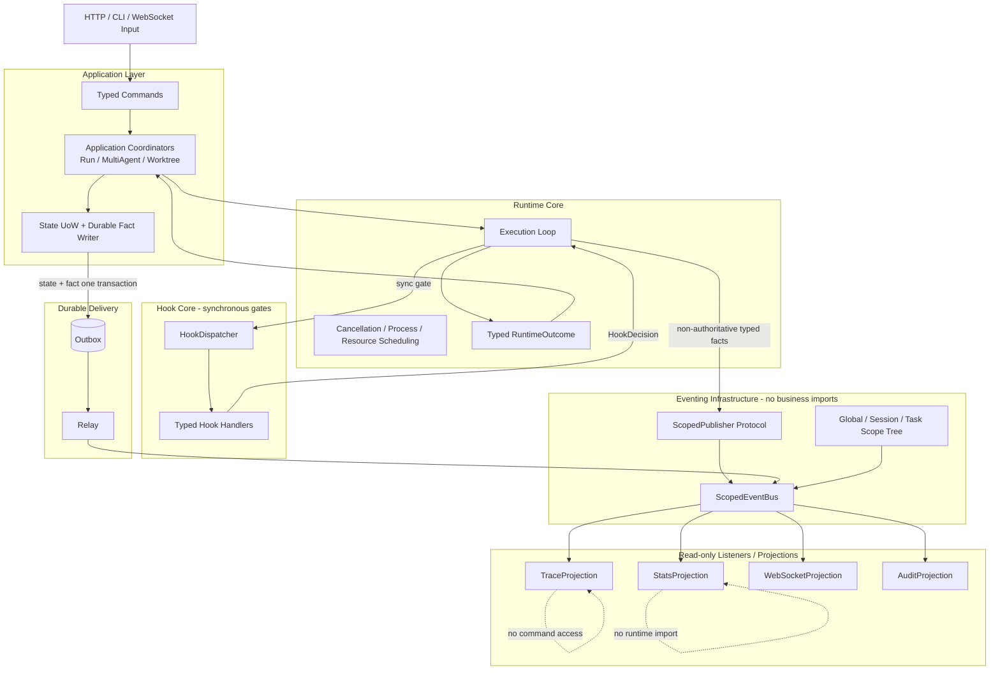
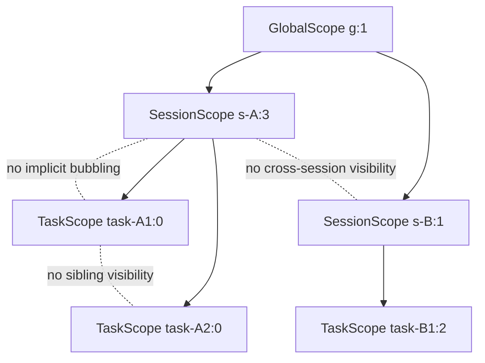
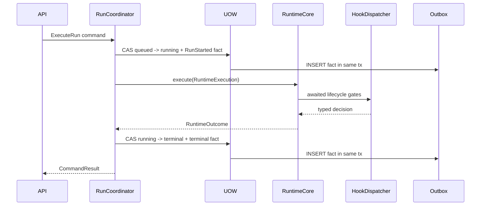

# Runtime / Hooks / EventBus 职责分离重构规划书

> 文档版本：2.0.0  
> 创建日期：2026-08-02  
> 状态：**APPROVED FOR IMPLEMENTATION — 尚未开始本规划的代码实施**  
> 适用代码库：`grace-code`  
> 上一阶段基线：`RUNTIME_HOOK_EVENTBUS_IMPLEMENTATION_COMPLETION_2026-08-02.md`  
> 本文定位：下一轮 From-Scratch CC-Native 重建的唯一施工规范

---

## 0. 阅读方式与不可违背的执行约束

这不是“优化建议”，而是下一轮开发的施工合同。执行模型必须逐条完成每个阶段，不得自行合并阶段、修改顺序、保留未声明的兼容路径，或因为旧测试通过就判定新架构完成。

### 0.1 本文中的关键词

- **MUST / 必须**：不满足即拒绝合并。
- **MUST NOT / 禁止**：一旦出现，立即停止该阶段并回退本阶段变更。
- **SHOULD / 应当**：除非有新的代码证据和 ADR，否则不得偏离。
- **Fact**：已经发生、使用过去时命名、不可撤销的事实。
- **Command**：请求系统执行动作的意图，可能失败，必须有明确接收者。
- **Hook**：Runtime 生命周期中的同步 gate；调用者等待其决策。
- **Listener / Projection**：事实的异步只读消费者；不得驱动权威状态机。
- **Scope**：事件发布、订阅和销毁的隔离边界，不是 payload 中的一个随意字符串。

### 0.2 绝对禁止

1. 禁止继续扩展现有 `server/services/event_bus.py`。
2. 禁止为现有 `DomainEvent.payload: dict` 增加更多 helper。
3. 禁止创建 `GenericEvent`、`AnyEvent`、`BasePayload(dict)`、`dict[str, Any]` 事件协议。
4. 禁止让 EventBus 调用 Repository、SQLite、WebSocket、StatsRecorder 或业务 mapper。
5. 禁止让 Listener 调用 Command Handler、Coordinator 或 Runtime。
6. 禁止让 Runtime import 具体 Hook、Listener、WebSocket、FastAPI、SQLite、SessionStore 实现。
7. 禁止使用事件来表达 `cancel_run`、`start_run`、`apply_worktree` 等命令。
8. 禁止用“临时兼容层”无限期保留旧 API。所有迁移 flag 必须在本文指定阶段删除。
9. 禁止恢复 Team topology。本项目只支持 build、plan、primary-mediated multi-agent。
10. 禁止修改一个阶段声明范围之外的第 4 个文件。

### 0.3 低能力执行模型的固定工作循环

每个阶段严格执行：

```text
读取本阶段全部内容
  -> 只打开“允许修改文件”
  -> 运行阶段前置测试
  -> 实现最小完整交付物
  -> 运行本阶段 AC
  -> 运行 git diff --check
  -> 输出阶段报告
  -> 等待人工/上级模型确认
  -> 才能进入下一阶段
```

出现下列任一情况必须停止，不得猜测：

- 需要修改第 4 个文件；
- 新类型需要 `Any` 才能“方便实现”；
- 新 Event 需要携带 Runtime、Repository、WebSocket、Callback 或其他对象引用；
- Listener 需要发布另一个业务事件才能完成工作；
- Hook 需要直接修改 Run/Session 持久化状态；
- Runtime 需要知道某个 Listener 是否存在；
- 测试只能通过 sleep 或增加随机重试解决；
- 新旧两条链路同时写同一权威状态。

### 0.4 版本与变更治理

- 本文采用语义版本号。文字澄清且不改变契约时只增加 PATCH；新增可选契约或阶段时增加 MINOR；改变职责边界、权威状态、投递语义、作用域、Hook 决策权、阶段顺序或验收阈值时增加 MAJOR。
- 任何 MAJOR 变更都必须重新执行完整 Step 1：重新检索官方资料、重新审计当前代码行号、重新回答五项质询，并留下新的搜索日期与证据链接。禁止直接修改 Step 2/3/4 来绕过调研。
- 影响 Event Schema 的变更即使向后兼容，也必须登记新 schema version；禁止静默改变同一 `(event_type, version)` 的字段或语义。
- 每个实施阶段的报告必须记录其依据的文档版本。执行模型发现工作区文档版本与阶段报告版本不一致时必须停止，不得自行合并两个版本的要求。
- ADR 只能解释本文已批准决策，不能暗中覆盖本文。若 ADR 与本文冲突，以更新后的、已重新完成 Step 1 的高版本规划书为准。

---

# 1. Step 1 — 调研与质询记录

## 1.1 搜索记录与证据等级

调研日期：2026-08-02。

执行过的检索：

1. `Claude Code runtime hooks event bus architecture separation`
2. `Cline agent event driven lifecycle implementation source code`
3. `typed event bus vs direct hook invocation tradeoffs`
4. `event bus anti-patterns agent framework scope isolation`
5. Claude Code 官方 Hook reference、Agent SDK Hook guide
6. Cline 官方 Hook 文档与公开仓库
7. CloudEvents 规范
8. Python asyncio Queue / cancellation 官方文档

### 证据分级

| 等级 | 含义 | 本文使用方式 |
|---|---|---|
| A | Claude Code / Claude Agent SDK 官方文档 | Hook 生命周期、同步决策和输入输出契约的直接依据 |
| A | Cline 官方文档与官方公开仓库 | Coding Agent 生命周期、Hook gate、checkpoint/隔离思想的交叉验证 |
| A | CloudEvents 官方规范 | 事件 identity、source、type、schema、duplicate 语义依据 |
| A | Python 官方文档 | Queue timeout、structured cancellation 的实现依据 |
| B | Azure 官方架构文档 | EDA producer/channel/consumer 解耦与 eventual consistency 风险依据 |
| C | 本项目代码审计 | 当前实现缺陷和迁移边界的唯一依据 |

### 官方资料

- [Claude Code Hooks reference](https://code.claude.com/docs/en/hooks)
- [Claude Code Hooks guide](https://code.claude.com/docs/en/hooks-guide)
- [Claude Agent SDK Hooks](https://code.claude.com/docs/en/agent-sdk/hooks)
- [Cline Hooks](https://docs.cline.bot/customization/hooks)
- [Cline public repository](https://github.com/cline/cline)
- [CloudEvents specification](https://github.com/cloudevents/spec/blob/main/cloudevents/spec.md)
- [Python asyncio Queue](https://docs.python.org/3/library/asyncio-queue.html)
- [Python asyncio Task cancellation](https://docs.python.org/3.11/library/asyncio-task.html)
- [Azure Event-Driven Architecture](https://learn.microsoft.com/en-us/azure/architecture/guide/architecture-styles/event-driven)

### 重要真实性声明

Claude Code 的完整 Runtime/EventBus 内部源码并未作为稳定、可审计的公共架构规范发布。官方公开材料明确描述了 Hook 生命周期与 decision control，但没有公开一个可直接复制的“Claude Code EventBus”。因此：

- 本文对 **Hook gate** 的结论属于官方事实。
- 本文对 **Command/Fact 分离、三级 Scope、Outbox、Projection** 的结论，是结合 CloudEvents、EDA 和本项目约束形成的工程设计。
- 文档禁止把工程推导冒充“Claude Code 内部就是这样实现”。
- Cline 当前公开仓库包含 team 能力；本项目已经明确不开发 Team，因此只参考其生命周期、隔离和 checkpoint 思想，不复制 Team 模块。

## 1.2 搜索摘要

### 1.2.1 Claude Code / Agent SDK 的明确结论

Claude Code Hook 在确定的生命周期点执行。`PreToolUse`、`UserPromptSubmit`、`Stop` 等 Hook 可以返回决策并阻断后续行为；调用方必须等待结果。官方还区分成功、阻断和非阻断错误，并为不同 Hook 定义 event-specific input/output。

直接结论：

- 需要改变当前动作是否继续的交互必须是同步 Hook。
- Hook 决策不应该通过异步 EventBus 返回，因为异步返回时动作可能已经执行。
- `PostToolUse`、审计、统计和 UI 通知如果不修改当前动作，应转成 Fact Event/Listener。
- Hook 输入必须是事件专用类型，不能是包含所有可选字段的上帝对象。

### 1.2.2 Cline 的明确结论

Cline 官方 Hook 文档将 Hook 描述为确定性 guardrail，覆盖 TaskStart/Resume/Cancel/Complete、Pre/PostToolUse、UserPromptSubmit、PreCompact。全局和 workspace hook 具有确定顺序；阻断结果会停止操作。

直接结论：

- Hook 是生命周期 gate，不是任意后台任务框架。
- Hook 的匹配、顺序、输入输出必须稳定。
- project/global 配置组合必须生成一个不可变执行快照，不能让运行中的 task 感知 registry 的中途变更。

### 1.2.3 CloudEvents / EDA 的明确结论

CloudEvents 将 Event 定义为“发生的事实及其上下文”，并要求稳定的 `id`、`source`、`type`；`source + id` 可用于识别重复事件。事件本身不指定目标消费者。Azure EDA 文档强调 producer 不应知道 consumer，且 eventual consistency 不适用于要求即时强一致的状态变更。

直接结论：

- Event 必须使用过去时，不能是命令。
- EventBus 不应知道 WS、Trace、Stats 等消费者。
- Run 状态与 terminal fact 必须经同一 UoW/Outbox 提交，不能依赖异步 EventBus 实现强一致。
- Event identity、schema version、scope 必须位于不可变 envelope 中。

## 1.3 严肃质询与明确回答

### 质询 1：CC/Claude Code 中 Runtime、Hooks、EventBus 三者的边界如何划分？哪些场景用 Sync Hook，哪些用 Async Event？

**回答：**

公开文档能直接确认的边界是：Hook 在生命周期点被调用，匹配后返回 allow/block/transform/context 等结果；需要决策的调用方等待 Hook。公开资料不能证明 Claude Code 内部存在本文形式的 EventBus。

本项目采用以下严格边界：

| 交互 | 机制 | 原因 |
|---|---|---|
| 用户输入是否接受 | Sync Hook | 必须在进入模型前决定 |
| 工具是否允许执行 | Sync Hook | 必须在副作用前决定 |
| 权限审批 | Sync Hook / HITL Gate | 必须返回明确授权结果 |
| Stop 是否允许结束 | Sync Hook | 结果会改变当前执行流 |
| 工具已经成功/失败 | Fact Event | 已发生，只供投影/审计 |
| Run 已提交/启动/终止 | Durable Fact Event | 已发生，需可重放 |
| UI delta | Scoped Live Notification | 非权威、允许断线后由快照恢复 |
| Stats/Trace/WS 更新 | Listener / Projection | 不能反向控制 Runtime |
| Cancel/Start/Retry | Direct Command to Coordinator | 是意图，不是事实，不能经 EventBus |

### 质询 2：当前 Runtime 是否包含了本应属于 Hook/Listener 的逻辑？是否存在硬编码通知？

**回答：是，而且数量仍然显著。**

代码证据：

1. `agent/session/runtime.py` 共约 2842 行，不是纯执行核心。
2. `runtime.py:1198-1219` 直接更新 Session/Run 状态并启动 Run。
3. `runtime.py:1488-1543` 直接读取和写入持久化消息，并组装上下文。
4. `runtime.py:1693-1774` 根据业务 RunStatus 写 Session summary/status。
5. `runtime.py:1794-1910` 构造 verification/workspace/evidence terminal payload 并调用持久化 finalizer。
6. `runtime.py:1947+` 管理 child background execution、notification persistence。
7. `runtime.py:875-955` 内置 worktree queue、worker 和 completion callback。
8. `runtime.py:2417-2434`、`2624-2636` 仍直接调用 `_event_callback(Event(...))`。
9. `runtime.py:2545-2583` 暴露一组运行时 setter；这表明依赖并未真正冻结在 composition root。
10. `server/services/agent_service.py:529-563` 把 WS callback 重新塞回 Runtime，形成 transport 反向注入。

这些逻辑必须分别迁移到 Application Coordinator、Context Assembler、Workspace Lease Service、Projection 或 composition root。

### 质询 3：当前 Hooks 是否越权？事件机制是否弱类型？是否存在泄漏或顺序依赖？

**回答：Hooks 的权限矩阵方向正确，但类型和生命周期仍未达标；EventBus 明显弱类型。**

Hooks 代码证据：

- `hooks/events.py:42-61` 使用一个通用 `HookContext`，包含 `dict[str, Any]`、`list[Any]` 和大量与当前 Hook 无关的可选字段。
- `hooks/protocol.py:48-54` 的 `updated_input/updated_output` 是 `dict[str, Any]`。
- `hooks/registry.py:55` 的 internal callback 返回 `Any`。
- `hooks/dispatcher.py:41` 的 execution runtime 是 `Any`。
- `hooks/dispatcher.py:224-234` 接受 `dict` 作为内部 Hook 返回值。
- `hooks/dispatcher.py:236-252` 用 detached daemon thread 执行 Hook，无法结构化 join，也没有 scope-owned cancellation。
- `HookRegistry` 是可变 list registry；clone 能缓解部分问题，但运行期注册/注销没有 revision snapshot 契约。

EventBus 代码证据：

- `server/services/event_bus.py:29` import `Any`。
- `event_bus.py:31` 直接 import FastAPI `WebSocket`。
- `event_bus.py:47` queue payload 是 `dict[str, Any]`。
- `event_bus.py:140` `_translate_event(event: Any)` 内置业务翻译。
- `event_bus.py:292-294` 持有 recorder/trace_store/trace_cache service locator。
- `event_bus.py:332-345` 直接持久化 trace。
- `event_bus.py:377` `publish(event: Any)` 接受弱类型事件。
- `event_bus.py:402` `publish_live(..., dict[str, Any])` 仍是 raw dictionary channel。
- 只有 Session map，没有 Global/Task scope object；销毁由 WebSocket 是否订阅决定，而不是由 owning scope 决定。

泄漏风险：

- SessionSubscriber 同时拥有 queue、drain task 和 WebSocket set；只要 unsubscribe/close 的某一步漏调，scope 无法统一回收。
- daemon detached Hook 不属于任何 scope，Session 关闭不会等待或取消它。
- EventBus 的 `destroy_session()` 以 `has_subscribers` 为条件，无法表达“Session 已结束但 WS 尚未断开”的权威生命周期。

顺序依赖：

- `_translate_event -> _persist_trace_event -> subscriber.publish` 固定在同一函数中，Trace 成功与 WS enqueue 的顺序由 EventBus 业务代码隐式保证。
- Listener 增加后只能继续修改 EventBus，导致上帝总线。

### 质询 4：如何实现 Global / Session / Task 隔离和强类型，而不是魔改？

**回答：使用显式 Scope 对象、不可变 token、无隐式 bubbling 的 scoped bus；业务 schema 与 bus infra 分包。**

具体规则：

1. `GlobalScope` 由进程 composition root 创建和销毁。
2. `SessionScope` 必须由 `GlobalScope.open_session(session_id)` 创建。
3. `TaskScope` 必须由 `SessionScope.open_task(task_id)` 创建。
4. 每个 scope 都有不可变 `ScopeToken(kind, global_id, session_id?, task_id?, generation)`。
5. publish 必须携带与 publisher scope 完全相同的 token。
6. 默认不向父级、兄弟级或全局级传播。
7. 子 Task terminal 需要父级可见时，由 MultiAgentCoordinator 显式创建一个新的 `ChildTaskCompleted` 父 scope fact；禁止 bus 自动 bubbling。
8. 关闭 parent 时，按 Task -> Session -> Global 的顺序取消 queue/drain/subscription。
9. 业务 Event class 放在 `application/events/`；EventBus infra 只能依赖 `EventEnvelope` Protocol 和 scope primitives。
10. 每个 Event payload 是独立 frozen dataclass，禁止公共 `payload: dict`。

### 质询 5：Agent EventBus 的主要反模式是什么？如何规避？

**回答：**

| 反模式 | 当前表现 | 新设计约束 |
|---|---|---|
| 上帝事件 / GenericEvent | `Event + payload dict` | 每个 Fact 独立 dataclass |
| EventBus 充当命令总线 | 旧 cancellation/terminal callback 倾向 | Command 只能 direct-call Coordinator |
| 上帝总线 | EventBus 翻译、持久化、缓存、WS | Bus 仅路由 envelope |
| 隐式状态传递 | run_context 在 publish 时补字段 | envelope 创建时字段完整，bus 不补写 |
| 自动 scope bubbling | 当前 scope 不显式 | 默认隔离，桥接创建新 fact |
| Listener 事件风暴 | Listener 可再次 publish | Listener port 不提供 publisher；静态禁止 |
| 循环触发业务 | Event 触发 coordinator command | Listener 禁止 import commands/coordinators |
| 可变 payload 引用 | dict/list 直接传递 | frozen dataclass + tuple + serialization copy |
| 无限 queue | queue_max_size 可为 0 | 所有 channel 必须显式有界 |
| 静默吞错 | `except Exception: logger` | error sink + metric + policy outcome |
| detached orphan | daemon Hook thread | structured task owner + scope cancel |
| 伪强一致 | EventBus 先/后写 trace | state + outbox UoW；bus 只通知 |
| schema 漂移 | `to_dict()` duck typing | registry + version + codec compile/runtime validation |

## 1.4 当前完成度重新定级

上一轮已经完成 P0 生命周期可靠性：Run/Delegation 的 state + outbox、relay、trace projection 和 live push 已闭环。该成果作为行为基线保留，但代码组织不是最终架构。

| 区域 | 行为可靠性 | CC-Native 结构成熟度 | 结论 |
|---|---:|---:|---|
| Run/Delegation durable lifecycle | 90% | 55% | 行为可用，依赖方向错误 |
| Runtime purity | 70% | 35% | 仍是 orchestration + repository + business service locator |
| Hook contract | 80% | 55% | 权限矩阵可用，类型/并发生命周期不合格 |
| Event schema | 55% | 20% | frozen envelope 外观，实际 payload 仍为 dict |
| EventBus infra | 75% | 25% | WS 可用，但 bus 与 transport/persistence/business 强耦合 |
| Scope isolation | 45% | 15% | 只有 session subscriber map，无 Task/Global scope contract |

## 1.5 Step 1 最终决策

**允许进入 Step 2。** 五个问题均已得到明确回答。

决策是 From Scratch 新建以下最终模块，而不是继续修补旧文件：

```text
application/commands/       # Command + Coordinator
application/events/         # 强类型业务事实 schema
runtime_core/               # 纯执行与资源调度
hook_core/                  # 同步 gate 契约与 dispatcher
eventing/                   # 无业务语义的 scoped bus infra
infrastructure/outbox/      # durable delivery adapter
listeners/                  # trace/ws/stats projections
composition/                # 唯一装配点
```

---

# 2. Step 2 — CC-Native 设计规范

## 2.1 总体架构与权威状态边界

### 2.1.1 职责边界图



### 2.1.2 唯一权威规则

- Run/Session/Delegation 的权威状态属于 Application Coordinator + Repository UoW。
- Runtime 只能返回 `RuntimeOutcome`，不能直接写 Run/Session 状态。
- Hook 只能返回 decision/transform/context attachment，不能写权威状态。
- EventBus 只移动已经构造好的 envelope，不能补字段、翻译、持久化或执行业务。
- Listener 只能写自己的 projection store；projection 不是权威状态。
- WS 是 projection，不是事实来源。

## 2.2 Command / Fact / Lifecycle 分类

### 2.2.1 Command

Command 是现在或未来的意图，使用祈使语义，有唯一 handler，直接调用，不进入 EventBus。

```python
@dataclass(frozen=True, slots=True)
class SubmitRun:
    session_id: SessionId
    prompt: UserPrompt
    idempotency_key: IdempotencyKey

@dataclass(frozen=True, slots=True)
class ExecuteRun:
    run_id: RunId
    session_id: SessionId
    task: TaskDescription

@dataclass(frozen=True, slots=True)
class RequestRunCancellation:
    run_id: RunId
    reason: CancellationReason

@dataclass(frozen=True, slots=True)
class FinalizeRun:
    run_id: RunId
    expected_version: AggregateVersion
    outcome: RuntimeOutcome
```

禁止命名：`RunCancelEvent`、`StartRunEvent`、`ApplyWorktreeEvent`。这些都是命令伪装成事件。

### 2.2.2 Durable Fact

Fact 使用过去时；事实创建后不可变；需要重放、审计或跨进程恢复时写 Outbox。

计划中的 durable facts：

| Event type | Payload class | 触发时机 | Scope | Aggregate |
|---|---|---|---|---|
| `run.submitted.v1` | `RunSubmittedV1` | Run、turn、user message 同事务创建后 | Session | Run |
| `run.started.v1` | `RunStartedV1` | queued→running CAS 成功后 | Session | Run |
| `run.completed.v1` | `RunCompletedV1` | terminal CAS 成功后 | Session | Run |
| `run.failed.v1` | `RunFailedV1` | terminal CAS 成功后 | Session | Run |
| `run.cancelled.v1` | `RunCancelledV1` | terminal CAS 成功后 | Session | Run |
| `run.blocked.v1` | `RunBlockedV1` | Runtime outcome 被 coordinator 接受后 | Session | Run |
| `run.gave_up.v1` | `RunGaveUpV1` | Runtime outcome 被 coordinator 接受后 | Session | Run |
| `delegation.created.v1` | `DelegationCreatedV1` | delegation UoW commit | Session | Delegation |
| `child_task.started.v1` | `ChildTaskStartedV1` | child CAS start commit | Task | ChildTask |
| `child_task.completed.v1` | `ChildTaskCompletedV1` | child terminal commit | Task | ChildTask |
| `delegation.completed.v1` | `DelegationCompletedV1` | aggregation CAS commit | Session | Delegation |
| `tool.executed.v1` | `ToolExecutedV1` | tool result accepted | Task | Run/ChildTask |
| `approval.resolved.v1` | `ApprovalResolvedV1` | approval record committed | Task | Approval |

### 2.2.3 Live Lifecycle / Telemetry

以下数据可丢失或合并，不属于权威状态：

| Notification | Scope | Delivery class | 断线恢复 |
|---|---|---|---|
| `assistant.text_delta.v1` | Task | coalescing/bounded | 从最终 assistant message 恢复 |
| `tool.progress.v1` | Task | latest-only | 从 ToolExecuted fact 恢复 |
| `resource.pressure_changed.v1` | Global/Session | latest-only | 从 governor snapshot 恢复 |
| `context.budget_changed.v1` | Task | latest-only | 从 context snapshot 恢复 |

Live notification 仍必须强类型，但不进入 durable outbox。

## 2.3 Event Envelope 与 Payload 精确定义

### 2.3.1 基础值对象

禁止到处传裸字符串。ID 必须通过值对象构造并在入口验证。

```python
@dataclass(frozen=True, slots=True)
class SessionId:
    value: str

@dataclass(frozen=True, slots=True)
class TaskId:
    value: str

@dataclass(frozen=True, slots=True)
class RunId:
    value: str

@dataclass(frozen=True, slots=True)
class EventId:
    value: UUID

@dataclass(frozen=True, slots=True)
class AggregateVersion:
    value: int
```

所有 `__post_init__` 必须验证非空、格式和非负约束。

### 2.3.2 ScopeToken

```python
class ScopeKind(str, Enum):
    GLOBAL = "global"
    SESSION = "session"
    TASK = "task"

@dataclass(frozen=True, slots=True)
class ScopeToken:
    kind: ScopeKind
    global_id: UUID
    generation: int
    session_id: SessionId | None = None
    task_id: TaskId | None = None
```

验证规则：

- GLOBAL：session_id/task_id 必须为空。
- SESSION：session_id 必须存在，task_id 必须为空。
- TASK：session_id/task_id 必须存在。
- generation 必须 >= 0，用于拒绝旧 scope 的迟到事件。

### 2.3.3 EventEnvelope

```python
PayloadT = TypeVar("PayloadT", covariant=True)

@dataclass(frozen=True, slots=True)
class EventEnvelope(Generic[PayloadT]):
    event_id: EventId
    event_type: EventTypeName
    schema_version: SchemaVersion
    occurred_at: datetime
    source: EventSource
    scope: ScopeToken
    correlation_id: CorrelationId
    causation_id: EventId | None
    aggregate_id: AggregateId
    aggregate_version: AggregateVersion
    payload: PayloadT
```

注意：`EventEnvelope` 是泛型载体，不是 `GenericEvent`。它不能直接实例化为 `EventEnvelope[dict]`；schema registry 只允许登记白名单 payload class。

### 2.3.4 Payload 示例

```python
class RunTerminalStatus(str, Enum):
    COMPLETED = "completed"
    FAILED = "failed"
    CANCELLED = "cancelled"
    BLOCKED = "blocked"
    GAVE_UP = "gave_up"
    PARTIAL = "partial"

@dataclass(frozen=True, slots=True)
class VerificationCheckV1:
    name: str
    status: VerificationCheckStatus
    detail: str

@dataclass(frozen=True, slots=True)
class WorkspaceDeltaV1:
    changed_files: tuple[RepoRelativePath, ...]
    has_changes: bool
    patch_available: bool

@dataclass(frozen=True, slots=True)
class RunCompletedV1:
    run_id: RunId
    turn_id: TurnId
    turn_index: int
    summary: str
    steps_taken: int
    total_tokens: int
    termination_reason: TerminationReason
    verification_status: VerificationStatus
    verification_reason: VerificationReason
    verification_checks: tuple[VerificationCheckV1, ...]
    workspace_delta: WorkspaceDeltaV1

@dataclass(frozen=True, slots=True)
class ToolExecutedV1:
    run_id: RunId
    task_id: TaskId
    invocation_id: InvocationId
    tool_name: ToolName
    success: bool
    duration_ms: int
    result_digest: ContentDigest
    error_code: ToolErrorCode | None
```

禁止字段：

- `payload: dict`
- `metadata: dict`
- `data: object`
- `runtime: Runtime`
- `callback: Callable`
- `repository: Repository`
- `websocket: WebSocket`
- mutable `list`/`set`
- 未约束的文件绝对路径
- 完整 secret/tool credential

## 2.4 Event Schema Registry 与版本规则

Schema registry 属于 application schema package，不属于 EventBus。

```python
@dataclass(frozen=True, slots=True)
class EventSchema(Generic[PayloadT]):
    event_type: EventTypeName
    version: SchemaVersion
    payload_type: type[PayloadT]
    encoder: EventEncoder[PayloadT]
    decoder: EventDecoder[PayloadT]
```

规则：

1. `(event_type, version)` 唯一。
2. 已发布 schema 不允许原地改字段含义。
3. 新增可选语义也优先新建 v2，而不是让消费者猜字段是否存在。
4. decoder 必须拒绝未知必填字段缺失、错误 enum、负数和 scope 不匹配。
5. JSON round-trip 后必须等值。
6. schema package 不 import EventBus/Listener/Runtime。

## 2.5 EventBus 三级 Scope 模型



### 创建

- Composition root 调用 `ScopedEventBus.open_global()`。
- RunCoordinator 调用 `global_scope.open_session(session_id)`。
- RuntimeAdapter/MultiAgentCoordinator 调用 `session_scope.open_task(task_id)`。
- 同一 owner 重复 open 必须返回冲突，不得静默复用旧 generation。

### 继承

- 子 scope 继承 immutable delivery configuration snapshot。
- 子 scope 不继承父 scope subscriber。
- 子 scope 不继承父 scope queue。
- 子 scope 不自动发布到父 scope。

### 销毁

```text
scope.close(reason)
  -> accepting = false
  -> reject new publish with ScopeClosed
  -> cancel/drain owned subscriber tasks by policy
  -> unsubscribe all registrations
  -> close children recursively
  -> increment generation tombstone
  -> report undelivered count
```

### 显式桥接

当 child result 需要父协调器可见：

1. child task scope 发布 `ChildTaskCompletedV1`。
2. MultiAgentCoordinator 通过直接查询/await child outcome 获得结果，不靠监听器驱动。
3. Coordinator 聚合并在 Session scope 创建新的 `DelegationProgressedV1` 或 `DelegationCompletedV1`。
4. 两个 Fact 使用 causation_id 关联。

禁止 bus 把 child event 原样冒泡到 parent。

## 2.6 EventBus Infrastructure 契约

### 2.6.1 Bus 只提供的能力

```python
class ScopedPublisher(Protocol[EventT]):
    def publish(self, event: EventT) -> PublishReceipt: ...

class ScopedSubscriber(Protocol[EventT]):
    def subscribe(
        self,
        event_type: type[EventT],
        handler: EventHandler[EventT],
        policy: SubscriptionPolicy,
    ) -> Subscription: ...

class EventScope(Protocol):
    @property
    def token(self) -> ScopeToken: ...
    def publisher(self, event_type: type[EventT]) -> ScopedPublisher[EventT]: ...
    def close(self, reason: ScopeCloseReason) -> ScopeCloseReport: ...
```

### 2.6.2 Bus 禁止提供的能力

- `translate_event`
- `insert_trace_event`
- `publish_to_websocket`
- `record_stats`
- `get_session`
- `update_run`
- `execute_command`
- `publish(dict)`
- `set_recorder()` / `trace_store` / `trace_cache`

### 2.6.3 Delivery policy

Bus 不根据业务 event type 写 if/else。Policy 在 subscription 创建时显式声明：

```python
class OverflowPolicy(str, Enum):
    REJECT = "reject"
    DROP_OLDEST = "drop_oldest"
    COALESCE_BY_KEY = "coalesce_by_key"

@dataclass(frozen=True, slots=True)
class SubscriptionPolicy:
    capacity: int
    overflow: OverflowPolicy
    handler_timeout_ms: int
    close_drain_timeout_ms: int
```

Durable fact 的可靠性来自 Outbox + idempotent consumer，不来自无限内存 queue。

### 2.6.4 Ordering

- 保证同一 scope、同一 publisher sequence 的 FIFO。
- 不承诺跨 scope 全局顺序。
- envelope 的 aggregate_version 用于 projection 检测 gap。
- consumer 发现 gap 必须返回 retryable error，不得自行跳过。
- 任何 at-least-once consumer 必须以 `(consumer_name, event_id)` 幂等。

## 2.7 Hook 原生契约

### 2.7.1 删除上帝 HookContext

每个 gate 使用独立 frozen input：

```python
@dataclass(frozen=True, slots=True)
class PreToolUseInput:
    scope: ScopeToken
    invocation_id: InvocationId
    tool: ToolDescriptor
    input: ToolInputSnapshot
    required_permissions: tuple[Permission, ...]

@dataclass(frozen=True, slots=True)
class StopInput:
    scope: ScopeToken
    candidate_outcome: RuntimeOutcome
    last_assistant_message: str
    stop_attempt: int

@dataclass(frozen=True, slots=True)
class UserPromptSubmitInput:
    scope: ScopeToken
    prompt: UserPrompt
    attachments: tuple[PromptAttachment, ...]
```

### 2.7.2 Hook result 使用 sum type

```python
@dataclass(frozen=True, slots=True)
class Continue:
    attachments: tuple[ContextAttachment, ...] = ()

@dataclass(frozen=True, slots=True)
class Block:
    reason: NonEmptyText

@dataclass(frozen=True, slots=True)
class ReplaceToolInput:
    input: ToolInputSnapshot
    reason: NonEmptyText

HookDecision = Continue | Block | ReplaceToolInput
```

禁止通过 `dict` 表达 decision。

### 2.7.3 四维 Hook contract

```python
@dataclass(frozen=True, slots=True)
class HookContract:
    scheduling: Literal["awaited"]
    decision_authority: HookDecisionAuthority
    data_authority: HookDataAuthority
    failure_policy: HookFailurePolicy
    timeout_ms: int
```

新 Hook Core 不支持 detached hook。原 detached advisory hook 迁移为 Listener；原因是“不等待结果”已经不再是 gate。

### 2.7.4 Registry snapshot

- Registry 修改生成新 revision，不原地修改 list。
- TaskScope 创建时绑定 revision。
- 正在运行的 task 永远使用自己的 revision。
- 新注册 Hook 只影响之后创建的 task。
- scope close 时释放 revision reference。

## 2.8 Hook vs Event 决策矩阵

| 交互点 | 调度 | 决策权 | 数据权 | 失败策略 | 选择 |
|---|---|---|---|---|---|
| Session 输入上下文注入 | Sync | Advisory | Attach context | fail-open + warning | Hook |
| UserPrompt 校验 | Sync | Policy | Read-only/replace prompt | fail-closed | Hook |
| PreToolUse | Sync | Policy | Read-only/replace typed input | dangerous fail-closed | Hook |
| PermissionRequest | Sync/HITL | Policy | Read-only | fail-closed | Hook/Gate |
| Stop completion check | Sync | Policy | Read-only | configured fail-closed | Hook |
| SubagentStop completion check | Sync | Policy | Read-only | fail-closed | Hook |
| PreCompact | Sync | Advisory | Context attachment | fail-open | Hook |
| Tool succeeded | Async | None | Immutable fact | retry projection | Event |
| Tool failed | Async | None | Immutable fact | retry projection | Event |
| Run terminal | Durable async delivery after UoW | None | Immutable fact | Outbox retry/DLQ | Fact Event |
| UI assistant delta | Async | None | Immutable live DTO | coalesce/drop | Notification |
| Trace write | Async consumer | None | Projection only | idempotent retry | Listener |
| Stats update | Async consumer | None | Projection only | idempotent retry | Listener |
| Memory prune | Scheduled command | Application authority | Memory state | explicit retry | Coordinator/Scheduler，非 Listener |
| Cancel run | Direct | Application authority | Run state | explicit result | Command |
| Apply worktree | Direct | Application authority | Workspace state | explicit result | Command |

## 2.9 Runtime 最终接口

### 2.9.1 Runtime 依赖

```python
@dataclass(frozen=True, slots=True)
class RuntimePorts:
    model: ModelPort
    tools: ToolExecutorPort
    hooks: RuntimeHookPort
    events: RuntimeFactPublisher
    cancellation: CancellationPort
    resources: ResourceLeasePort
    clock: Clock
```

禁止依赖：

- SessionStore / SQLiteStorageBackend
- EventBus concrete class
- WebSocket / FastAPI
- TraceProjection / StatsRecorder
- MemoryStore
- WorktreeService concrete class
- AgentService
- OutboxStore

### 2.9.2 Runtime 输入输出

```python
@dataclass(frozen=True, slots=True)
class RuntimeExecution:
    scope: ScopeToken
    task_context: TaskContext
    conversation: ConversationSnapshot
    capabilities: CapabilitySnapshot
    budget: ExecutionBudget

@dataclass(frozen=True, slots=True)
class RuntimeOutcome:
    status: RuntimeOutcomeStatus
    assistant_message: AssistantMessage
    steps: tuple[StepOutcome, ...]
    token_usage: TokenUsage
    verification: VerificationOutcome
    workspace_delta: WorkspaceDelta
    evidence: tuple[EvidenceRecord, ...]
```

Runtime 不返回持久化 row、不返回 WS dict、不返回 callback。

## 2.10 Application Coordinator

Coordinator 是命令、Runtime 和权威状态之间的唯一桥梁。



Cancellation：

1. API 调用 `RunCoordinator.request_cancellation()`。
2. Coordinator 将 application cancellation handle 标记为 requested。
3. Runtime CancellationPort push 到进程/工具。
4. Runtime 返回 Cancelled outcome。
5. Coordinator 提交 terminal state + `RunCancelledV1`。
6. 不允许 EventBus 驱动第 2-5 步。

## 2.11 Listener 契约

```python
class Projection(Protocol[EventT]):
    @property
    def consumer_name(self) -> ConsumerName: ...
    def apply(self, event: EventT, tx: ProjectionTransaction) -> ProjectionResult: ...
```

Listener MUST：

- 只订阅明确 event class；
- 幂等；
- 使用自己的 projection transaction；
- 失败时返回 retryable/permanent typed error；
- 能从 durable fact log 重建；
- 不 import Runtime、Command、Coordinator。

Listener MUST NOT：

- 发起 Run/Tool/Worktree/Memory command；
- 发布业务 Fact；
- 修改 sessions/runs/delegation authoritative tables；
- 依赖另一个 Listener 先执行；
- 通过全局 singleton 共享可变状态。

## 2.12 Runtime 净化映射表

| 当前代码位置 | 当前责任 | 目标组件 | 处理方式 |
|---|---|---|---|
| `runtime.py:1198-1219` | Session/Run start 状态写入 | RunCoordinator + RunUoW | 从 Runtime 删除 |
| `runtime.py:1488-1543` | 历史读取、消息持久化、上下文选择 | ConversationService + ContextAssembler | Runtime 只收 snapshot |
| `runtime.py:1693-1774` | Session status/summary business mapping | RunCoordinator outcome mapper | 从 Runtime 删除 |
| `runtime.py:1794-1910` | terminal payload + repository finalization | RunOutcomeMapper + RunUoW | 从 Runtime 删除 |
| `runtime.py:1947+` | child notification persistence | MultiAgentCoordinator | Runtime 只执行 child TaskContext |
| `runtime.py:875-955` | worktree queue/worker/callback | WorkspaceLeaseService | 作为明确 resource port |
| `runtime.py:225-228` | EvidenceStore persistence wiring | EvidenceCollector + EvidenceProjection | Runtime outcome 返回 immutable evidence |
| `runtime.py:1363-1375` | 修改 MemoryContext 当前 session/run | ContextAssembler | 禁止共享 mutable current context |
| `runtime.py:2417-2434` | callback event publish | Typed RuntimeFactPublisher | 删除 callback 和 raw Event |
| `runtime.py:2545-2680` | 多个 setter/pending state map | immutable execution input / Coordinator state | 删除 service locator setters |
| `agent_service.py:239-370` | memory bootstrap + maintenance | Composition + MaintenanceScheduler | 从 AgentService 拆出 |
| `agent_service.py:380-440` | resource event 写业务状态 + WS | ResourceCoordinator + projections | 拆分 command/fact |
| `agent_service.py:529-563` | transport callback 回灌 Runtime | WS Projection | 删除 callback 注入 |
| `event_bus.py:140-269` | 业务 Event→WS 翻译 | WebSocketProjection mapper | 从 bus 删除 |
| `event_bus.py:332-345` | trace/cache persistence | TraceProjection | 从 bus 删除 |
| `event_bus.py:463-475` | WebSocket subscription | WebSocketGateway adapter | 从 bus 删除 FastAPI import |
| `hooks/dispatcher.py:236-252` | detached daemon thread | Async advisory Listener | Hook Core 删除 detached |
| `hooks/events.py:42-119` | 上帝 HookContext | event-specific hook inputs | 整个类型废弃 |

## 2.13 解耦矩阵

允许：✅；禁止：❌。

| From \ To | Commands/Coordinator | Runtime Core | Hook Core | Eventing Infra | Event Schema | Listener | Infrastructure Adapter |
|---|---:|---:|---:|---:|---:|---:|---:|
| Commands/Coordinator | ✅ | ✅ | ❌ | 仅 publisher protocol | ✅ | ❌ | repository/UoW protocol |
| Runtime Core | ❌ | ✅ | 仅 HookPort | 仅 Publisher protocol | ✅ runtime facts | ❌ | ❌ |
| Hook Core | ❌ | ❌ | ✅ | ❌ | 仅 hook types | ❌ | process executor protocol |
| Eventing Infra | ❌ | ❌ | ❌ | ✅ | ❌ | handler protocol only | clock/executor protocol |
| Event Schema | ❌ | ❌ | ❌ | ❌ | ✅ | ❌ | ❌ |
| Listener | ❌ | ❌ | ❌ | subscriber protocol | ✅ | ✅ | projection store protocol |
| Adapter | ❌ | ❌ | ❌ | protocol implementation | codec only | ❌ | ✅ |

静态 import contract：

```text
runtime_core -> application.events.protocols, hook_core.ports, core value objects
eventing -> core value objects only
listeners -> application.events + listener ports
hook_core -> hook contracts + process executor port
application -> runtime_core ports + repositories + event schema
```

## 2.14 废弃清单

最终必须删除，而不是 deprecated：

### Runtime

- `agent/session/runtime.py` 当前 2842 行实现，由新 `runtime_core/` 替代后删除或缩减为无业务 facade；最终不得保留双 Runtime。
- `SessionRuntime.set_web_mode`
- `SessionRuntime.set_stats_recorder`
- `SessionRuntime.set_evidence_event_callback`
- `SessionRuntime.set_memory_event_callback`
- `SessionRuntime.set_worktree_completion_callback`
- `SessionRuntime.update_run`
- `_event_callback`
- Runtime 内全部 SessionStore 持久化调用

### Event

- `server/domain_events.py::DomainEvent(payload: dict)`
- 所有 helper function 返回 generic DomainEvent 的方式
- `agent.task.Event` 作为跨层消息协议
- `server/services/event_bus.py::_translate_event`
- `publish(event: Any)`
- `publish_live(dict)`
- duck-typed `hasattr(event, "to_dict")`

### EventBus

- `server/services/event_bus.py` 当前实现
- `SessionSubscriber` 对 FastAPI WebSocket 的直接所有权
- `recorder/trace_store/trace_cache` mutable injection
- EventBus 内 trace persistence
- EventBus 内 WS DTO mapping

### Hooks

- `HookContext`
- `HookOutput.updated_input: dict[str, Any]`
- `InternalHook.callback -> Any`
- dispatcher runtime `Any`
- internal hook 返回 raw dict
- detached hook scheduling
- mutable in-place registry list

### 依赖方向

- `agent/session/session_store.py -> server.services.event_outbox`
- `AgentService` 作为 1500+ 行 service locator/composition/business daemon 混合体

---

# 3. Step 3 — 分阶段开发路线图

## 3.1 总体阶段表

每阶段最多 3 个文件。工时单位为一名熟悉 Python、SQLite、asyncio 的工程师人日。

| 阶段 | 目标 | 交付物 | 前置依赖 | 工时 | 回滚方案 |
|---|---|---|---|---:|---|
| P1 | Core value objects + scope token | 3 个 core 文件 | None | 1.0 | 删除新增文件 |
| P2 | Run fact schemas | 3 个 schema 文件 | P1 | 1.5 | 删除新增文件 |
| P3 | Tool/delegation schemas + registry | 3 个 schema 文件 | P1 | 1.5 | 删除新增文件 |
| P4 | Eventing ports | publisher/subscriber/subscription | P1-P3 | 1.0 | 删除新增文件 |
| P5 | Scoped bus core | scope tree + bus + tests | P4 | 2.0 | flag 不装配新 bus |
| P6 | Queue/backpressure/close | queue policy + lifecycle tests | P5 | 1.5 | 回退 P5 commit |
| P7 | Durable fact/outbox neutral port | neutral UoW/outbox contracts | P2-P4 | 1.5 | 旧 outbox 仍权威 |
| P8 | SQLite outbox adapter | store + relay + crash tests | P7 | 2.0 | composition 不启用 adapter |
| P9 | Hook event-specific contracts | inputs/results/policies | P1 | 1.5 | 旧 Hook 不变 |
| P10 | Hook immutable registry | registry + matcher + tests | P9 | 1.5 | 旧 registry 不变 |
| P11 | Hook dispatcher | dispatcher + executor port + tests | P9-P10 | 2.0 | composition 继续旧 Hook |
| P12 | Runtime ports/outcome | ports + execution + outcome | P1-P3/P9 | 1.5 | 纯新增 |
| P13 | Runtime core skeleton | loop + cancellation + tests | P11-P12 | 2.5 | 纯新增，不接生产 |
| P14 | Run command/coordinator | commands + coordinator + UoW | P7/P12-P13 | 2.5 | shadow-only |
| P15 | Trace projection | typed trace listener + tests | P5/P8 | 1.5 | 旧 trace 仍权威 |
| P16 | WS projection/gateway | mapper + gateway + tests | P5 | 2.0 | 旧 WS 仍权威 |
| P17 | Stats projection | typed listener + tests | P5 | 1.0 | 关闭新 listener |
| P18 | Shadow composition | flags + composition + comparator | P13-P17 | 2.0 | `legacy` 模式 |
| P19 | Run path cutover | submission/start/final 3 文件 | P18 | 2.0 | 首个写入前切回；之后 DB snapshot |
| P20 | Multi-agent cutover | child/delegation 3 文件 | P19 | 2.0 | 关闭 multi-agent admission |
| P21 | Context/message extraction | assembler/service/runtime adapter | P19 | 2.0 | 切回旧 Runtime（仅灰度期） |
| P22 | Worktree/evidence extraction | workspace/evidence/runtime adapter | P20 | 2.0 | 禁用 write delegation |
| P23 | AgentService decomposition A | bootstrap/maintenance/service | P21 | 2.0 | composition flag |
| P24 | AgentService decomposition B | resources/approval/service | P23 | 2.0 | composition flag |
| P25 | 删除旧 EventBus | 旧 bus/mapper/tests | P19-P24 | 1.5 | release snapshot rollback |
| P26 | 删除旧 Hooks | 旧 dispatcher/context/registry | P11/P24 | 1.5 | release snapshot rollback |
| P27 | 删除旧 Runtime/flags | runtime/service/architecture gates | P21-P26 | 2.5 | 不允许代码级回滚，只允许 release rollback |
| P28 | 性能、泄漏、故障验收 | benchmark/leak/fault tests | 全部 | 2.0 | 修复不得降低阈值 |

总预估：约 47 人日。两名工程师可在 P9-P11 与 P7-P8、P15-P17 之间并行，但 P18 以后必须串行。

## 3.2 各阶段详细施工说明

### P1 — Core value objects 与 ScopeToken

允许修改文件：

1. `core/eventing/identifiers.py`
2. `core/eventing/scope.py`
3. `tests/eventing/test_scope_values.py`

实施：

- 创建所有 ID frozen/slots value object。
- 创建 ScopeKind/ScopeToken 和完整 invariant。
- 不 import server/agent/runtime/hooks。

禁止：暂时不要创建 bus、event schema 或 adapter。

回滚：删除 3 个新增文件。

### P2 — Run Fact Schema

允许修改文件：

1. `application/events/envelope.py`
2. `application/events/run_facts.py`
3. `tests/application/events/test_run_fact_schema.py`

实施：

- 建立 envelope 泛型和 RunSubmitted/Started/terminal 独立 payload。
- 所有 terminal status 使用独立 payload class 或有约束 sum type。
- encoder 输出 canonical JSON；禁止默认 `asdict` 吞掉类型语义。

回滚：删除文件；无生产接线。

### P3 — Tool/Delegation Schema 与 Registry

允许修改文件：

1. `application/events/tool_facts.py`
2. `application/events/delegation_facts.py`
3. `application/events/schema_registry.py`

实施：

- 建立 ToolExecuted、ChildTask、Delegation facts。
- registry 显式登记 payload class/version/codec。
- 重复 key 启动即失败。

回滚：删除文件。

### P4 — Eventing Ports

允许修改文件：

1. `eventing/publisher.py`
2. `eventing/subscriber.py`
3. `eventing/subscription.py`

实施：

- 只定义 Protocol、receipt、typed errors。
- 不 import `application.events.run_facts` 等业务 schema。
- 使用 TypeVar 保持 handler 类型。

回滚：删除文件。

### P5 — ScopedEventBus Core

允许修改文件：

1. `eventing/scoped_bus.py`
2. `eventing/scope_tree.py`
3. `tests/eventing/test_scope_isolation.py`

实施：

- 创建 Global/Session/Task scope tree。
- 默认 exact-scope routing，无 bubbling。
- scope generation 拒绝迟到 publish。
- subscription token 幂等 close。

回滚：不在 composition 装配；删除新增实现。

### P6 — Backpressure 与 Structured Close

允许修改文件：

1. `eventing/bounded_channel.py`
2. `eventing/scoped_bus.py`
3. `tests/eventing/test_bus_lifecycle.py`

实施：

- capacity 必须 > 0。
- asyncio wait 使用 `wait_for`。
- close 拥有并 await drain task；不得 daemon fire-and-forget。
- 区分 rejected/closed/overflow receipt。

回滚：回退本阶段；P5 core 仍不接生产。

### P7 — 中立 Durable Fact / UoW Ports

允许修改文件：

1. `application/transactions/unit_of_work.py`
2. `application/events/durable_writer.py`
3. `tests/application/test_durable_fact_uow_contract.py`

实施：

- 定义 state mutation + append fact 的 transaction contract。
- 从接口层消除 `agent -> server` 反向依赖。
- event writer 接受白名单 envelope，不接受 dict。

回滚：纯新增。

### P8 — SQLite Outbox Adapter

允许修改文件：

1. `infrastructure/outbox/sqlite_store.py`
2. `infrastructure/outbox/relay.py`
3. `tests/infrastructure/test_outbox_failure_matrix.py`

实施：

- 从现有已验证行为重新实现，不 import 旧 `server.services.event_outbox`。
- DDL 只在 startup migration。
- state + outbox 同 connection。
- claim/lease/retry/DLQ/receipt。
- stop 等待 in-flight thread；不得产生假 drain gap。

回滚：composition 不启用新 adapter。

### P9 — Hook Event-Specific Contracts

允许修改文件：

1. `hook_core/inputs.py`
2. `hook_core/decisions.py`
3. `hook_core/policies.py`

实施：

- 独立 PreToolUse/UserPrompt/Stop/SubagentStop/PreCompact input。
- frozen decisions。
- 不包含 Any/dict raw transform。

回滚：旧 Hook 仍工作。

### P10 — Immutable Hook Registry

允许修改文件：

1. `hook_core/registry.py`
2. `hook_core/matcher.py`
3. `tests/hook_core/test_registry_snapshot.py`

实施：

- copy-on-write revision。
- matcher 编译失败即拒绝配置。
- task bind revision 后不受新注册影响。

回滚：不装配新 registry。

### P11 — Hook Dispatcher

允许修改文件：

1. `hook_core/dispatcher.py`
2. `hook_core/executor.py`
3. `tests/hook_core/test_dispatch_failure_policy.py`

实施：

- 只支持 awaited gate。
- total deadline + per-hook timeout。
- policy/data/failure authority 编译为固定 execution plan。
- 禁止返回 dict。

回滚：composition 继续旧 dispatcher。

### P12 — Runtime Ports / Input / Outcome

允许修改文件：

1. `runtime_core/ports.py`
2. `runtime_core/execution.py`
3. `runtime_core/outcome.py`

实施：

- 定义 frozen RuntimePorts/RuntimeExecution/RuntimeOutcome。
- Conversation、Context、Capability 全部是 snapshot。
- 不包含 Repository 和 UI 类型。

回滚：纯新增。

### P13 — Runtime Core Skeleton

允许修改文件：

1. `runtime_core/runtime.py`
2. `runtime_core/step_loop.py`
3. `tests/runtime_core/test_runtime_isolation.py`

实施：

- 模型→action→hook gate→tool→outcome loop。
- Runtime 不写 DB。
- cancellation/process/resource scheduling 可保留。
- 测试使用 fake ports，不使用 Mock Listener。

回滚：不接生产。

### P14 — Run Commands / Coordinator / UoW

允许修改文件：

1. `application/commands/run_commands.py`
2. `application/coordinators/run_coordinator.py`
3. `tests/application/test_run_coordinator_atomicity.py`

实施：

- submit/start/execute/cancel/finalize command。
- Coordinator 创建 RuntimeExecution、接收 RuntimeOutcome。
- terminal state + fact one UoW。

回滚：shadow-only，旧 coordinator 权威。

### P15 — TraceProjection

允许修改文件：

1. `listeners/trace_projection.py`
2. `listeners/projection_runner.py`
3. `tests/listeners/test_trace_projection.py`

实施：

- typed visitor/overload，不写 `if payload.get`。
- receipt + trace 同 transaction。
- unknown version permanent failure/DLQ。

回滚：关闭新 listener。

### P16 — WebSocket Projection / Gateway

允许修改文件：

1. `listeners/websocket_projection.py`
2. `adapters/websocket_gateway.py`
3. `tests/adapters/test_websocket_scope_delivery.py`

实施：

- mapper 属于 projection，不属于 bus。
- gateway 持有 WebSocket；bus 只见 handler。
- reconnect 使用 trace snapshot + live watermark。

回滚：旧 WS path 权威。

### P17 — StatsProjection

允许修改文件：

1. `listeners/stats_projection.py`
2. `listeners/stats_models.py`
3. `tests/listeners/test_stats_projection.py`

实施：只读事实、幂等投影，不回写 Run。

### P18 — Shadow Composition 与灰度

允许修改文件：

1. `composition/runtime_composition.py`
2. `composition/architecture_flags.py`
3. `tests/composition/test_shadow_equivalence.py`

Flag：

```python
class ArchitectureMode(str, Enum):
    LEGACY = "legacy"
    SHADOW = "shadow"
    NATIVE = "native"
```

SHADOW 规则：

- 旧链路仍是唯一权威写入者。
- 新 Runtime 对录制输入运行，但禁止调用真实副作用 tool。
- 新 EventBus 只投递到 comparator/null projection。
- 禁止 state/outbox 双写。
- 比较 outcome status、tool plan、terminal payload digest。

回滚：切回 LEGACY；无新权威写入。

### P19 — Run Path Cutover

允许修改文件：

1. `server/services/run_submission.py`
2. `server/services/chat_pipeline.py`
3. `composition/runtime_composition.py`

实施：API 只调用 RunCoordinator；禁止直接 SessionStore/Runtime。

回滚：

- 首个 NATIVE command 前可切回 LEGACY。
- 首个 NATIVE 权威写入后，代码 flag 回滚被禁止；必须停止 admission、恢复发布前 DB snapshot 和 release artifact。

### P20 — Multi-Agent Cutover

允许修改文件：

1. `application/coordinators/multi_agent_coordinator.py`
2. `agent/session/agent_batch_tool.py`
3. `tests/application/test_multi_agent_scope_chain.py`

实施：

- parent-mediated multi-agent。
- child 使用 TaskScope + fresh TaskContext。
- child terminal 不冒泡；Coordinator 创建 parent fact。
- 不增加 Team。

回滚：关闭 multi-agent admission，不回退已提交 delegation state。

### P21 — Context/Message 从 Runtime 提取

允许修改文件：

1. `application/context/context_assembler.py`
2. `application/conversation/conversation_service.py`
3. `runtime_core/runtime.py`

实施：Runtime 只收 immutable snapshots；删除 memory current session/run mutation。

### P22 — Worktree/Evidence 提取

允许修改文件：

1. `application/workspaces/workspace_lease_service.py`
2. `application/evidence/evidence_collector.py`
3. `runtime_core/runtime.py`

实施：worktree 是明确 resource lease；evidence 是 outcome，不直接持久化。

### P23 — AgentService 拆分 A

允许修改文件：

1. `composition/application_bootstrap.py`
2. `application/maintenance/maintenance_scheduler.py`
3. `server/services/agent_service.py`

实施：memory bootstrap/maintenance 移出 AgentService。

### P24 — AgentService 拆分 B

允许修改文件：

1. `application/resources/resource_coordinator.py`
2. `application/approvals/approval_coordinator.py`
3. `server/services/agent_service.py`

实施：resource fact 与 business update 分离；approval 走 direct command/gate。

### P25 — 删除旧 EventBus

允许修改文件：

1. 删除 `server/services/event_bus.py`
2. 删除/替换 `server/ws/event_mapper.py`
3. `tests/test_runtime_architecture_gates.py`

验收：仓库中不存在旧 EventBus import、Any publish、FastAPI→bus coupling。

### P26 — 删除旧 Hooks

允许修改文件：

1. 删除 `hooks/events.py`
2. 删除 `hooks/protocol.py`
3. 删除 `hooks/dispatcher.py`

registry 的删除/迁移若成为第 4 文件，必须单独新增 P26b，不得违反粒度限制。

### P27 — 删除旧 Runtime 与全部迁移 Flag

允许修改文件：

1. `agent/session/runtime.py`
2. `server/services/agent_service.py`
3. `tests/test_runtime_architecture_gates.py`

完成态：

- 旧 Runtime 不再可实例化。
- LEGACY/SHADOW flag 删除。
- composition 只有 NATIVE 路径。
- 不保留 fallback。

### P28 — 性能、泄漏与故障矩阵

允许修改文件：

1. `tests/benchmarks/test_eventing_benchmarks.py`
2. `tests/faults/test_hook_event_fault_matrix.py`
3. `tests/faults/test_scope_leak_detection.py`

不得通过调高本文阈值让测试变绿；阈值变更需要新 ADR + 重新执行 Step 1。

## 3.3 并行开发约束

允许并行：

- P7-P8 与 P9-P11；
- P15/P16/P17 三个 projection；
- P21 与 P23 的设计调研，但代码修改需避免同时改 composition。

禁止并行：

- P18-P20 cutover；
- P25-P27 删除阶段；
- 两个阶段同时修改 `runtime_core/runtime.py`；
- 两个阶段同时修改 `server/services/agent_service.py`。

## 3.4 每阶段报告模板

执行模型必须输出：

```markdown
## Phase Px Report
- Modified files: [必须 <= 3]
- New public contracts: [...]
- Deleted contracts: [...]
- Tests before: command + result
- Tests after: command + result
- AC results: AC-x PASS/FAIL
- Architecture grep: command + zero/nonzero
- Rollback status: 可回滚/已越过权威写入点
- Open risks: 无 / 明确列表
- STOP: 等待确认，不进入下一阶段
```

---

# 4. Step 4 — 验收标准清单

## 4.1 Schema 与类型系统

- [ ] **AC-1**：`application/events/`、`eventing/`、`hook_core/`、`runtime_core/` 在 strict type check 下零错误。
- [ ] **AC-2**：以下命令返回零匹配：

  ```powershell
  rg -n "\bAny\b|dict\[str, object\]|dict\[str, Any\]|payload:\s*dict|GenericEvent|AnyEvent" application/events eventing hook_core runtime_core
  ```

- [ ] **AC-3**：每个 schema 都通过 canonical JSON round-trip 等值测试。
- [ ] **AC-4**：重复 `(event_type, version)` 注册导致 startup test 明确失败。
- [ ] **AC-5**：payload 中的 list/set/dict 或对象引用被构造器/codec 拒绝。
- [ ] **AC-6**：所有 durable fact 包含 event_id、type、version、source、scope、correlation、aggregate id/version、occurred_at。

## 4.2 Command / Fact 边界

- [ ] **AC-7**：Command class 不实现 Event protocol，传给 bus.publish 在类型检查和运行时均失败。
- [ ] **AC-8**：事件名称全部是过去时事实；人工审查表中不存在 Start/Cancel/Apply/Retry 等命令式 event。
- [ ] **AC-9**：以下静态检查零匹配：

  ```powershell
  rg -n "publish\(.*(Command|CancelRun|StartRun|ApplyWorktree)" application runtime_core listeners
  ```

- [ ] **AC-10**：Listener package 无 import `application.commands`、`application.coordinators`、`runtime_core.runtime`。

## 4.3 EventBus 作用域

- [ ] **AC-11**：Task A event 只被 Task A subscriber 收到；Session、Task B、其他 Session、Global 均收不到。
- [ ] **AC-12**：Session close 后所有 child Task subscription 自动归零。
- [ ] **AC-13**：旧 generation scope 的迟到 publish 返回 `ScopeClosed/StaleGeneration`，queue size 不变。
- [ ] **AC-14**：父 scope 关闭 1000 个 child scope 后，bus registry/subscription/task count 全部为 0。
- [ ] **AC-15**：没有 implicit bubbling；只有 Coordinator 新建的 parent fact 可见。
- [ ] **AC-16**：跨 session 同 event_id 仍按 source/scope identity 正确处理，不串数据。

## 4.4 EventBus 基础设施纯度

- [ ] **AC-17**：以下命令零匹配：

  ```powershell
  rg -n "FastAPI|WebSocket|sqlite|SessionStore|RunCoordinator|TraceProjection|StatsRecorder|server\.events|application\.events\.(run|tool|delegation)" eventing
  ```

- [ ] **AC-18**：EventBus 不具有 `translate`、`persist`、`record`、`websocket`、`command` 命名的方法或字段。
- [ ] **AC-19**：queue capacity=0 构造失败；仓库不存在无界 production queue。
- [ ] **AC-20**：handler 超时不会阻塞其他 subscription；结果被 error sink 记录。
- [ ] **AC-21**：同 scope FIFO 测试 10,000 events 无乱序；跨 scope 测试不声明虚假的全局顺序。

## 4.5 Hook 契约

- [ ] **AC-22**：不存在通用 HookContext；每个 blockable lifecycle point 有独立 input type。
- [ ] **AC-23**：internal hook 返回 dict/None/任意对象均失败；只能返回声明的 decision sum type。
- [ ] **AC-24**：PreToolUse fail-closed timeout 时 tool executor 调用次数为 0。
- [ ] **AC-25**：advisory fail-open timeout 时 Runtime 继续，warning fact 为 1，EventBus 仍能发布后续事实。
- [ ] **AC-26**：Hook 抛错不会关闭 EventBus scope，不会修改 Run repository。
- [ ] **AC-27**：运行中 Task 绑定 registry revision N；注册 N+1 后该 Task 仍只执行 N，新 Task 执行 N+1。
- [ ] **AC-28**：仓库中无 detached Hook/daemon Hook thread。
- [ ] **AC-29**：空 Hook dispatch P99 < 1.0 ms；100 个简单 matcher 下 P99 < 5.0 ms。

## 4.6 Runtime 纯度

- [ ] **AC-30**：Runtime unit tests 不构造 SessionStore、EventBus concrete、WebSocket、Listener 或 FastAPI。
- [ ] **AC-31**：以下命令零匹配：

  ```powershell
  rg -n "SessionStore|SQLite|WebSocket|FastAPI|TraceProjection|StatsRecorder|MemoryStore|AgentService|OutboxStore|server\.services|listeners\." runtime_core
  ```

- [ ] **AC-32**：Runtime Core 不调用 create/update/insert/delete/commit DB 方法。
- [ ] **AC-33**：相同 RuntimeExecution + deterministic fake ports 产生相同 RuntimeOutcome digest。
- [ ] **AC-34**：RuntimeOutcome 是 frozen，修改 nested tuple/value object 明确失败。
- [ ] **AC-35**：Runtime Core 总生产代码不超过 900 行；单文件不超过 400 行。超过必须重新拆责。

## 4.7 Coordinator / UoW / Outbox

- [ ] **AC-36**：state 写成功、outbox 写失败时 state=0/outbox=0。
- [ ] **AC-37**：state + outbox commit 后模拟进程崩溃，重启 relay 能投影事实。
- [ ] **AC-38**：terminal CAS 竞争 20 个线程，权威 terminal row=1、terminal fact=1。
- [ ] **AC-39**：同 event_id 同内容重试幂等；同 event_id 不同内容永久失败并进入告警。
- [ ] **AC-40**：projection receipt + projection row 同事务；任一失败两者均回滚。
- [ ] **AC-41**：poison event 达 MAX_ATTEMPTS 后真实状态为 DLQ，后续 good event 已 delivered。
- [ ] **AC-42**：Relay shutdown 等待 in-flight delivery；返回 undelivered 精确计数。

## 4.8 Listener / Projection

- [ ] **AC-43**：每个 Listener 只注册具体 event class；不存在 catch-all subscription。
- [ ] **AC-44**：Listener 处理同 event 两次，projection row 仍为 1。
- [ ] **AC-45**：随机打乱不同 aggregate event 不影响各自 projection；同 aggregate version gap 被检测。
- [ ] **AC-46**：WS projection 断线重连以 trace watermark 补齐，terminal 不重复展示。
- [ ] **AC-47**：停止所有 Listener 后 Runtime/Coordinator 仍能完成命令并提交权威状态。
- [ ] **AC-48**：Listener 无 publisher port，静态上无法形成 listener→event→listener 环。

## 4.9 性能与内存

- [ ] **AC-49**：in-process exact-scope enqueue（无 handler）P99 < 250 μs，测试样本 >= 100,000，报告硬件/OS/Python。
- [ ] **AC-50**：单 subscriber handler dispatch P99 < 1.0 ms，不含 handler 自身执行时间。
- [ ] **AC-51**：100 个 Session × 10 个 Task × 每 Task 10 subscriptions 创建后全部 close，强制 GC 后 retained subscription=0。
- [ ] **AC-52**：上述循环重复 100 次，进程 retained heap 增长 < 1%，或 < 2 MiB，取更大阈值。
- [ ] **AC-53**：容量满时行为严格符合 SubscriptionPolicy；无 silent unbounded growth。

## 4.10 Cutover 与删除

- [ ] **AC-54**：SHADOW 模式不写 authoritative state、不执行真实副作用 tool。
- [ ] **AC-55**：NATIVE cutover 前 shadow outcome digest 一致率 >= 99.5%；其余 0.5% 每条有分类报告。
- [ ] **AC-56**：P27 后仓库不存在 `ArchitectureMode.LEGACY/SHADOW` 和对应环境变量。
- [ ] **AC-57**：旧 EventBus/HookContext/generic DomainEvent/SessionRuntime service-locator API 均无法 import。
- [ ] **AC-58**：Team topology 静态 gate 持续为零：

  ```powershell
  rg -n "AgentTopology\.TEAM|team_enabled|team_approved|TeamCoordinator" agent application runtime_core eventing hook_core
  ```

- [ ] **AC-59**：全量 pytest、strict type check、compileall、Web build、diff check 全部通过。
- [ ] **AC-60**：架构 import contract 在 CI 中强制执行，不能只写在文档。

## 4.11 CI Gate 建议命令

```powershell
python -m compileall -q application runtime_core hook_core eventing listeners infrastructure composition
pytest -q tests/application tests/runtime_core tests/hook_core tests/eventing tests/listeners tests/infrastructure
pytest -q tests/faults tests/benchmarks
python -m mypy --strict application runtime_core hook_core eventing listeners
python -m importlinter
rg -n "\bAny\b|payload:\s*dict|GenericEvent|AnyEvent" application/events runtime_core hook_core eventing
rg -n "FastAPI|WebSocket|sqlite|SessionStore|RunCoordinator" eventing
rg -n "application\.commands|application\.coordinators|runtime_core\.runtime" listeners
rg -n "AgentTopology\.TEAM|team_enabled|team_approved" agent application runtime_core
git diff --check
cd web
npm run build
```

任何一个 `rg` gate 的预期是零匹配。PowerShell 中 `rg` 零匹配返回 exit code 1，CI wrapper 必须将“零匹配”转换为成功，而不能误判为执行失败。

---

# 5. 风险登记与处置

| 风险 | 概率 | 影响 | 预防 | 触发后的动作 |
|---|---:|---:|---|---|
| 低能力模型把 EventBus 当 CommandBus | 高 | Critical | AC-7/9/10 + 无 command import | 回退阶段，重写 schema |
| 用 dict 逃避 schema 设计 | 高 | Critical | AC-2 + strict typing | 不接受 type ignore |
| Shadow 模式产生真实副作用 | 中 | Critical | fake tool executor + AC-54 | 立即关闭 shadow |
| Scope close 泄漏 task | 中 | High | structured close + leak test | 阻断 cutover |
| Hook fail policy 配错导致危险工具放行 | 中 | Critical | event-specific default + fault matrix | fail-closed，人工审查 |
| Listener 驱动业务状态 | 中 | Critical | import gate + 无 command port | 删除 Listener 动作逻辑 |
| Outbox schema migration 隐式 commit | 低 | Critical | DDL startup-only test | 回退 adapter |
| 双写制造重复事实 | 中 | High | shadow 禁止权威写 | 关闭 shadow，清理非权威表 |
| Runtime 拆分后性能下降 | 中 | Medium | P28 thresholds | profile，不提高阈值 |
| 旧 API 未删除形成双架构 | 高 | High | P25-P27 import failure tests | 不允许宣布完成 |

---

# 6. 最终 Definition of Done

只有同时满足以下条件，才能声称“Runtime / Hooks / EventBus CC-Native 重构完成”：

1. Runtime 只执行模型/工具循环和资源/cancellation 调度。
2. Runtime 不知道 Repository、WebSocket、Trace、Stats、MemoryStore、具体 Listener。
3. Hook 只在同步 gate 返回 typed decision；无 detached Hook。
4. EventBus 无业务 import、无 Any/dict payload、无 persistence、无 transport。
5. Global/Session/Task scope 有创建、隔离、generation、结构化销毁测试。
6. Command 永远不进入 EventBus。
7. Durable fact 与权威 state 使用同一 UoW/Outbox。
8. Listener 只做幂等 projection，不驱动状态机。
9. 旧 EventBus、generic DomainEvent、HookContext、Runtime service-locator 和迁移 flags 已删除。
10. Team topology 没有恢复。
11. AC-1 至 AC-60 全部由机器输出证明通过。
12. 全量回归与 Web build 通过，无架构 gate 豁免。

如果只完成新类、新接口或 shadow 接线，但旧路径仍可运行，则完成度最高只能标记为 70%，不得标记完成。

---

# 7. 下一位执行模型的第一条指令

复制以下内容作为下一轮开工指令：

```text
你只能执行 docs/RUNTIME_HOOKS_EVENTBUS_CC_NATIVE_REBUILD_V2_2026-08-02.md 的 P1。
开始前完整读取文档的第 0、1、2、3.2/P1、4.1 节。
只允许修改 P1 列出的 3 个文件。
不要修改现有 Runtime、Hook、EventBus 或测试。
完成后运行 P1 的验收测试、compileall 和 git diff --check。
按第 3.4 节模板报告，然后停止；不得自动进入 P2。
如果需要 Any、dict payload、第 4 个文件或兼容层，立即停止并报告阻塞。
```
