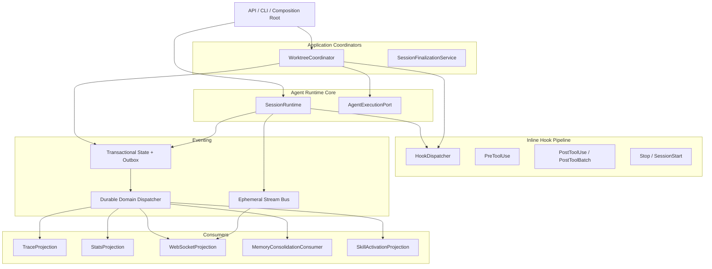

# Runtime / Hooks / Eventing 职责分离重构规划书

> 版本: v1.2  
> 日期: 2026-08-01  
> 状态: Implementation Ready  
> 对标口径: Claude Code/Cline 公开 Hook 行为 + 本仓库代码审计；不推断未公开内部实现

---

## 0. Executive Decision

本重构采用“四位分离 + 双事件通道”架构：

1. **Application Coordinator**：处理显式命令、业务状态机和多步流程，必须返回结果。
2. **Agent Runtime**：只负责单次 Agent 执行流、模型/工具调度、子 Agent 和取消。
3. **Hook Dispatcher**：执行路径内的确定性拦截和数据变换。
4. **Eventing**：只发布已经发生的事实，进一步拆成：
   - Durable Domain Events：Transactional Outbox、At-Least-Once、消费者幂等；
   - Ephemeral Stream Events：内存有界队列、At-Most-Once、允许按策略丢弃。

核心不变量：

- 产品只保留 **Build、Plan、Multi-Agent** 三种执行能力；Agent Team 明确删除。
- Worktree 的权威状态只能由 WorktreeCoordinator 修改，绝不由 Listener 驱动。
- Runtime 不 import Server、WebSocket、具体 Projection 或 Worktree 实现。
- Hook 的 awaited、决策权、数据权、失败策略是四个独立维度。
- 生命周期终态与对应 Domain Event 必须在同一事务提交。
- 可丢弃的 Stream Queue 不得承载 Run/Session terminal event。
- Feature Flag 任意组合下，同一副作用只允许一条执行路径。

### 0.1 产品能力边界

| 能力 | 决策 | 定义 |
|---|---|---|
| Build | 保留 | Agent 执行代码修改、工具调用、验证和结果交付 |
| Plan | 保留 | 只读分析、任务拆解和实施规划，不产生未经授权的代码副作用 |
| Multi-Agent | 保留 | 父 Agent 按显式 TaskContext 启动一个或多个隔离子 Agent，支持并行执行、取消传播、结果聚合和可选 Worktree 隔离 |
| Agent Team | **删除** | 删除 team proposal/approval、teammate identity、mailbox、共享 task board、lease、team message 和 team review 状态机 |

`Multi-Agent`不等同于`Agent Team`：Multi-Agent 是父 Agent 控制的树形任务执行；子 Agent 只接收显式 TaskContext，不加入长期团队、不共享 mailbox/task board，也不拥有独立 Team 生命周期。

---

## 1. 审计结论与可追踪问题

### 1.1 审计范围

| ID 范围 | 类别 | 数量 | 典型问题 |
|---|---:|---:|---|
| HP-01～HP-02 | Hooks Purity | 2 | `_goal_stop_hook` 绕过 HookDispatcher |
| RP-01～RP-11 | Runtime Purity | 11 | AgentService 修改 Runtime 私有字段；Runtime 持有已废弃 Team 和 Worktree 业务逻辑 |
| EC-01～EC-03 | Event Contract | 3 | `publish_raw()`、EventBus 依赖 `Any`、事件路由契约不统一 |
| BL-01～BL-03 | Business Logic Placement | 3 | Memory maintenance、compaction、context injection 位于 AgentService |
| **合计** |  | **19** | 原 v1.0 所写 18 项为计数错误 |

### 1.2 关键代码证据

| Finding | 代码位置 | 问题 | 目标决策 |
|---|---|---|---|
| HP-01 | `agent/core.py:2924-2928` | `_goal_stop_hook`直接调用 | 全部 STOP 进入 HookDispatcher |
| RP-01 | `agent/session/runtime.py:375-912` | 已废弃的 Team command/state machine 位于 Runtime | 删除 Team 能力及全部公开入口 |
| RP-02 | `agent/session/runtime.py:1333-1495` | Worktree queue/worker 位于 Runtime | 移至 `WorktreeCoordinator` |
| RP-03 | `agent/session/runtime.py:3139-3159` | Skill activation recording 位于 Runtime | Durable Projection |
| RP-04 | `server/services/agent_service.py:521-577` | 私有字段和 callback 注入 | Constructor Ports + Composition Root |
| RP-05 | `server/services/chat_pipeline.py:631` | 穿透 Runtime 更新 Store | 显式 Coordinator/Runtime command |
| EC-01 | `server/services/event_bus.py:411-450` | raw/typed 双发布 API | Envelope + legacy adapter |
| EC-02 | `server/services/event_bus.py:286-288` | recorder/store/cache 为 `Any` | Projection 从 Bus 中移除 |
| EC-03 | `server/services/event_bus.py:65-81` | WS 背压会同步阻塞 producer | Stream Bus 独立于 Domain Outbox |
| BL-01 | `server/services/agent_service.py:487-503` | STOP Hook 启动异步 memory consolidation | Durable `SessionCompleted` Consumer |
| BL-02 | `server/services/agent_service.py:306-355` | 周期维护由 AgentService 启动 | `MemoryMaintenanceJob` |
| BL-03 | `server/services/agent_service.py:1145-1220` | compaction pipeline 位于 Service | ContextWindowManager 单一入口 |

### 1.3 Hook 对标边界

公开的 Claude Code Hook 行为证明了以下外部语义，本设计只对标这些行为：

- PreToolUse 可拒绝或修改工具输入；修改后必须重新校验。
- PostToolUse 不能撤销已发生的副作用，但可修改模型可见输出或追加 context。
- SessionStart 可在首个模型请求前注入 context，但不能拒绝 session 启动。
- async/background Hook 不得返回阻断决策或数据变换。
- 多个匹配 Hook 必须完成后按确定性规则合并。

参考：

- https://code.claude.com/docs/en/hooks
- https://code.claude.com/docs/en/hooks-guide
- https://docs.cline.bot/customization/hooks

---

## 2. 目标架构

### 2.1 架构图



### 2.2 职责边界

| 组件 | 可以 | 不得 |
|---|---|---|
| Application Coordinator | 驱动状态机、组织事务、调用 Runtime、返回 Result、写 Outbox | 通过 Listener 等待命令结果；访问 Runtime 私有字段 |
| Agent Runtime | 执行 turn、模型/工具调度、隔离子 Agent、取消、调用 Hook | 持有 Worktree 权威状态；实现已删除的 Team 能力；依赖 WebSocket/Projection |
| Hook Dispatcher | awaited gate、input/output transform、context injection | 持久化长任务；代替业务状态机；持有 Runtime 引用 |
| Durable Consumer | 幂等投影、审计、最终一致维护 | 创建 Agent、apply worktree、决定 Run/Worktree 状态 |
| Stream Consumer | 实时展示、progress/token delta | 保存权威状态；假定事件一定送达 |
| Background Job | 周期清理、TTL/decay | 伪装成 Event Listener；阻塞 Session 主流程 |

### 2.3 依赖规则

```text
API/Bootstrap
    ├── Application Coordinators
    │       ├── AgentExecutionPort
    │       ├── HookPort
    │       ├── StateRepository
    │       └── DomainEventSink
    └── SessionRuntime
            ├── HookPort
            ├── StateRepository
            ├── DomainEventSink
            ├── StreamEventSink
            └── CancellationPort

Durable Dispatcher ──> Durable Consumers
Stream Bus         ──> Stream Consumers
```

禁止依赖：

- `agent/session/**` → `server/**`
- Runtime → Worktree concrete implementation
- Runtime/Coordinator → concrete Projection
- Projection → Runtime/Coordinator
- Event infrastructure → concrete business payload classes

---

## 3. Application Coordinator 契约

### 3.1 命令与结果

```python
@dataclass(frozen=True)
class CommandMeta:
    command_id: str
    workspace_id: str
    session_id: str
    expected_version: int | None = None


class WorktreeCoordinator(Protocol):
    async def apply(self, command: ApplyWorktree) -> WorktreeResult: ...
    async def discard(self, command: DiscardWorktree) -> WorktreeResult: ...
    async def retain(self, command: RetainWorktree) -> WorktreeResult: ...
```

规则：

- 所有 command 必须包含稳定 `command_id`，重复调用返回同一结果或版本冲突。
- Coordinator 使用 Repository/CAS 驱动状态，不操作 Runtime 私有字典。
- 状态更新与 Domain Event 写入同一事务。
- Runtime 通过 `AgentExecutionPort`启动执行，不暴露内部 registry/store/token。
- Worktree apply/discard 属于副作用命令，必须保留 approval、idempotency 和 cancellation 语义。

### 3.2 Memory 分类

| 能力 | 最终位置 | 投递语义 |
|---|---|---|
| Session 结束后的 memory consolidation | `MemoryConsolidationConsumer` | Durable At-Least-Once，幂等 |
| TTL prune / decay | `MemoryMaintenanceJob` | Scheduler 触发，可重试 |
| SessionStart memory context | `SessionStart` transform Hook | 首次模型请求前 awaited |
| 手动 consolidation API | `MemoryMaintenanceService` | 显式 command，返回结果 |

当前 consolidation 使用 `async_run=True`且异常不影响 Session 终态，因此不属于 Session 完成条件。

---

## 4. Domain Event 契约

### 4.1 Envelope 与 Payload

```python
from dataclasses import dataclass
from datetime import datetime
from enum import StrEnum
from typing import Generic, Protocol, TypeVar
from uuid import UUID

PayloadT = TypeVar("PayloadT", bound="DomainPayload")


class DomainPayload(Protocol):
    """Marker protocol. Payload 必须是 frozen dataclass。"""


@dataclass(frozen=True)
class EventMetadata:
    event_id: UUID
    schema_version: int
    occurred_at: datetime
    sequence: int
    workspace_id: str
    session_id: str
    run_id: str | None
    generation: int | None
    correlation_id: str
    causation_id: str | None
    producer: str


@dataclass(frozen=True)
class EventEnvelope(Generic[PayloadT]):
    metadata: EventMetadata
    payload: PayloadT
```

路由键由 `EventMetadata`唯一决定，不再由 `publish()`重复传入。

### 4.2 生命周期 Payload

```python
@dataclass(frozen=True)
class SessionStarted:
    source: str


@dataclass(frozen=True)
class SessionCompleted:
    steps_taken: int


@dataclass(frozen=True)
class SessionCancelled:
    reason: str


@dataclass(frozen=True)
class SessionFailed:
    error_code: str
    error_message: str


@dataclass(frozen=True)
class RunStarted:
    model: str


@dataclass(frozen=True)
class RunCancelRequested:
    reason: str


@dataclass(frozen=True)
class RunCompleted:
    steps_taken: int
    input_tokens: int
    output_tokens: int


@dataclass(frozen=True)
class RunCancelled:
    reason: str


@dataclass(frozen=True)
class RunFailed:
    error_code: str
    error_message: str
```

事件子类型已经表达状态，不再添加重复的 `status: str`。

### 4.3 Tool Payload

```python
class ToolExecutionStatus(StrEnum):
    COMPLETED = "completed"
    FAILED = "failed"
    CANCELLED = "cancelled"
    TIMED_OUT = "timed_out"


class SideEffectStatus(StrEnum):
    NONE = "none"
    APPLIED = "applied"
    NOT_APPLIED = "not_applied"
    UNKNOWN = "unknown"


@dataclass(frozen=True)
class ToolExecutionFinished:
    invocation_id: str
    tool_name: str
    status: ToolExecutionStatus
    side_effect: SideEffectStatus
    duration_ms: float
    attempt: int
    result_ref: str | None
    error_code: str | None
```

### 4.4 Schema Registry

```python
class EventSchemaRegistry(Protocol):
    def serialize(self, event: EventEnvelope[DomainPayload]) -> dict: ...
    def deserialize(self, data: dict) -> EventEnvelope[DomainPayload]: ...
```

规则：

- `event_type`由 Payload 类型到稳定字符串的 registry 映射提供，不使用 Python 类路径。
- 未知 `schema_version`进入 quarantine/dead-letter，不进行猜测性反序列化。
- 所有时间为 timezone-aware UTC。
- 所有 ID 和 sequence 在写入事务时生成，Producer 不允许提供空字符串默认值。
- Payload 不得包含可变 Runtime、Store、Process 或 WebSocket 引用。

---

## 5. 双事件通道

### 5.1 Durable Domain Events

用途：

- Session/Run lifecycle；
- Tool terminal/audit；
- Worktree 状态事实；
- Memory consolidation trigger；
- Skill activation audit；
- 必须恢复的 terminal WebSocket projection。

```python
class DomainEventSink(Protocol):
    def append(self, event: EventEnvelope[DomainPayload]) -> None:
        """写入当前业务事务的 outbox；不直接调用 consumer。"""


class DurableEventConsumer(Protocol):
    consumer_id: str

    async def handle(
        self,
        event: EventEnvelope[DomainPayload],
    ) -> ConsumerResult: ...
```

投递保证：

- Transactional Outbox；
- At-Least-Once；
- 同一 `(session_id, run_id, generation)`按 sequence 有序；
- 跨 run 不保证全局顺序；
- consumer 通过 `(consumer_id, event_id)`实现幂等；
- 指数退避，达到上限进入 dead-letter；
- shutdown 停止接收新 claim，并在期限内完成已 claim 事件；
- dispatcher 崩溃后可以重新 claim 未确认事件。

### 5.2 Ephemeral Stream Events

用途：

- token delta；
- thinking/progress；
- 临时 tool progress；
- UI typing/status。

```python
class StreamEventSink(Protocol):
    def emit(self, event: StreamEvent) -> StreamEmitResult: ...
```

投递保证：

- At-Most-Once；
- 每 run 有序；
- 有界队列；
- token delta 可合并；
- progress 可丢旧保新；
- terminal lifecycle event 禁止进入此通道；
- 慢 WebSocket 不得阻塞状态事务和 Runtime worker；
- shutdown 在期限内 drain，超时后报告丢弃数量。

### 5.3 Projection 契约

Projection 不得：

- 发起需要调用方确认成功的命令；
- 创建 Agent 或 apply/discard Worktree；
- 修改 Run/Worktree 权威状态；
- 回调 Runtime；
- 通过 EventBus 给其他 Projection 发命令。

Projection 必须：

- 对 Durable Event 幂等；
- 显式声明支持的 `event_type/schema_version`；
- 有独立 timeout、retry 和 metrics；
- 将不可处理事件送入 dead-letter，而不是吞异常。

---

## 6. Hook Dispatcher 契约

### 6.1 四维策略

| Hook | 调度 | 决策权 | 数据权 | 默认失败策略 |
|---|---|---|---|---|
| PreToolUse | Awaited | allow/deny/escalate | transform input | Security: fail-closed |
| PermissionRequest | Awaited | allow/deny/escalate | approval rules | fail-closed |
| PostToolUse | Awaited before next model call | 不能撤销副作用 | transform visible output/context | fail-open 或 fail-turn |
| PostToolUseFailure | Awaited before next model call | observe | recovery context | fail-open |
| PostToolBatch | Awaited | 可阻止下一次模型调用 | batch context | configurable |
| Stop | Awaited | 可阻止 Agent 停止 | continuation reason | bounded fail-turn |
| SessionStart | Awaited before first model call | 不能拒绝启动 | initial context | fail-open |
| SessionEnd | Background 或 awaited shutdown | 无 | cleanup notification | 按注册类型 |

### 6.2 Registration 与 Result

```python
@dataclass(frozen=True)
class HookRegistration:
    hook_id: str
    event: HookEvent
    priority: int
    matcher: HookMatcher
    scheduling: HookScheduling
    failure_policy: HookFailurePolicy
    timeout_s: float
    trust_level: HookTrustLevel


@dataclass(frozen=True)
class HookDispatchResult:
    decision: HookDecision
    transformed_input: JsonValue | None = None
    transformed_output: JsonValue | None = None
    additional_context: tuple[str, ...] = ()
    diagnostics: tuple[HookDiagnostic, ...] = ()


class HookPort(Protocol):
    async def dispatch(
        self,
        event: HookEvent,
        context: HookContext,
    ) -> HookDispatchResult: ...
```

### 6.3 合并与安全规则

- 决策优先级：`deny > escalate > allow > observe`。
- transform 按 `(priority, hook_id)`稳定顺序串行应用。
- 每个 transform 的输入是前一个 transform 的输出。
- updated tool input 必须重新执行 schema、capability、policy 和 approval 校验。
- Hook 的 allow 不能绕过硬策略或 HITL。
- Background Hook 返回 decision/transform 时视为无效配置并拒绝注册。
- 每个 Hook 有独立 timeout，dispatch 另有总 deadline。
- Hook 输出进入 ContextWindowManager 前必须执行大小限制和 Artifact 外置。
- `HookContext`不得包含 Runtime/Store 等可变内部引用。
- Stop Hook 必须有最大重入次数，防止无限继续循环。
- PostTool context injection 必须持久化；resume 重放记录，不重新执行历史 Hook。

### 6.4 Tool 调用顺序

```text
parse tool call
  → schema validation
  → PreToolUse transform/deny
  → schema revalidation
  → capability/policy evaluation
  → user approval if required
  → cancellation check
  → execute
  → PostToolUse/PostToolUseFailure
  → persist model-visible result/context
  → publish ToolExecutionFinished
```

---

## 7. Runtime 与 Composition Root

### 7.1 Runtime 公共接口

```python
class AgentExecutionPort(Protocol):
    async def execute(self, request: AgentExecutionRequest) -> AgentExecutionResult: ...
    async def cancel(self, run_ref: RunRef, reason: str) -> bool: ...


class SessionRuntime(AgentExecutionPort):
    def __init__(
        self,
        *,
        store: SessionStorePort,
        hook_port: HookPort,
        domain_events: DomainEventSink,
        stream_events: StreamEventSink,
        cancellation: CancellationPort,
    ) -> None: ...
```

禁止通过 getter 暴露 `approval_broker`、token registry、store 或 internal executor。对外只提供行为型 API，例如：

- `request_approval()`
- `resolve_approval()`
- `execute()`
- `cancel(run_ref)`
- `query_active_run()`

### 7.2 Composition Root

`AgentService`逐步退化为应用入口，依赖组装放到 `server/bootstrap.py`或等价 container：

```text
build storage
build outbox dispatcher
build stream bus
build hook registry/dispatcher
build runtime
build coordinators
register projections/consumers
start jobs
```

Feature Flag 只能在 Composition Root 选择实现，业务代码内部不得同时执行新旧路径。

---

## 8. 净化映射与废弃清单

### 8.1 最终归位

| 当前位置 | 当前逻辑 | 目标位置 | 机制 |
|---|---|---|---|
| `runtime.py:375-912` | Agent Team orchestration | **删除，不迁移** | 产品能力下线 |
| `runtime.py:1333-1495` | Worktree queue/worker | `application/worktree_coordinator.py` | 显式 command |
| `runtime.py:3139-3159` | Skill activation recording | `projections/skill_activation.py` | Durable projection |
| Runtime/Core evidence injection | Evidence context | `hooks/evidence_injector.py`或 Context layer | Awaited transform |
| `agent_service.py:1145-1220` | Compaction | `context/` | ContextWindowManager |
| `agent_service.py:487-503` | Memory consolidation | `consumers/memory_consolidation.py` | Durable consumer |
| `agent_service.py:1266-1312` | Session context injection | `hooks/session_context.py` | SessionStart transform |
| `agent_service.py:306-355` | Memory periodic maintenance | `jobs/memory_maintenance.py` | Scheduler |
| `agent/core.py:2928` | `_goal_stop_hook` | HookDispatcher | Stop Hook |
| EventBus recorder/cache/store | Projection logic | `projections/` | Consumer registration |

### 8.2 删除项

- `_goal_stop_hook`及其直接调用路径；
- Runtime 内全部 Agent Team 字段、command methods、mailbox/task board/lease 适配代码；
- Agent Team API、Tool schema、配置项、事件类型及前端入口；
- Runtime 内 Worktree 权威状态和 queue/worker；
- Runtime 的 `_publish_run_terminal`、`_memory_event_callback`等 callback setters；
- AgentService 对 `runtime._*`的所有访问；
- `EventBus.publish_raw()`生产调用点；
- EventBus 内置 recorder/trace_store/trace_cache；
- AgentService 内 memory maintenance thread/task；
- AgentService 内硬编码 memory STOP Hook；
- ChatPipeline 直接访问 Runtime Store；
- 新旧实现双副作用 fallback。

兼容期允许保留一个 `LegacyEventAdapter`，但它只能把单个 typed event 转换为单个旧 WS payload，不得再次持久化或双 publish。

---

## 9. 分阶段实施路线

| 阶段 | 目标 | 交付物 | 依赖 | 工时 | 回滚 |
|---|---|---|---|---:|---|
| P0 | Characterization | WS golden payload、terminal transaction、Hook 顺序、Multi-Agent/Worktree 行为测试 | 无 | 1.5d | 测试-only |
| P1 | Event contracts | Envelope、Payload、SchemaRegistry、LegacyEventAdapter | P0 | 2.5d | adapter 切回旧 serializer |
| P2 | Hook contract | 四维策略、merge、timeout、重入和 transform pipeline | P0 | 3d | dispatcher feature flag 单路选择 |
| P3 | 双事件通道 | outbox schema/dispatcher + ephemeral stream bus | P1 | 4d | domain 保留旧事务路径；stream 单路切换 |
| P4 | 删除 Agent Team | 删除 proposal/approval、mailbox、task board、lease、team API/tool/event/config；保留并验证 Multi-Agent | P0 | 1.5d | 单独 revert 删除提交 |
| P5 | WorktreeCoordinator | Multi-Agent 所需 queue/apply/discard/review 从 Runtime 提取 | P2,P3,P4 | 2.5d | composition root 切回旧 Runtime |
| P6 | Jobs/Projections | Memory job/consumer、Stats、Trace、Skill、WS | P3 | 2.5d | 各 consumer 独立禁用 |
| P7 | Runtime Ports | Runtime 只依赖最小 Ports；AgentService 不访问私有字段 | P2,P4,P5,P6 | 2d | Runtime implementation flag |
| P8 | Exclusive cutover | 新 Composition Root，禁止双副作用 | P7 | 1.5d | 单点配置回切 |
| P9 | Legacy deletion | 删除旧 callback/raw/Worktree fallback/maintenance 路径 | P8 稳定期 | 1d | Git revert |
| P10 | Failure/concurrency | crash、outbox、幂等、背压、顺序、shutdown 测试 | P3-P9 | 2.5d | 测试-only |
| **总计** |  |  |  | **22.5d** |  |

实施原则：

- P0 在修改生产行为前合入。
- P1/P2 可以并行。
- P4 只删除 Agent Team，不改写 Multi-Agent 执行语义；P5 再独立提取 Multi-Agent 所需的 WorktreeCoordinator。
- P9 只能在新路径完成至少一个稳定发布周期后执行。
- Shadow mode 只比较序列化结果，不执行新侧副作用。

---

## 10. 机器可验证验收标准

### P0：Characterization

- [ ] AC-0.1：现有 WS lifecycle/tool/token payload 均有 golden fixture。
- [ ] AC-0.2：run terminal 状态与 terminal trace 的原子提交行为有回归测试。
- [ ] AC-0.3：Multi-Agent/Worktree 所有公开命令的成功、冲突、重复调用行为有 characterization test。
- [ ] AC-0.4：现有 Hook 顺序、STOP 重入和 context injection 行为被记录。

### P1：Event Contract

- [ ] AC-1.1：所有 Domain Event 具有非空 event_id、schema_version、session_id、sequence。
- [ ] AC-1.2：Payload 100% 为 frozen dataclass，业务字段无 `Any`。
- [ ] AC-1.3：serialize → deserialize 后类型和值完全相等。
- [ ] AC-1.4：未知 schema version 被送入 quarantine/dead-letter。
- [ ] AC-1.5：LegacyEventAdapter 对每个 event 最多产生一个旧 payload。
- [ ] AC-1.6：事件类不存在重复的 `status: str`编码。

### P2：Hook Contract

- [ ] AC-2.1：PreToolUse deny 时实际工具调用次数为 0。
- [ ] AC-2.2：修改后的 tool input 被重新执行 schema、policy 和 approval 校验。
- [ ] AC-2.3：多个 transform 按 `(priority, hook_id)`确定性合并。
- [ ] AC-2.4：Security Hook timeout 按 fail-closed 处理。
- [ ] AC-2.5：Background Hook 返回 decision/transform 时注册失败。
- [ ] AC-2.6：PostToolUse additional context 在下一次模型请求前可见并被持久化。
- [ ] AC-2.7：resume 不重新执行历史 PostToolUse Hook。
- [ ] AC-2.8：Stop Hook 达到最大重入次数后确定性结束。

### P3：Eventing

- [ ] AC-3.1：权威状态与 outbox event 在同一数据库事务提交。
- [ ] AC-3.2：提交后、发布前模拟崩溃，重启后 event 被补发。
- [ ] AC-3.3：同一 consumer 重放相同 event_id 不产生重复副作用。
- [ ] AC-3.4：同一 run 的 durable sequence 严格递增。
- [ ] AC-3.5：terminal lifecycle event 无法发布到 ephemeral stream API。
- [ ] AC-3.6：慢 WS subscriber 不阻塞 run 状态提交和 Runtime worker。
- [ ] AC-3.7：stream queue 满时按事件类型执行 merge/drop 策略并增加 metrics。
- [ ] AC-3.8：shutdown 停止新 claim，drain 超时返回未投递数。

### P4：删除 Agent Team

- [ ] AC-4.1：生产代码不存在 `_teams`、`_team_proposals`、`TeamRuntime`、Team mailbox/task board/lease 调用。
- [ ] AC-4.2：Agent Team 的 API route、tool definition、event schema、配置项和前端入口全部删除。
- [ ] AC-4.3：Build 和 Plan 模式的既有行为不变。
- [ ] AC-4.4：Multi-Agent 仍可启动至少两个隔离子 Agent、聚合结果并从父级级联取消。
- [ ] AC-4.5：子 Agent 不继承父历史，只接收显式 TaskContext。

### P5：WorktreeCoordinator

- [ ] AC-5.1：Worktree command 返回明确 Result/Error，不通过 Event Listener 等待结果。
- [ ] AC-5.2：重复 command_id 不重复 apply/discard Worktree。
- [ ] AC-5.3：Coordinator CAS 失败时不发布 completed event。
- [ ] AC-5.4：Worktree apply/discard 保留 approval、cancellation 和 side-effect UNKNOWN 语义。
- [ ] AC-5.5：Runtime 不再持有 Worktree worker queue 或权威状态。

### P6：Jobs 与 Projections

- [ ] AC-6.1：Memory consolidation 相同 event_id 处理两次只产生一次有效更新。
- [ ] AC-6.2：MemoryMaintenanceJob 可独立启动、停止、重试，不依赖 AgentService 生命周期细节。
- [ ] AC-6.3：Projection 不 import Runtime/Coordinator。
- [ ] AC-6.4：Projection 异常进入 retry/dead-letter，不影响权威状态提交。
- [ ] AC-6.5：Session A/Run A 的事件不会泄漏到 Session B 或 Run B。

### P7-P9：边界与迁移

- [ ] AC-7.1：`agent/session/**`不存在对 `server/**`的 import。
- [ ] AC-7.2：`server/**`不存在 `runtime._`直接访问。
- [ ] AC-7.3：Runtime 仅依赖 HookPort、StorePort、DomainEventSink、StreamEventSink、CancellationPort。
- [ ] AC-7.4：Feature Flag 任意配置只激活一条副作用路径。
- [ ] AC-7.5：生产调用点不存在 `publish_raw()`。
- [ ] AC-7.6：`agent/core.py`不存在 `_goal_stop_hook`。
- [ ] AC-7.7：Event infrastructure 不 import具体业务 Payload 类。
- [ ] AC-7.8：使用 AST/import-linter 校验依赖，不以文件行数作为架构验收。

### P10：系统级验收

- [ ] AC-10.1：全量现有测试通过，无新增失败。
- [ ] AC-10.2：并发 session/run 的事件路由和顺序测试通过。
- [ ] AC-10.3：outbox dispatcher crash/restart 测试通过。
- [ ] AC-10.4：slow consumer、queue overflow、shutdown timeout 测试通过。
- [ ] AC-10.5：cancel_requested → cancelled/completed 的 CAS 竞态测试通过。
- [ ] AC-10.6：真实 WS 客户端在升级期间保持 payload 向后兼容。

---

## 11. Definition of Done

只有同时满足以下条件，重构才算完成：

1. Agent Team 能力及入口已删除；Runtime 中不存在 Worktree/Memory/Projection 业务实现。
2. 所有阻断和 transform 都通过 HookDispatcher，且没有 legacy bypass。
3. Domain terminal event 使用 Transactional Outbox；Stream event 与其物理隔离。
4. Coordinator 状态更新、事件写入和 command idempotency 已通过 crash/竞态测试。
5. Production path 不存在 `publish_raw()`和 Runtime 私有字段穿透。
6. 新旧路径不会同时执行副作用。
7. 架构依赖由自动化规则持续验证。
8. 全量测试及本文所有 AC 通过。

---

## 12. 非目标

本重构不包含：

- 更换 LLM backend；
- 重写 ContextWindowManager；
- 重写 MCP transport；
- 新增 Agent Team 产品功能；该能力已明确下线；
- 改变 Build、Plan、Multi-Agent 的产品语义；
- 引入外部分布式消息中间件。

首版 Durable Dispatcher 使用现有 SQLite StorageBackend + Outbox 即可；只有在吞吐或多进程部署证明需要时，才评估外部 broker。
