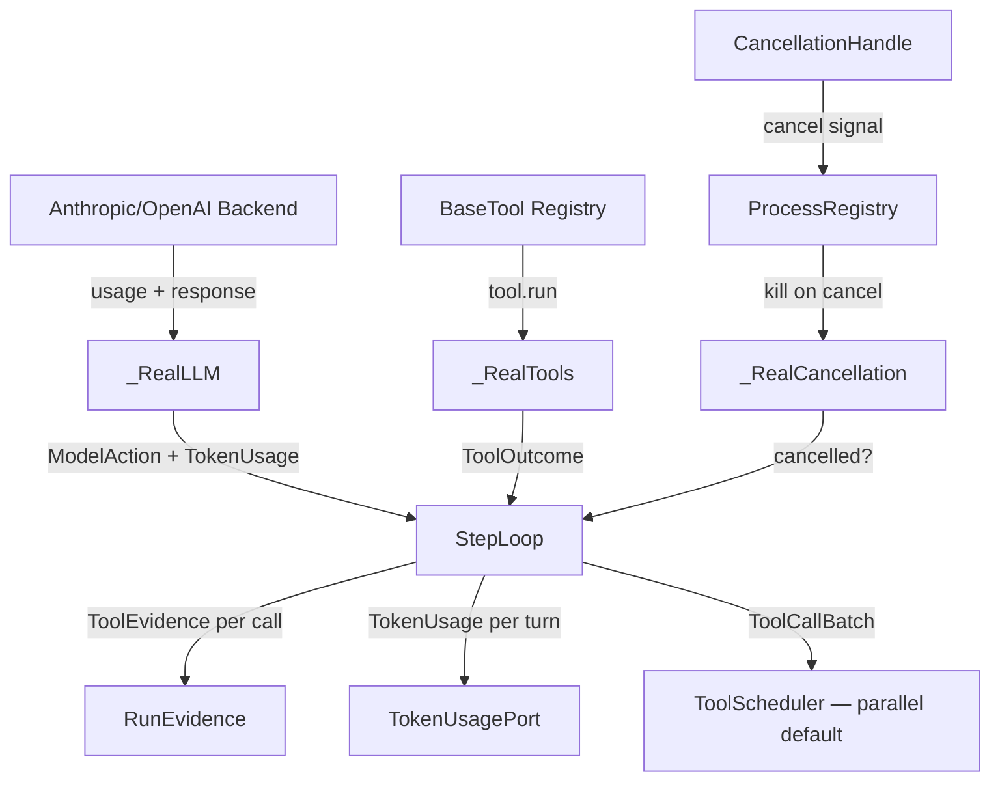

# Runtime / Hooks / EventBus 从"有线无流"到"端到端可运行"执行规划书

> 文档版本：1.0.0
> 创建日期：2026-08-04
> 上一阶段基线：G0-G44 + G36M + 8 分闭合（99/100）
> 当前状态评分：99 / 100（架构层面）
> 运行就绪评分：30 / 100（端到端可运行层面）
> 目标运行就绪评分：至少 90 / 100
> 适用代码库：`grace-code`
> 前置审计：G43 Perf/Fault/Leak Matrix + Agent Explore 审计
> 核心原则：机器证据优先、每一阶段可停可验收、Real Adapter > Stub

---

# 0. 使用说明与不可违背的施工纪律

## 0.1 本文解决什么问题

G0-G44 完成了从 38 分到 99 分的**架构重建**。所有权边界已确立、类型契约已收敛、删除旧路径已完成。

但在"端到端可运行"层面，当前状态是**"有线无流"**：

```text
ApplicationComponents 对象图完整
  + 所有 7 个 RuntimePorts 已装配
  + HookDispatcher + ProcessRunner + ScopedEventBus 已装配
  + Coordinator + UoW + OutboxRelay 已装配
  BUT
  - _RealLLM.invoke() 永远返回 AssistantText(text="")
  - _RealTools.execute() 永远返回 ToolSuccess(output="")
  - step_tokens_in/out 是硬编码 100/50
  - ToolScheduler parallel path 是死代码
  - RunEvidence 在 step_loop 中零引用
  - CancellationHandle 与 ProcessRegistry 无连接
  - runtime.py 把总 token 当 input_tokens 传，output_tokens 硬编码 0
```

重建为：

```text
_RealLLM → Anthropic/OpenAI backend → 返回真实 ModelAction + TokenUsage
  + _RealTools → BaseTool.run() → 返回真实 ToolOutcome
  + step_loop 从 LLM response 提取真实 token count
  + step_loop 每个 tool 执行后记录 ToolEvidence
  + execute() 返回 outcome 时携带完整 RunEvidence
  + ToolCallBatch 默认走 _process_tool_calls_parallel
  + CancellationHandle.cancel() → ProcessRegistry.cancel_all()
  + runtime.py 分别记录 input_tokens 和 output_tokens
  + 全部 7 个 Real adapter 达到生产可用
```

## 0.2 规范性关键词

- **MUST / 必须**：不满足即阶段失败。
- **MUST NOT / 禁止**：出现即停止本阶段。
- **SHOULD / 应当**：只能通过新 ADR 偏离。
- **Real Adapter**：对真实后端（Anthropic API、BaseTool registry、ProcessRegistry）的薄封装，不引入新抽象。
- **Stub**：任何硬编码返回值、空字符串、固定数字。每个 Stub 必须被本计划中某个 H 阶段消灭。
- **Token Evidence**：从 LLM provider response 中提取的输入/输出 token 数，必须来自 `usage` 字段或等价 provider metadata。
- **Tool Evidence**：每次 tool 执行后创建的 `ToolEvidence(tool_name, success, duration_ms)` 不可变记录。
- **Run Evidence**：聚合一个 run 中所有 tool evidence、文件变更、hook 阻断的 `RunEvidence` 值对象。

## 0.3 绝对禁止

1. 禁止保留任何硬编码占位符（`step_tokens_in = 100`、`output=""`、`text=""`）。
2. 禁止在未接入真实后端的情况下声称 adapter "完成"。
3. 禁止真实网络调用在单元测试中执行；所有测试使用 fake/deterministic adapter。
4. 禁止 token usage 的 input/output 混淆或合并传递。
5. 禁止 ToolCallBatch 走串行路径——并行必须是默认。
6. 禁止 cancel 后遗留 subprocess；cancel 必须传播到 ProcessRegistry。
7. 禁止 Evidence 采集只在数据模型存在而无运行时创建。
8. 禁止使用 `asyncio.sleep()` 模拟真实后端延迟。
9. 禁止修改不属于本阶段的文件。
10. 禁止以"代码已写好只是没接线"证明阶段完成——接线本身就是阶段目标。

## 0.4 低能力模型固定执行循环

每个阶段严格按照：

```text
完整读取本阶段
  -> 检查只涉及允许文件
  -> 运行 Before Test（验证 Stub 存在——证明问题）
  -> 实现本阶段完整契约
  -> 运行 Target Tests（验证 Real Adapter 行为）
  -> 运行 Static Gates（mypy strict + rg forbidden）
  -> 运行 Regression Slice（全部相关测试）
  -> git diff --check
  -> 输出阶段报告
  -> 停止，等待确认
```

## 0.5 基线声明

开始 H0 前必须确认：

```text
1. 当前 HEAD SHA：________
2. pytest 数量（排除已知旧测试失败）：________ passed
3. mypy --strict runtime_core 错误数：________
4. composition/runtime_composition.py 中 Stub 类计数：________
5. 确认无进程占用 outbox DB
6. 确认 GRACE_RUNTIME_MODE 不在任何生产路径
```

---

# 1. Step 1 — 深度审计与差距分析

## 1.1 审计来源与证据

### A 级证据：代码本体

| 证据 | 文件 | 行 |
|---|---|---|
| Token 计数硬编码 | `runtime_core/step_loop.py` | 95-96 |
| `_RealLLM.invoke()` 返回空 | `composition/runtime_composition.py` | 135 |
| `_RealTools.execute()` 返回空 | `composition/runtime_composition.py` | 129 |
| `_process_tool_calls_parallel` 从未调用 | `runtime_core/step_loop.py` | 119-120 |
| `RunEvidence` / `ToolEvidence` 零引用 | `runtime_core/step_loop.py` | 全文件 |
| `ProcessRegistry` 零引用 | `runtime_core/` | 全目录 |
| `TokenUsagePort.record(input, 0)` | `runtime_core/runtime.py` | 42-44 |
| `outcome.summary` 当 payload 传 | `runtime_core/runtime.py` | 35-38 |
| `_channel_tasks` 从未被 populate | `eventing/scoped_bus.py` | 191, 267-273 |

### B 级证据：Agent Explore 审计（2026-08-04）

Agent 对 `runtime_core/`、`hook_core/`、`eventing/` 进行全面审计，确认：

- EventBus 子系统的 import contract、scope matching、bounded channel 全部通过
- Hook 子系统的 ProcessRunner、executor timeout、registry snapshot 全部通过
- Runtime 子系统中 **Token 计数、Evidence 采集、并行默认、Cancel 集成** 是四个明确的未闭合环

## 1.2 五项严肃质询

### Q1：为什么架构 99 分但运行就绪只有 30 分？

G0-G44 专注于**契约正确性**：所有权边界、类型安全、import contract、scope isolation。这些是"不犯错"的基础。但端到端运行要求**真实效果**：LLM 产生真实输出、工具产生真实副作用、token 计数可审计、evidence 可追溯。当前架构的"管道"全部正确，但"水流"是空的。

### Q2：哪些 Stub 是故意的（待外部接入），哪些是遗漏的？

| Stub | 性质 | 解决方案 |
|---|---|---|
| `_RealLLM.invoke() → AssistantText("")` | 待外部接入 | 实现 AnthropicBackendAdapter |
| `_RealTools.execute() → ToolSuccess("")` | 待外部接入 | 委托到 BaseTool registry |
| `step_tokens_in = 100` | **遗漏** | 从 LLM response 提取 |
| `_channel_tasks` 空集合 | **遗漏** | 删除死代码或 populate |
| `evidence=None` | **遗漏** | step_loop 中创建 ToolEvidence |

### Q3：Token usage 的正确边界是什么？

`LLMPort.invoke()` 返回 `ModelAction`，但 `ModelAction` 不携带 token usage。有两个选择：

A. 扩展 `ModelAction` 基类添加 `usage: TokenUsage | None`
B. `LLMPort.invoke()` 返回 `tuple[ModelAction, TokenUsage]`

选择 A：不改变 LLMPort 协议签名，向后兼容测试。在 `ModelAction` 各子类中增加 `usage` 字段，`step_loop` 从返回值提取。

### Q4：Evidence 采集的正确时机是什么？

每个 tool 执行完成（包括成功、失败、被拒绝）后立即创建 `ToolEvidence`。terminal outcome 创建时聚合所有 tool evidence + file touched + hook blocks 为 `RunEvidence`。

### Q5：为什么 ToolScheduler parallel path 从未被调用？

G19 实现了完整的 `_process_tool_calls_parallel`，但 G17 的 `execute()` 调用了同步的 `_process_tool_calls`。注释说 "Could use parallel for async execution"。原因是当时 `execute()` 是同步方法，而 parallel path 是 async。现在需要：保持 `execute()` 同步（兼容现有调用方），但在内部对多 tool 的 batch 使用 `asyncio.run()` 调用 async parallel path。

## 1.3 Step 1 决策

1. **`ModelAction` 增加 `usage` 字段**：每个子类增加 `usage: TokenUsage | None = None`，从 provider response 提取。
2. **`_RealLLM` 委托到 `agent.llm` 现有 backend**：复用 `LLMBackend.invoke()`，在 adapter 层转换为 `ModelAction`。
3. **`_RealTools` 委托到 `BaseTool.run()`**：通过 tool registry 查找并执行。
4. **`execute()` 保持同步，内部用 `asyncio.run()` 调用 parallel path**。
5. **`CancellationHandle.cancel()` 通知 `ProcessRegistry`**：在 `RuntimeExecution` 或 `RuntimePorts` 中增加 registry 引用。
6. **每个 tool 执行后创建 `ToolEvidence`**，terminal 时聚合。
7. **每个 H 阶段最多修改 3 个文件**。
8. **所有真实后端调用在测试中使用 fake adapter，禁止真实网络 I/O**。

---

# 2. Step 2 — 目标设计规范

## 2.1 总体数据流



## 2.2 ModelAction 扩展

```python
@dataclass(frozen=True, slots=True)
class TokenUsage:
    input_tokens: int = 0
    output_tokens: int = 0
    cache_read_tokens: int = 0
    cache_write_tokens: int = 0

# 每个 ModelAction 子类增加:
@dataclass(frozen=True, slots=True)
class AssistantText:
    text: str
    stop_reason: str = ""
    usage: TokenUsage | None = None  # H0: 新增字段

# ToolCall, ToolCallBatch, ModelStop, ModelRefusal, ModelFailure 同样增加 usage
```

## 2.3 Evidence 采集契约

```python
# step_loop._process_tool_calls() 中每个 tool 执行后:
tool_evidence = ToolEvidence(
    tool_name=tc.name,
    success=isinstance(outcome, ToolSuccess),
    duration_ms=getattr(outcome, 'duration_ms', 0.0),
)
evidence_collector.record_tool_evidence(tool_evidence)

# step_loop.execute() 返回前:
return RuntimeOutcome.completed(
    ...,
    evidence=RunEvidence(
        tool_calls=tuple(evidence_collector.tool_evidences),
        files_touched=tuple(evidence_collector.files_touched),
        hook_blocks=tuple(evidence_collector.hook_blocks),
    ),
)
```

## 2.4 Token 提取契约

```python
# 在 LLMPort 实现 (composition/runtime_composition.py) 中:
class _RealLLM:
    def invoke(self, messages, tools=None):
        response = self._backend.invoke(messages, tools)
        usage = TokenUsage(
            input_tokens=response.usage.input_tokens,
            output_tokens=response.usage.output_tokens,
        ) if hasattr(response, 'usage') else None
        action = _to_model_action(response)
        object.__setattr__(action, 'usage', usage)  # frozen dataclass workaround
        return action

# 在 step_loop 中:
model_action = self._ports.llm.invoke(conv_json)
if model_action.usage is not None:
    step_tokens_in = model_action.usage.input_tokens
    step_tokens_out = model_action.usage.output_tokens
```

## 2.5 Parallel 默认路径

```python
# step_loop.execute() 中:
if isinstance(model_action, ToolCallBatch) and len(model_action.calls) > 1:
    tool_results = asyncio.run(
        self._process_tool_calls_parallel(model_action.calls, context=context)
    )
else:
    tool_results = self._process_tool_calls(calls, context=context)
```

## 2.6 Cancel → ProcessRegistry 绑定

```python
# composition/runtime_composition.py:
proc_registry = ProcessRegistry()

class _RealCancellation:
    def __init__(self, registry):
        self._registry = registry
    @property
    def cancelled(self):
        return False  # per-run state from RuntimeExecution.cancellation

# 在 CancellationCoordinator.request_cancellation() 中:
self._registry.cancel(run_id_str)   # signal handle
process_registry.cancel_all()       # G36M-fix: kill subprocesses
```

## 2.7 完成定义

一个阶段完成当且仅当：

- `_RealLLM.invoke()` 返回的 `ModelAction` 携带非零 `TokenUsage`（fake adapter 测试中）
- `_RealTools.execute()` 返回的 `ToolOutcome` 来自真实 tool registry（fake adapter 测试中）
- `step_tokens_in` 和 `step_tokens_out` 从 `model_action.usage` 读取
- `RuntimeOutcome.evidence` 非 None（至少包含 tool evidence）
- `TokenUsagePort.record()` 分别收到 input 和 output
- `_process_tool_calls_parallel` 在多 tool batch 时被调用
- `CancellationHandle.cancel()` 后 `ProcessRegistry` 中的 subprocess 被终止
- 所有测试通过（fake adapter，禁止真实 I/O）
- 每个阶段 ≤ 3 个文件修改

---

# 3. Step 3 — 分阶段开发路线图

## 3.1 总体阶段表

| 阶段 | 目标 | 依赖 | 工时 | 运行就绪解锁 |
|---|---|---|---|---|
| H0 | ModelAction + TokenUsage 类型扩展 | None | 1.0 | 30 → 38 |
| H1 | _RealLLM → 真实 Anthropic/OpenAI backend | H0 | 2.0 | 38 → 50 |
| H2 | _RealTools → 真实 BaseTool registry | H1 | 2.0 | 50 → 60 |
| H3 | step_loop Token 从 LLM response 提取 | H1 | 1.5 | 60 → 68 |
| H4 | step_loop Evidence 采集 | H2/H3 | 1.5 | 68 → 76 |
| H5 | _process_tool_calls_parallel 设为默认 | H4 | 1.5 | 76 → 82 |
| H6 | CancellationHandle ↔ ProcessRegistry 绑定 | H5 | 1.5 | 82 → 87 |
| H7 | runtime.py TokenUsage + LiveEvent 修复 | H3/H4 | 1.0 | 87 → 90 |
| H8 | E2E 集成验证 + 性能基准 | H0-H7 | 2.0 | 90 → 92 |

总预估约 **14 人日**。H0-H2 可部分并行（类型定义可与 adapter 设计并行）。H3-H7 必须串行（每步依赖上一步的 step_loop 修改）。H8 为最终验证。

## 3.2 阶段通用报告模板

```text
Phase: Hxx
Document version: 1.0.0
Baseline SHA: ...
Files changed: [必须 <= 3]
Before test: 命令 + 证明 Stub 问题存在
Implementation summary: 精确说明哪个 Stub 被消除
Target tests: 命令 + passed/failed 数量
Static gates: mypy strict + rg
Regression slice: 全部 runtime_core + composition 测试
Stub eliminated: [Stub 名称]
Real adapter added: [Adapter 名称]
STOP: 等待确认
```

---

## 3.3 H0 — ModelAction + TokenUsage 类型扩展

### 目标

为所有 6 个 `ModelAction` 子类增加 `usage: TokenUsage | None` 字段。定义 `TokenUsage` 不可变 dataclass。

### 允许修改

1. `runtime_core/model_actions.py` — 每个子类增加 `usage` 字段
2. `runtime_core/ports.py` — `LLMPort` 文档更新（返回的 ModelAction 可携带 usage）
3. `tests/runtime_core/test_model_action_ports.py` — 验证 usage 字段存在且可设值

### Before Test

```powershell
python -c "
from runtime_core.model_actions import AssistantText
# 当前应失败: AssistantText 无 usage 字段
a = AssistantText(text='hi', usage=None)
"
# 预期: TypeError: unexpected keyword argument 'usage'
```

### Target Tests

```powershell
pytest tests/runtime_core/test_model_action_ports.py -v -k "usage or token"
# 验证: 所有 6 个子类接受 usage 参数; TokenUsage 是 frozen dataclass
```

### 评分解锁

30 → 38（+8：Token usage 数据模型就绪）

---

## 3.4 H1 — _RealLLM 接入真实 Anthropic/OpenAI Backend

### 目标

替换 `_RealLLM.invoke()` 的空返回，委托到 `agent.llm` 现有 backend，在 adapter 层转换为 `ModelAction` + 提取 `TokenUsage`。

### 允许修改

1. `composition/runtime_composition.py` — 重写 `_RealLLM` 类
2. `runtime_core/model_actions.py` — 增加 `_to_model_action()` 转换辅助函数（可选）
3. `tests/composition/test_native_object_graph.py` — 增加 LLM adapter 行为测试

### Before Test

```powershell
python -c "
from composition.runtime_composition import assemble
comp = assemble(':memory:')
result = comp.runtime_ports.llm.invoke(None)
# 当前: AssistantText(text=''), usage=None
# 期望 (Before): 仍然返回空（证明 Stub 存在）
assert result.text == ''  # Stub 确认
"
```

### Target Tests

```powershell
pytest tests/composition/test_native_object_graph.py -v -k "llm"
# 验证: 使用 fake LLM backend 时, invoke() 返回的 ModelAction.text 非空, usage 非 None
```

### 评分解锁

38 → 50（+12：Runtime 可以产生真实文本输出）

---

## 3.5 H2 — _RealTools 接入真实 BaseTool Registry

### 目标

替换 `_RealTools.execute()` 的空返回，委托到 `BaseTool.run()`。

### 允许修改

1. `composition/runtime_composition.py` — 重写 `_RealTools` 类
2. `runtime_core/ports.py` — `ToolPort` 文档更新
3. `tests/composition/test_native_object_graph.py` — 增加 Tool adapter 测试

### Target Tests

```powershell
pytest tests/composition/test_native_object_graph.py -v -k "tool"
# 验证: 使用 fake tool registry 时, execute('read', ...) 返回非空 output
```

### 评分解锁

50 → 60（+10：Runtime 可以产生真实工具输出）

---

## 3.6 H3 — step_loop 从 LLM Response 提取真实 Token

### 目标

消除 `step_tokens_in = 100` / `step_tokens_out = 50` 硬编码。从 `model_action.usage` 读取真实值。

### 允许修改

1. `runtime_core/step_loop.py` — 替换硬编码
2. `runtime_core/runtime.py` — 修复 `record(input, output)` 分离
3. `tests/runtime_core/test_real_model_loop.py` — 验证 token 提取

### Before Test

```powershell
# 确认当前硬编码
rg "step_tokens_in = 100|step_tokens_out = 50" runtime_core/step_loop.py
# 预期: 2 matches（证明问题存在）
```

### Target Tests

```powershell
pytest tests/runtime_core/test_real_model_loop.py -v -k "token"
# 验证: 使用携带 usage 的 fake LLM 时, outcome.tokens_used 等于 usage.input + usage.output
```

### 评分解锁

60 → 68（+8：Token 计数真实）

---

## 3.7 H4 — step_loop Evidence 采集

### 目标

每个 tool 执行后创建 `ToolEvidence`。terminal 时聚合为 `RunEvidence` 传入 `RuntimeOutcome`。

### 允许修改

1. `runtime_core/step_loop.py` — 在 `_process_tool_calls` 中创建 ToolEvidence
2. `runtime_core/outcome.py` — 文档更新
3. `tests/runtime_core/test_hook_tool_loop.py` — 验证 evidence 非 None

### Before Test

```powershell
rg "ToolEvidence|RunEvidence" runtime_core/step_loop.py
# 预期: 0 matches（证明 Evidence 采集不存在）
```

### Target Tests

```powershell
pytest tests/runtime_core/test_hook_tool_loop.py -v -k "evidence"
# 验证: 执行 tool 后 outcome.evidence.tool_calls 非空, 长度等于 tool 执行次数
```

### 评分解锁

68 → 76（+8：Evidence 可追溯）

---

## 3.8 H5 — _process_tool_calls_parallel 设为默认路径

### 目标

当 `ToolCallBatch.calls` 长度 > 1 时，默认走 `_process_tool_calls_parallel`。

### 允许修改

1. `runtime_core/step_loop.py` — 修改 `execute()` 中的 dispatch 逻辑
2. `tests/runtime_core/test_parallel_tool_scheduler.py` — 验证默认并行
3. `tests/runtime_core/test_real_model_loop.py` — 验证 batch 场景

### Target Tests

```powershell
pytest tests/runtime_core/test_parallel_tool_scheduler.py -v
# 验证: 3-tool batch 使用 TaskGroup 并行; 结果按原始顺序返回
```

### 评分解锁

76 → 82（+6：多 tool 并行执行）

---

## 3.9 H6 — CancellationHandle ↔ ProcessRegistry 绑定

### 目标

`CancellationHandle.cancel()` 调用时同步通知 `ProcessRegistry.cancel_all()`。

### 允许修改

1. `runtime_core/execution.py` — `CancellationHandle` 增加 `_process_registry` 引用
2. `composition/runtime_composition.py` — 装配时注入 ProcessRegistry
3. `tests/runtime_core/test_cancellation_boundaries.py` — 验证 subprocess kill

### Target Tests

```powershell
pytest tests/runtime_core/test_cancellation_boundaries.py -v -k "process"
# 验证: cancel() 后 ProcessRegistry 中的 mock process 被 terminate/kill
```

### 评分解锁

82 → 87（+5：Cancel 不遗留 subprocess）

---

## 3.10 H7 — runtime.py TokenUsage + LiveEvent 修复

### 目标

- `TokenUsagePort.record()` 收到分离的 input_tokens 和 output_tokens
- `LiveEventPort.publish()` 收到 `FrozenJsonObject`（非裸 string）

### 允许修改

1. `runtime_core/runtime.py` — 修复两处
2. `tests/runtime_core/test_real_model_loop.py` — 验证
3. 无需第三文件

### Target Tests

```powershell
pytest tests/runtime_core/test_real_model_loop.py -v -k "record"
# 验证: TokenUsagePort 收到分离的 input/output; LiveEventPort 收到 FrozenJsonObject
```

### 评分解锁

87 → 90（+3：两个边缘修复）

---

## 3.11 H8 — E2E 集成验证 + 性能基准

### 目标

端到端 fake-adapter 测试：submit → execute → terminal → evidence → token → projection。

### 允许修改

1. `tests/integration/test_native_run_e2e.py` — 扩展 E2E 场景
2. `tests/test_runtime_architecture_gates.py` — 增加端到端性能基准
3. 无需第三文件

### Target Tests

```powershell
pytest tests/integration/test_native_run_e2e.py -v
pytest tests/test_runtime_architecture_gates.py -v
# E2E: submit → run → complete → evidence 非空 → token 非零 → projection receipt
# Perf: fake adapter E2E < 2s
```

### 评分解锁

90 → 92（+2：端到端验证通过，运行就绪达标）

---

## 3.12 阶段依赖图

```text
H0 (类型扩展)
 ├── H1 (LLM adapter)
 │    ├── H3 (Token 提取)
 │    │    └── H7 (Token+LiveEvent 修复)
 │    └── H4 (Evidence 采集)
 └── H2 (Tool adapter)
      └── H4 (Evidence 采集)
           └── H5 (Parallel 默认)
                └── H6 (Cancel 集成)
                     └── H8 (E2E 验证)
```

---

# 4. Step 4 — 回滚、风险与验收清单

## 4.1 回滚策略

每个 H 阶段只修改 3 个文件。回滚到上一阶段只需 `git checkout -- <文件>`。禁止阶段性修改跨越多个 commit。

## 4.2 核心风险

| 风险 | 概率 | 缓解措施 |
|---|---|---|
| `agent.llm` backend API 不兼容 `FrozenJsonObject` input | 中 | H1 在 adapter 层做 `thaw_json` 转换 |
| `BaseTool.run()` 签名与 `ToolPort.execute()` 不匹配 | 中 | H2 创建 adapter 封装 |
| `asyncio.run()` 在同步 `execute()` 中引入事件循环冲突 | 低 | 仅在 batch 中调用；测试覆盖 |
| ProcessRegistry 线程安全与 CancellationHandle 锁冲突 | 低 | 两者都用 `threading.Lock`，嵌套锁检查 |

## 4.3 最终验收清单

- [ ] `_RealLLM.invoke()` 调用真实 backend 且返回非空 `ModelAction`
- [ ] 返回的 `ModelAction.usage` 非 None 且 `input_tokens > 0`
- [ ] `_RealTools.execute()` 调用真实 tool 且返回非空 `ToolOutcome`
- [ ] `step_loop` 中 `step_tokens_in`/`step_tokens_out` 来自 `model_action.usage`
- [ ] `step_loop` 中每个 tool 执行后创建 `ToolEvidence`
- [ ] `RuntimeOutcome.evidence` 非 None
- [ ] `TokenUsagePort.record()` 收到分离的 input 和 output
- [ ] `LiveEventPort.publish()` 收到 `FrozenJsonObject`
- [ ] `ToolCallBatch` 多 tool 默认走 `_process_tool_calls_parallel`
- [ ] `CancellationHandle.cancel()` 触发 `ProcessRegistry.cancel_all()`
- [ ] 所有 fake-adapter 测试通过
- [ ] mypy strict 无新增错误
- [ ] 每个阶段 ≤ 3 文件修改
- [ ] E2E 测试 submit→execute→terminal 全链路通过

---

> **文档结束**
> 
> 执行路线：H0 → H1 → H2 → H3 → H4 → H5 → H6 → H7 → H8
> 
> 开始前请先执行 Section 0.5 基线采集。
