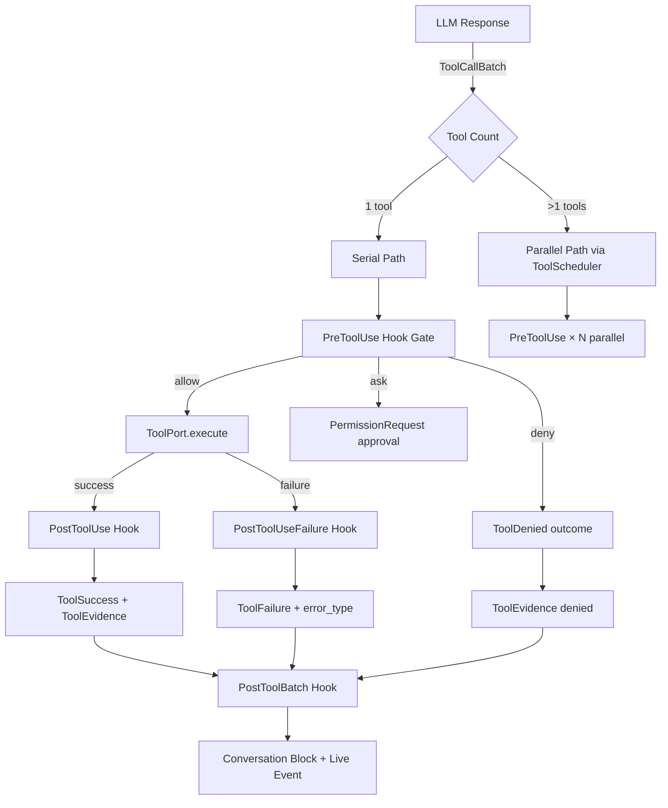

# Tool 系统 CC-Native 设计规范与分批重建计划

> 文档版本：1.0.0
> 创建日期：2026-08-06
> 前置文档：Runtime/Hook/EventBus 系列（G0-G44, H0-H8, Phase A-C, R1-R3）
> 基准代码：f6a534f
> 核心原则：从 CC 架构倒推设计，非补丁，逐阶段可停可验收

---

# 0. Claude Code Tool 系统事实基线

以下 20 条事实来自 [Claude Code Tools Reference](https://code.claude.com/docs/en/tools)、[Anthropic Tool Use](https://platform.claude.com/docs/en/docs/build-with-claude/tool-use)、[Claude Code Hooks](https://code.claude.com/docs/en/hooks) 和 [MCP Connector](https://code.claude.com/docs/en/mcp)。所有设计决策必须对齐这些事实。

## 0.1 工具定义与注册

| # | CC 事实 | 对代码的要求 |
|---|---|---|
| T1 | 每个工具通过 JSON Schema 定义：`name`、`description`、`input_schema`（含 `type: "object"`、`properties`、`required`） | `ToolCall.params` 必须是 JSON Schema-validatable 的 `FrozenJsonObject` |
| T2 | `description` 是模型选择工具的主要依据。描述应说明工具做什么、何时使用、参数含义 | 每个 `BaseTool` 的 `schema.description` 必须准确且面向模型可读 |
| T3 | `strict: true` 确保模型输出严格遵守 schema | 所有生产工具应启用 strict mode |
| T4 | `tool_choice` 控制调用行为：`auto`（默认，模型决定）、`any`（必须调一个）、`tool`（必须调指定工具）、`none`（禁止调工具） | StepLoop 的 `LLMPort.invoke()` 必须支持 `tool_choice` 参数 |

## 0.2 工具调用生命周期

| # | CC 事实 | 对代码的要求 |
|---|---|---|
| T5 | `tool_use` block：`id`（tool_use_id）、`name`、`input`（JSON object） | `ModelAction.ToolCall` 必须携带 `id`、`name`、`params` |
| T6 | `tool_result` block：`tool_use_id`、`content`（字符串或 content blocks）、`is_error`（bool） | `ToolOutcome` 必须区分 success/failure，携带输出内容 |
| T7 | `tool_result.is_error: true` 时，模型被告知工具调用失败并可重试或采取替代方案 | `ToolFailure` 必须映射到 `is_error: true` 语义 |
| T8 | `tool_result` 内容可以是纯文本或多模态 content blocks（image 等） | `ToolSuccess.output` 支持结构化内容 |

## 0.3 并行工具执行

| # | CC 事实 | 对代码的要求 |
|---|---|---|
| T9 | 模型在一个 response 中可返回多个 `tool_use` block，Claude 并行执行它们 | `ToolCallBatch` 的默认行为必须是并行（H5 已实现） |
| T10 | `disable_parallel_tool_use: true` 强制每轮只调一个工具 | `tool_choice` 参数支持串行模式 |
| T11 | 并行工具调用独立失败——一个工具的错误不影响同一 batch 中的其他工具 | ToolScheduler 的 sibling failure 隔离（G19 已实现） |

## 0.4 Hook 与工具交互

| # | CC 事实 | 对代码的要求 |
|---|---|---|
| T12 | `PreToolUse` hook 接收 `tool_name`、`tool_input`、`tool_use_id`，可返回 `permissionDecision`（allow/deny/ask/defer）和 `updatedInput` | StepLoop 的 `_process_tool_calls` 必须在 tool 执行前调用 `HookDispatcher` |
| T13 | `PostToolUse` hook 接收工具结果，可注入 `additionalContext` 或 `updatedToolOutput`，但不能回滚工具 | StepLoop 在 tool 执行后调用 PostToolUse，失败不阻断 |
| T14 | `PostToolBatch` 在整批并行工具完成后、下一次模型调用前触发 | 批处理完成后检查 `PostToolBatch` hook |
| T15 | `PermissionRequest` hook 在工具需要权限决策时触发，有独立的 decision schema | StepLoop 在 PreToolUse 返回 ask 时调用 PermissionRequest |

## 0.5 错误处理

| # | CC 事实 | 对代码的要求 |
|---|---|---|
| T16 | 工具执行失败返回 `tool_result` 且 `is_error: true`。模型看到这个标记后会尝试不同方法或报告问题 | `ToolFailure` 必须结构化，包含 `error_type`（timeout/permission/network/validation） |
| T17 | 不同类型的错误应有不同的 retry 策略：timeout → retry；permission → 不 retry；validation → 修正参数后 retry | `RetryPolicy` 必须绑定到每个工具，基于 `ToolMetadata.retry_policy` |
| T18 | `PostToolUseFailure` hook 在工具调用失败时触发 | 失败时 `HookDispatcher` 接收 `PostToolUseFailureInput` |

## 0.6 工具权限与分级

| # | CC 事实 | 对代码的要求 |
|---|---|---|
| T19 | 每个工具有 permission mode 行为：`default`（需要确认）、`auto`（自动批准）、`bypassPermissions`（跳过确认） | `ToolMetadata` 必须携带 `permission_mode` 和 `required_permissions` |
| T20 | `permission_rules` 在 settings.json 中配置，使用 `tool_name(pattern)` 语法匹配 | Composition Root 必须在 `assemble()` 时加载 permission rules 到 `PermissionPipeline` |

## 0.7 工具可插拔与发现

| # | CC 事实 | 对代码的要求 |
|---|---|---|
| T21 | MCP 工具通过 `mcp__server__tool` 命名约定自动发现。MCP 服务器在 session 启动时连接 | `ToolRegistry` 必须支持动态添加/移除 MCP 工具 |
| T22 | 内置工具有稳定的名称集合：`Read`、`Write`、`Edit`、`Bash`、`Glob`、`Grep`、`Task`、`Skill` 等 | 内置工具必须始终可用，不依赖外部配置 |
| T23 | `tool_search` server tool 可在数千工具中发现并按需加载 | 大型工具集需要 lazy-loading 和按需注册 |

## 0.8 工具元数据与可观测

| # | CC 事实 | 对代码的要求 |
|---|---|---|
| T24 | `tool_use` block 有 `id` 用于追踪。每次工具调用计入 token usage | 每次 `ToolPort.execute()` 调用必须记录到 `TokenUsagePort` |
| T25 | Tool use system prompt tokens 被计入 cost | Composition 层在组装时计算工具 schema 占用的 token 预算 |

---

# 1. 当前代码与 CC 标准的差距

## 1.1 差距总览

| 领域 | CC 要求 | 当前状态 | 差距等级 |
|---|---|---|---|
| Tool Schema | JSON Schema `input_schema` | `BaseTool.schema` 存在但不统一；`ToolMetadata` 未与 `runtime_core.ToolMetadata` 对齐 | P1 |
| 严格验证 | `strict: true` | `ToolCall.params` 已用 `FrozenJsonObject` 但 schema validation 未在 StepLoop 中执行 | P1 |
| tool_choice | auto/any/tool/none | `LLMPort.invoke()` 不支持 `tool_choice` 参数 | P1 |
| 结果回填 | `tool_result` with `is_error` | `ToolOutcome` 有 `ToolSuccess`/`ToolFailure` 但 `ToolFailure.error_type` 非结构化 | P1 |
| 并行执行 | default parallel | H5 已启用 `_process_tool_calls_parallel` | ✅ |
| PreToolUse | hook gate before execution | G17 已接线 `HookDispatcher` | ✅ |
| PostToolBatch | batch-level hook | **未实现**——StepLoop 没有 PostToolBatch hook | P1 |
| 权限分级 | permission_rules + permission mode | `BaseTool.metadata.required_permissions` 已声明但 Native 路径不使用 `PermissionPipeline` | P1 |
| 错误分类 | timeout/perm/network/validation | `ToolFailure.error_type` 是自由文本 | P0 |
| Retry 策略 | per-tool retry policy | `core.types.RetryPolicy` 已声明但 `_execute_via_registry` 不做 retry | P1 |
| MCP 工具 | `mcp__server__tool` 命名 | ToolRegistry 支持 MCP 但 Native 路径未解析 `mcp__` 前缀 | P2 |
| 工具可插拔 | 动态 register/unregister | ToolRegistry 支持 register 但 Native 路径使用静态 lookup | P2 |
| 工具发现 | tool_search / lazy load | 无 tool_search Server Tool 等价物 | P2 |
| 元数据双系统 | `core.types.ToolMetadata` vs `runtime_core.tool_scheduler.ToolMetadata` | 两套系统未桥接 | P0 |
| 可观测 | tool_use_id 追踪 + token counting | H3 已实现 token 提取；H4 已实现 evidence。但 tool_use_id 未关联到 evidence | P2 |

## 1.2 P0 差距详情

### P0-1: 错误类型非结构化

`ToolFailure` 当前：
```python
@dataclass(frozen=True, slots=True)
class ToolFailure:
    tool_name: str = ""
    error: str = ""
    error_type: str = ""
    duration_ms: float = 0.0
```

`error_type` 是自由文本。标准错误类型应包括：

```python
class ToolErrorType(StrEnum):
    TIMEOUT = "timeout"
    PERMISSION_DENIED = "permission_denied"
    NETWORK_ERROR = "network_error"
    VALIDATION_ERROR = "validation_error"
    TOOL_NOT_FOUND = "tool_not_found"
    EXECUTION_ERROR = "execution_error"
    RESOURCE_EXHAUSTED = "resource_exhausted"
    CANCELLED = "cancelled"
```

每个类型对应不同的 retry 策略。

### P0-2: 元数据双系统未桥接

`core.types.ToolMetadata`（80+ 工具使用）和 `runtime_core.tool_scheduler.ToolMetadata`（并行调度用）是两套独立系统。需要桥接函数：

```python
# runtime_core/tool_scheduler.py
@staticmethod
def from_base_tool(tool) -> "ToolMetadata":
    return ToolMetadata(
        name=tool.name,
        read_only=tool.isReadOnly(),
        concurrency_safe=tool.concurrency_mode() == ToolConcurrency.PARALLEL_SAFE,
        resource_key=(tool.metadata.path_parameter
                      if hasattr(tool.metadata, 'path_parameter') else ""),
    )
```

---

# 2. 目标设计规范

## 2.1 工具执行流水线



## 2.2 错误分类与 Retry 契约

```python
ERROR_RETRY_MAP = {
    ToolErrorType.TIMEOUT: RetryMode.AUTOMATIC,
    ToolErrorType.NETWORK_ERROR: RetryMode.AUTOMATIC,
    ToolErrorType.RESOURCE_EXHAUSTED: RetryMode.AUTOMATIC,
    ToolErrorType.PERMISSION_DENIED: RetryMode.NEVER,
    ToolErrorType.VALIDATION_ERROR: RetryMode.APPROVAL,
    ToolErrorType.TOOL_NOT_FOUND: RetryMode.NEVER,
    ToolErrorType.EXECUTION_ERROR: RetryMode.APPROVAL,
    ToolErrorType.CANCELLED: RetryMode.NEVER,
}
```

## 2.3 工具可插拔注册

```python
class ToolRegistryPort(Protocol):
    """Port for tool registration and discovery."""
    def register(self, tool: BaseTool) -> None: ...
    def unregister(self, name: str) -> None: ...
    def resolve(self, name: str) -> BaseTool | None: ...
    def list_names(self) -> list[str]: ...
    def metadata_for(self, name: str) -> ToolMetadata: ...
```

---

# 3. 分批重建路线图

## 3.1 阶段总览

| 阶段 | 目标 | 工时 | P0→? |
|---|---|---|---|
| T0 | ToolErrorType 结构化 + 元数据桥接 | 1.5d | 2→0 |
| T1 | PostToolBatch hook + tool_choice 支持 | 2.0d | — |
| T2 | tool_result 规范化回填 + error 语义 | 1.5d | — |
| T3 | 工具权限分级接线（PermissionPipeline → Native） | 2.0d | — |
| T4 | 工具可插拔注册（MCP 动态发现 + lazy load） | 2.0d | — |
| T5 | 端到端验证 + 可观测矩阵 | 1.5d | — |

## 3.2 T0 — ToolErrorType 结构化 + 元数据桥接

### 允许修改

1. `runtime_core/ports.py` — 增加 `ToolErrorType` 枚举 + 更新 `ToolFailure`
2. `runtime_core/tool_scheduler.py` — `ToolMetadata.from_base_tool()` 桥接
3. `tests/runtime_core/test_model_action_ports.py` — 验证错误类型 + 桥接

### 验收

- [ ] `ToolFailure.error_type` 是 `ToolErrorType` 枚举值
- [ ] `ERROR_RETRY_MAP` 覆盖全部 8 种错误类型
- [ ] `ToolMetadata.from_base_tool(BaseTool)` 正确映射 `isReadOnly()` / `concurrency_mode()`
- [ ] 80+ 个 BaseTool 子类的元数据可通过桥接函数转换为 `runtime_core.ToolMetadata`

## 3.3 T1 — PostToolBatch hook + tool_choice

### 允许修改

1. `runtime_core/step_loop.py` — 在 ToolCallBatch 处理后调用 PostToolBatch hook
2. `runtime_core/ports.py` — `LLMPort.invoke` 增加 `tool_choice` 参数
3. `tests/runtime_core/test_hook_tool_loop.py` — 验证 PostToolBatch 触发

### 验收

- [ ] PostToolBatch hook 在整批工具完成后触发
- [ ] `tool_choice: "auto"` 默认行为
- [ ] `tool_choice: {"type": "any"}` 强制至少一个工具调用
- [ ] `tool_choice: {"type": "tool", "name": "Read"}` 强制指定工具

## 3.4 T2 — tool_result 规范化回填

### 允许修改

1. `runtime_core/ports.py` — `ToolSuccess` 增加 `tool_use_id`、`content_type`
2. `runtime_core/step_loop.py` — 回填 tool_result 到 conversation
3. `tests/runtime_core/test_hook_tool_loop.py` — 验证回填格式

### 验收

- [ ] `ToolSuccess` 携带 `tool_use_id`
- [ ] tool_result 以 CC 格式（`type: "tool_result"`, `tool_use_id`, `content`）回填到 conversation
- [ ] `ToolFailure` 映射到 `is_error: true`

## 3.5 T3 — 工具权限分级接线

### 允许修改

1. `composition/runtime_composition.py` — `assemble()` 加载 permission rules
2. `runtime_core/step_loop.py` — PreToolUse 返回 ask → PermissionRequest
3. `tests/runtime_core/test_hook_tool_loop.py` — 验证权限分级

### 验收

- [ ] Permission rules 从 settings.json 加载到 `PermissionPipeline`
- [ ] PreToolUse ask → PermissionRequest hook gate
- [ ] bypassPermissions mode 跳过权限检查

## 3.6 T4 — 工具可插拔注册

### 允许修改

1. `composition/runtime_composition.py` — `_RealTools` 支持动态注册
2. `runtime_core/ports.py` — `ToolRegistryPort` 协议
3. `tests/composition/test_native_object_graph.py` — 验证动态注册

### 验收

- [ ] MCP 工具通过 `mcp__` 前缀自动识别
- [ ] 工具可运行时注册/注销
- [ ] `ToolRegistry.resolve_name()` 支持 alias 解析

## 3.7 T5 — 端到端验证 + 可观测矩阵

### 允许修改

1. `tests/integration/test_native_run_e2e.py` — 扩展 E2E 覆盖所有工具类型
2. `tests/test_runtime_architecture_gates.py` — 增加工具可观测检查

### 验收清单

- [ ] 所有 8 种 `ToolErrorType` 有对应的 retry 行为验证
- [ ] PostToolBatch hook 被触发且不阻断正常流程
- [ ] tool_choice: auto/any/tool/none 全部验证
- [ ] 权限 deny/ask 场景端到端通过
- [ ] MCP 工具 `mcp__server__tool` 可被发现和调用
- [ ] 工具元数据桥接对全部已注册工具通过
- [ ] 每阶段 ≤ 3 个文件修改
- [ ] 所有测试使用 FakeToolPort（禁止真实执行）

---

# 4. 验收清单（最终）

- [ ] `ToolErrorType` enum 8 种错误类型全部定义并接线
- [ ] `ERROR_RETRY_MAP` 覆盖全部错误类型
- [ ] `ToolMetadata.from_base_tool()` 桥接两套元数据系统
- [ ] PostToolBatch hook 在批处理后触发
- [ ] `tool_choice` 参数支持 4 种模式
- [ ] `tool_result` 以 CC 格式回填
- [ ] `ToolSuccess.tool_use_id` 关联到 evidence
- [ ] PermissionPipeline 接入 Native StepLoop
- [ ] MCP 工具可插拔（动态 register/unregister）
- [ ] 全部 5 阶段测试通过
- [ ] 每个阶段 ≤ 3 文件
- [ ] 零真实工具执行（测试用 FakeToolPort）

---

> **文档结束。执行路线：T0 → T1 → T2 → T3 → T4 → T5。共 6 个阶段，10.5 人日。每阶段先写测试→确认失败→实现→确认通过。**
